# Aula 01 — Introdução, Git e HTML5

**Disciplina:** Programação para Internet (ILP951)
**Professor:** Ronan Adriel Zenatti · ronan.zenatti@cps.sp.gov.br
**Fatec Jahu — 2º Semestre/2026**
**Pré-requisitos:** Nenhum — esta é a aula zero, o ponto de partida absoluto.

---

## 🗺️ O que você vai aprender nesta aula

Nesta primeira aula você vai configurar todo o ambiente de desenvolvimento que usaremos durante o semestre inteiro. Ao final, você terá instalado Python, criado a pasta do projeto, configurado um ambiente virtual, feito seu primeiro commit no GitHub e escrito um arquivo HTML5 válido. Parece muito, mas cada passo é simples quando feito um de cada vez — e é exatamente assim que vamos fazer.

---

## 🎯 Objetivos da Aula

Ao final desta aula você deverá ser capaz de:

- Instalar e configurar o ambiente de desenvolvimento do semestre (Python, VS Code e extensões essenciais)
- Criar a estrutura de pastas de um projeto e isolar suas dependências com um ambiente virtual (`venv`)
- Versionar um projeto com Git e publicá-lo em um repositório remoto no GitHub
- Escrever documentos HTML5 válidos, aplicando a estrutura obrigatória e as tags fundamentais (parágrafos, títulos, links, listas, tabelas, imagens e formulários)

---

## 🗺️ Mapa Mental da Aula

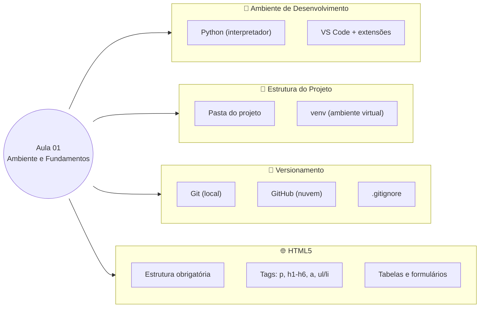

---

## Parte 1 — Entendendo o que vamos construir

Antes de instalar qualquer coisa, vale a pena ter uma imagem clara do que é uma aplicação web e quais peças a compõem. Isso vai ajudar você a entender *por que* cada ferramenta existe e qual papel ela desempenha no conjunto.

### O que é uma aplicação web?

Quando você abre o Google no navegador e digita uma pesquisa, uma sequência de eventos acontece: o navegador envia uma pergunta para um computador que está em algum servidor no mundo, esse computador processa a pergunta, busca as respostas em um banco de dados e devolve uma página HTML para o seu navegador mostrar na tela.

Nessa história existem três personagens principais. O **front-end** é tudo que você vê e clica — os botões, as cores, o texto, o layout. Ele vive no seu navegador e é feito de HTML, CSS e JavaScript. O **back-end** é o "cérebro" da aplicação — o código que roda no servidor, processa as informações, valida os dados e decide o que mostrar. É aqui que entra o Python com Flask. O **banco de dados** é onde as informações são guardadas de forma permanente — usuários cadastrados, produtos, pedidos, tudo fica salvo aqui.

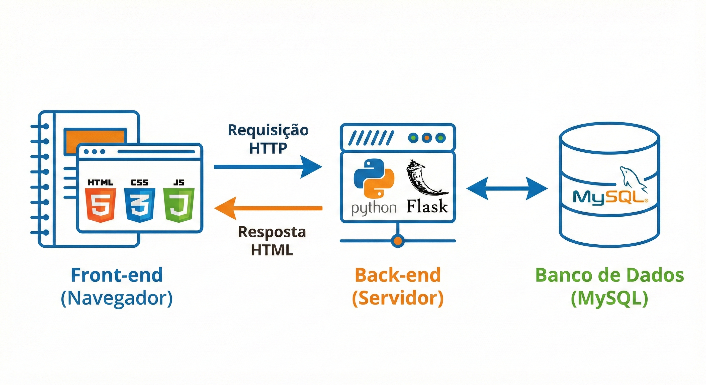

Nesta disciplina você vai aprender a construir as três camadas. Nesta primeira aula, vamos montar a estrutura base e entender o HTML — a fundação de tudo que aparece na tela.

### Por que Python?

Python é atualmente uma das linguagens de programação mais usadas no mundo, tanto em empresas iniciantes quanto em gigantes como Google, Netflix e Instagram. Ela foi escolhida para esta disciplina por três razões concretas: sua sintaxe é muito próxima da linguagem humana (você vai conseguir ler o código e entender o que ele faz antes mesmo de aprender as regras formais), ela tem uma biblioteca chamada Flask que simplifica a criação de aplicações web, e ela é a mesma linguagem usada em áreas de grande crescimento como Inteligência Artificial e Ciência de Dados — o que você aprende aqui abre portas bem além desta disciplina.

### 🔎 Verifique seu Entendimento

Imagine um assistente de estudos com IA que alguns colegas seus já usam para tirar dúvidas de matérias como Cálculo e Programação: você digita uma pergunta no navegador e recebe uma resposta gerada na hora.

**Desafio:** Identifique, nesse assistente, o que seria o front-end, o que seria o back-end e o que seria o banco de dados — explicando em uma frase o papel de cada camada *nesse cenário específico* (não repita a definição genérica, aplique ao assistente de estudos).

> 💬 Tente por conta própria antes de seguir. A solução comentada está no gabarito desta aula (link na última seção da página).

---

## Parte 2 — Instalando o Python

### O que é um interpretador e por que precisamos instalá-lo?

Uma linguagem de programação como Python é, em essência, um conjunto de regras e palavras que os humanos podem escrever e entender. O problema é que o computador não entende Python — ele só entende sequências de zeros e uns. O **interpretador Python** é o programa responsável por traduzir o que você escreve em Python para instruções que o processador consegue executar. Instalar o Python significa instalar esse tradutor no seu computador.

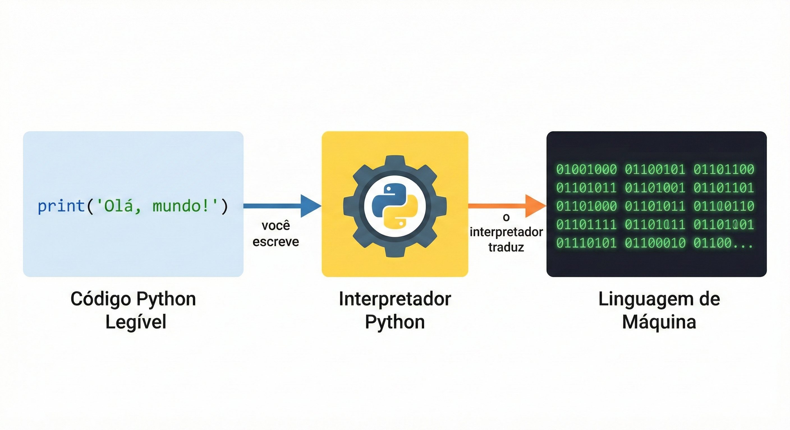

### Instalação no Windows

Acesse o site oficial em **python.org** e clique em "Download Python 3.x.x" (a versão mais recente da série 3). Baixe o instalador `.exe` e execute-o.

**Atenção crucial:** Na primeira tela do instalador, antes de clicar em qualquer botão, você verá uma caixa de seleção no rodapé com o texto **"Add Python to PATH"**. Marque essa opção. Se você não marcar ela agora, o Windows não vai saber onde encontrar o Python quando você digitar comandos no terminal, e você terá que configurar manualmente mais tarde. Após marcar, clique em "Install Now".

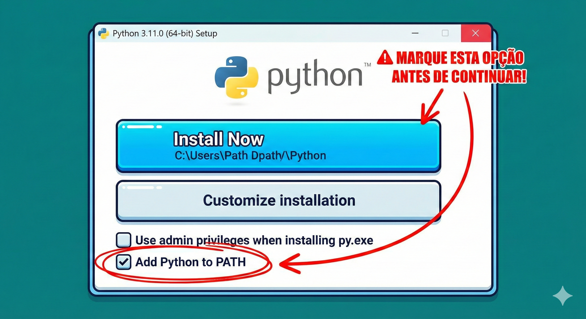

### Verificando se a instalação funcionou

Após a instalação, abra o **Prompt de Comando** (pressione `Windows + R`, digite `cmd` e pressione Enter). Digite o seguinte e pressione Enter:

```
python --version
```

Se a instalação funcionou corretamente, você verá algo como `Python 3.12.0`. Isso confirma que o interpretador está instalado e o Windows consegue encontrá-lo.

> 💡 **Por que testamos no terminal?** Ao longo do semestre, você vai usar o terminal com frequência. Cada comando será explicado quando aparecer pela primeira vez — não se preocupe com o que ainda não foi apresentado.

### 🔎 Verifique seu Entendimento

Um colega de turma está montando o ambiente para prototipar um app de bike-sharing (aluguel de bicicletas por aplicativo) e, na pressa, esqueceu de marcar "Add Python to PATH" durante a instalação.

**Desafio:** Descreva o que vai aparecer no terminal quando ele digitar `python --version` sem o PATH configurado, e explique — sem reinstalar nada do zero — o que precisa ser feito para resolver.

> 💬 Tente por conta própria antes de seguir. A solução comentada está no gabarito desta aula (link na última seção da página).

---

## Parte 3 — Instalando o Visual Studio Code

O **VS Code** é o editor de código que usaremos. Você poderia escrever código Python em qualquer editor de texto, até no bloco de notas, mas um editor especializado oferece recursos que aceleram muito o trabalho: coloração sintática (cada tipo de elemento fica com uma cor diferente, facilitando a leitura), autocompletar (o editor sugere o resto do que você está digitando) e integração direta com o terminal.

Acesse **code.visualstudio.com** e baixe a versão para Windows. A instalação é padrão — avance as telas com as opções padrão.

### Extensões essenciais

Após instalar o VS Code, você precisa adicionar duas extensões. Clique no ícone de blocos no painel lateral esquerdo (ou pressione `Ctrl + Shift + X`) para abrir o marketplace de extensões. Busque e instale a extensão **Python** (publicada pela Microsoft) e a extensão **Prettier - Code formatter**.

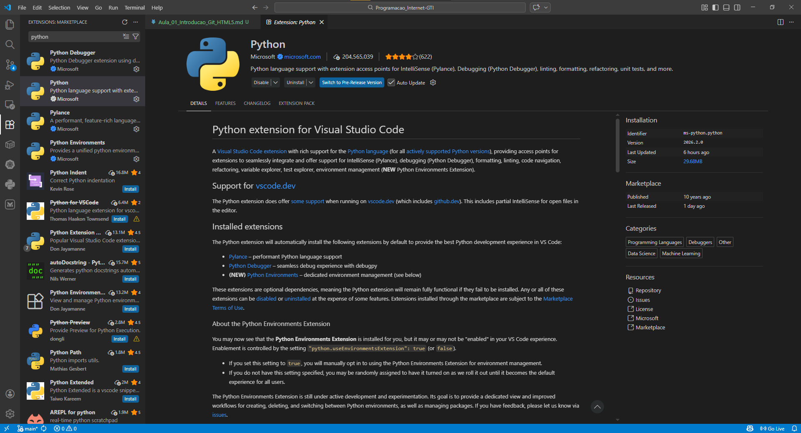

### 🔎 Verifique seu Entendimento

Uma colega que também é criadora de conteúdo tech vai gravar um vídeo curto mostrando, ao vivo, que as extensões Python e Prettier estão realmente ativas no VS Code — sem abrir o menu de extensões durante a gravação.

**Desafio:** Aponte duas evidências visuais na tela do VS Code (fora do menu de extensões) que provam que cada uma dessas extensões está funcionando.

> 💬 Tente por conta própria antes de seguir. A solução comentada está no gabarito desta aula (link na última seção da página).

---

## Parte 4 — Criando a pasta do projeto

### Por que a organização de pastas importa?

Imagine uma gaveta onde você joga tudo junto: documentos, ferramentas, roupas e comida. Encontrar qualquer coisa seria um pesadelo. Um projeto de software é igual — se os arquivos não estiverem organizados de forma lógica, o projeto vira um caos rapidamente. A estrutura de pastas que vamos criar segue um padrão que você encontrará em projetos Flask reais no mercado de trabalho.

### Criando a pasta via terminal

Abra o terminal e navegue até onde você quer criar o projeto. Para criar na área de trabalho:

```
cd Desktop
mkdir projeto-web
cd projeto-web
```

O comando `mkdir` cria uma pasta (de "make directory"). O comando `cd` navega para dentro de uma pasta (de "change directory"). Agora abra o VS Code diretamente nesta pasta:

```
code .
```

O ponto (`.`) significa "aqui" — ou seja, "abra o VS Code na pasta em que estou agora".

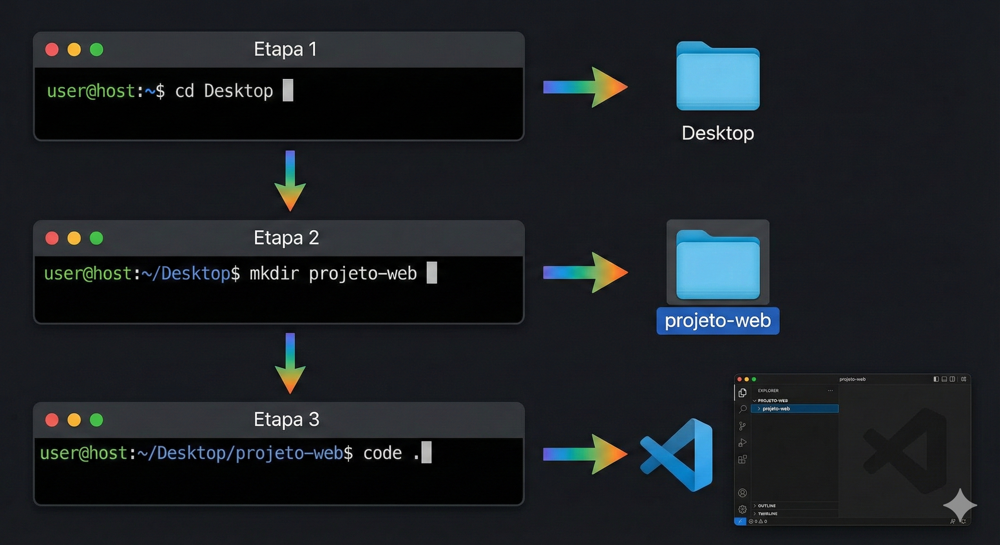

### 🔎 Verifique seu Entendimento

Você vai começar, do zero, o protótipo de um app de venda de ingressos para o show de encerramento de um festival de música de 2026, guardado em uma pasta própria na Área de Trabalho.

**Desafio:** Escreva, na ordem certa, os comandos de terminal para criar uma pasta chamada `ingressos-show`, entrar nela e abrir o VS Code já dentro dela.

> 💬 Tente por conta própria antes de seguir. A solução comentada está no gabarito desta aula (link na última seção da página).

---

## Parte 5 — Ambiente Virtual (venv)

### O problema que o ambiente virtual resolve

Imagine que você está trabalhando em dois projetos diferentes ao mesmo tempo. O Projeto A precisa da versão 1.0 de uma biblioteca chamada Flask. O Projeto B precisa da versão 3.0 da mesma biblioteca, que tem mudanças incompatíveis. Se você instalar as bibliotecas direto no Python global do seu computador, você só pode ter uma versão — e os dois projetos entrarão em conflito.

O **ambiente virtual** (ou `venv`, de "virtual environment") resolve isso criando um Python isolado para cada projeto. É como se cada projeto tivesse seu próprio aquário particular: os peixes (bibliotecas) de um aquário não interferem nos peixes do outro, mesmo que vivam no mesmo armário.

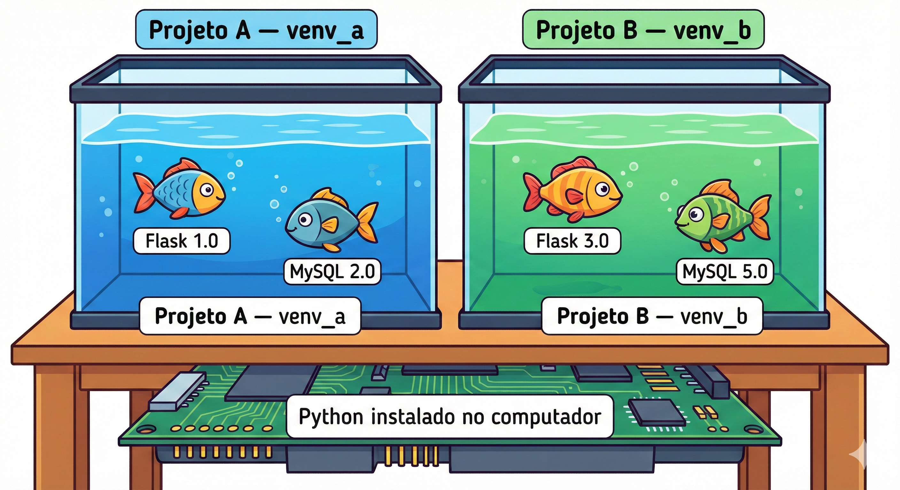

### Criando e ativando o ambiente virtual

Com o terminal aberto dentro da pasta `projeto-web`, crie o ambiente virtual com:

```
python -m venv venv
```

Você está dizendo ao Python: "execute o módulo `venv` e crie um ambiente virtual chamado `venv` aqui dentro." Uma pasta chamada `venv` aparecerá no projeto. Em seguida, ative-o:

```
venv\Scripts\activate
```

Após esse comando, o início da linha do terminal muda, ganhando o prefixo `(venv)`:

```
(venv) C:\Users\SeuNome\Desktop\projeto-web>
```

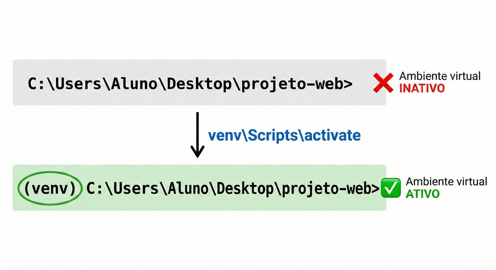

Esse `(venv)` é o sinal visual de que o ambiente virtual está ativo. Toda biblioteca instalada a partir deste momento vai para dentro da pasta `venv`, sem tocar no resto do computador.

> ⚠️ **Regra de ouro:** Sempre que abrir um novo terminal para trabalhar no projeto, o primeiro comando deve ser ativar o ambiente virtual. Se você esquecer, as bibliotecas não serão encontradas e o projeto não funcionará.

### 🔎 Verifique seu Entendimento

Você está com dois projetos no computador ao mesmo tempo: o Projeto A é um assistente de estudos com IA que só funciona com a versão mais recente de uma biblioteca de IA generativa; o Projeto B é um projeto antigo da faculdade que trava se essa biblioteca for atualizada.

**Desafio:** Explique por que instalar as bibliotecas direto no Python global quebraria um dos dois projetos, e escreva os comandos para criar e ativar um ambiente virtual só para o Projeto A.

> 💬 Tente por conta própria antes de seguir. A solução comentada está no gabarito desta aula (link na última seção da página).

---

## Parte 6 — Git e GitHub

### O que é versionamento e por que você precisa disso?

Imagine que você está escrevendo um trabalho de faculdade em Word. Você salva como `trabalho_v1.docx`. Faz mudanças: `trabalho_v2.docx`. Mais mudanças: `trabalho_v3_final.docx`. Depois: `trabalho_v3_final_MESMO.docx`. Todo programador que trabalhou sem versionamento já chegou nesse caos — e o Git existe para acabar com ele.

O **Git** registra cada mudança que você faz no código, com uma descrição do que foi alterado, quando e por quem. Você pode voltar para qualquer ponto da história do projeto com um único comando. Mais do que isso: ele permite que múltiplas pessoas trabalhem no mesmo projeto ao mesmo tempo sem sobrescrever o trabalho umas das outras, o que é fundamental em qualquer ambiente profissional real.

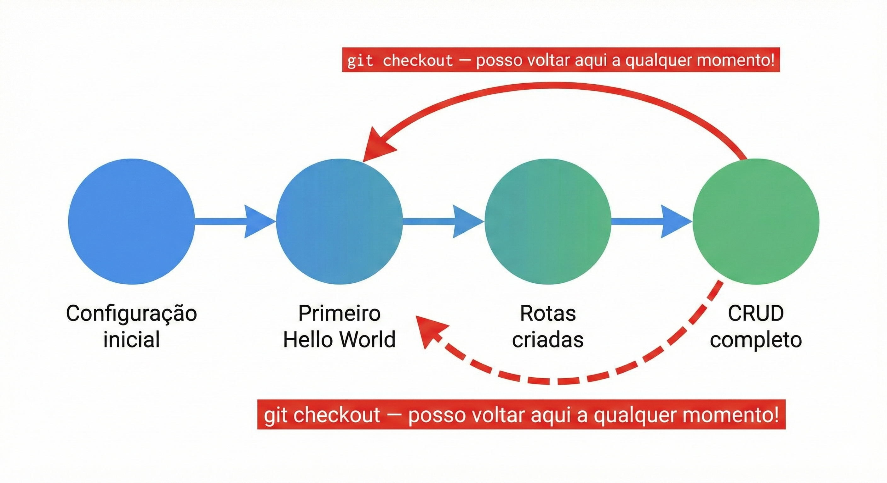

### Git vs. GitHub

**Git** é o programa instalado no seu computador que controla o versionamento localmente. **GitHub** é o serviço online que armazena o histórico do seu projeto na nuvem. O Git é seu diário pessoal; o GitHub é o cofre seguro na nuvem onde você guarda uma cópia.

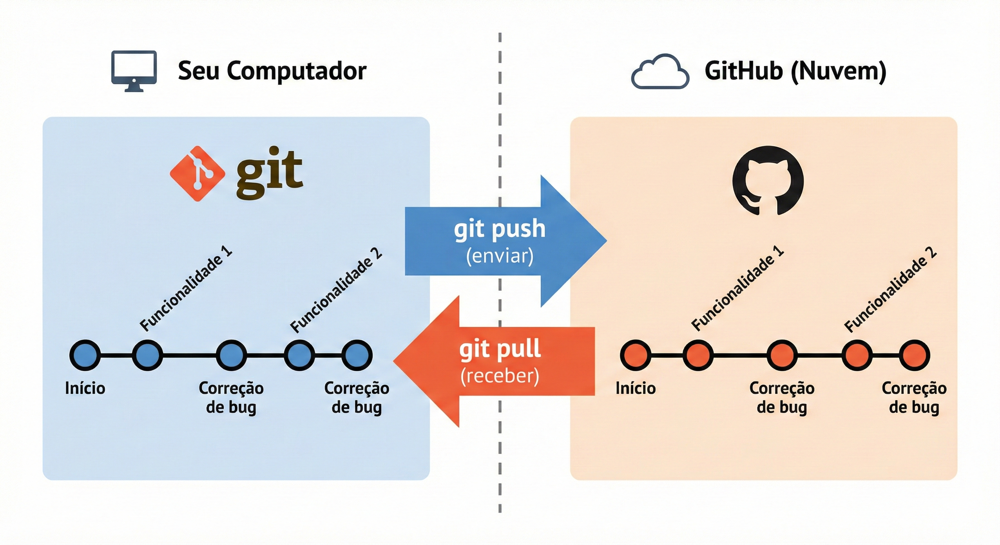

### Instalando o Git e configurando

Acesse **git-scm.com** e instale o Git com as opções padrão. Após a instalação, configure sua identidade — esse nome aparecerá em cada registro que você criar:

```
git config --global user.name "Seu Nome Completo"
git config --global user.email "seu.email@example.com"
```

### O arquivo .gitignore

A pasta `venv` contém milhares de arquivos do Python que **nunca devem ser enviados ao GitHub** — eles podem ser recriados a qualquer momento. O arquivo `.gitignore` diz ao Git o que ignorar. Crie-o na raiz do projeto com este conteúdo:

```
# Ambiente virtual — nunca versionar
venv/

# Arquivos de cache do Python
__pycache__/
*.pyc

# Configurações locais do VS Code
.vscode/

# Variáveis de ambiente sensíveis (senhas, chaves)
.env
```

### O fluxo de trabalho do Git

Todo commit passa por três estágios: você edita arquivos no seu projeto, adiciona as mudanças ao "stage" (uma área de preparação onde você escolhe o que vai entrar no commit), e então confirma o commit com uma mensagem descritiva.

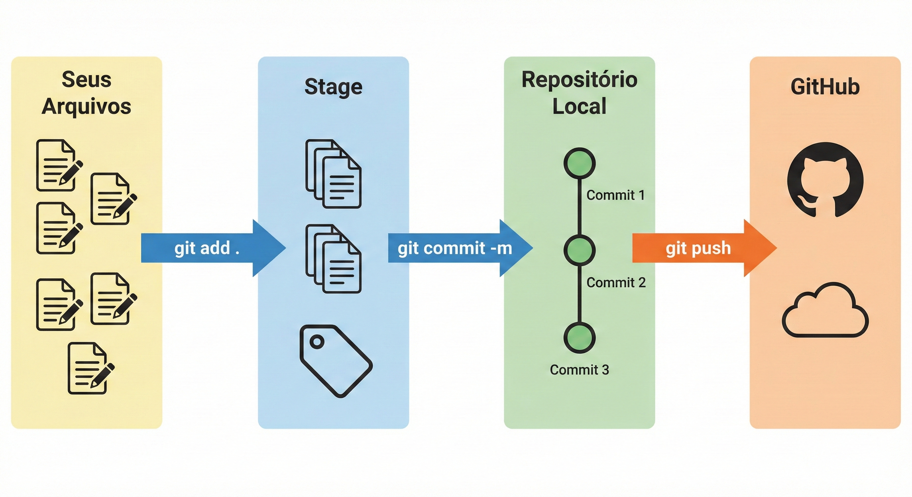

```
git init
git add .
git commit -m "Aula 01: configuração inicial do projeto"
```

Depois de criar o repositório no GitHub (em github.com, clique em "New repository"), conecte e envie:

```
git remote add origin https://github.com/SEU-USUARIO/projeto-web-fatec.git
git push -u origin main
```

Acesse o endereço do repositório no navegador e você verá seus arquivos lá. Seu portfólio online acabou de começar.

### 🔎 Verifique seu Entendimento

Você e mais dois colegas estão versionando juntos, pela primeira vez, o repositório de um app de caronas compartilhadas para ir à faculdade. Antes do primeiro commit, vocês criaram um arquivo `.env` guardando a chave de acesso (API key) de um serviço de mapas — e essa chave nunca pode ir para o GitHub público.

**Desafio:** Diga o que precisa estar dentro do `.gitignore` **antes** do primeiro commit para que essa chave nunca seja enviada ao GitHub, e escreva a sequência completa de comandos Git — do `git init` ao `git push` — que o grupo usaria para o primeiro envio do projeto.

> 💬 Tente por conta própria antes de seguir. A solução comentada está no gabarito desta aula (link na última seção da página).

---

## Parte 7 — HTML5: a linguagem da web

### O que é HTML e como ele funciona?

**HTML** (HyperText Markup Language) é a linguagem que define a **estrutura e o conteúdo** de uma página web. Quando o navegador recebe uma página, ele lê o arquivo HTML e decide o que mostrar na tela com base nas marcações que encontra. A palavra "marcação" é essencial aqui: HTML não é uma linguagem de programação — você não cria lógica nem repetições com HTML puro. Você está simplesmente **rotulando** pedaços de conteúdo para dizer o que eles são: "este é um título", "este é um parágrafo", "este é um link".

### Tags: a unidade fundamental do HTML

A unidade básica do HTML é a **tag** — um rótulo entre os sinais `<` e `>`. A grande maioria das tags vem em par: uma tag de abertura e uma de fechamento. A de fechamento é idêntica à de abertura, mas com uma barra `/` antes do nome.

Antes de ver um código completo, veja três exemplos conceituais de tags na prática:

**Exemplo conceitual 1 — Parágrafos:** A tag `<p>` marca um bloco de texto como parágrafo. O navegador automaticamente adiciona espaçamento antes e depois. `<p>Texto aqui.</p>` é suficiente para criar um parágrafo bem formado.

**Exemplo conceitual 2 — Títulos hierárquicos:** HTML tem seis níveis de título, de `<h1>` (mais importante, maior) a `<h6>` (menos importante, menor). O `<h1>` deve ser o título principal da página e deve existir apenas um por página — assim como um livro tem apenas um título principal.

**Exemplo conceitual 3 — Links:** A tag `<a>` (de "anchor", âncora) cria links. O atributo `href` indica o destino: `<a href="https://fatec.sp.gov.br">Visitar FATEC</a>`. O texto entre as tags é o texto clicável que o usuário vê.

### A estrutura obrigatória de um documento HTML5

Todo arquivo HTML5 válido precisa de uma estrutura mínima — o esqueleto que todo documento precisa antes de receber qualquer conteúdo.

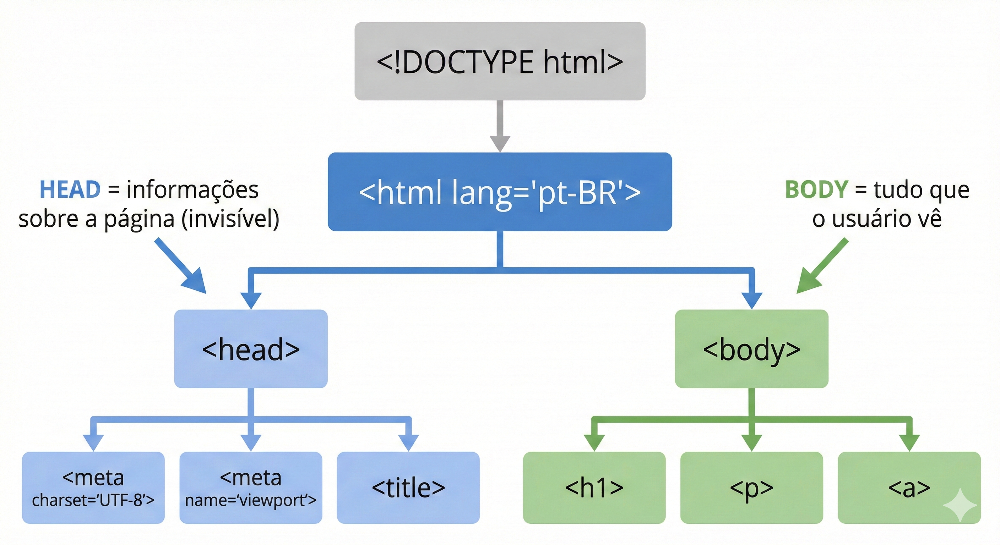

```html
<!DOCTYPE html>
<!-- Declara que este é um documento HTML5. Deve ser sempre a primeira linha. -->

<html lang="pt-BR">
<!-- Envolve todo o documento. lang="pt-BR" informa o idioma para navegadores
     e leitores de tela (importante para acessibilidade). -->

  <head>
    <!-- Contém informações SOBRE o documento — o usuário não vê o que está aqui,
         mas o navegador usa para configurar a exibição da página. -->

    <meta charset="UTF-8">
    <!-- Define a codificação de caracteres. Sem isso, acentos e cedilhas
         como ã, é, ç aparecem como símbolos estranhos e ilegíveis. -->

    <meta name="viewport" content="width=device-width, initial-scale=1.0">
    <!-- Essencial para responsividade: diz ao navegador em celulares
         para não reduzir o zoom automaticamente. -->

    <title>Minha Primeira Página</title>
    <!-- Aparece na aba do navegador e nos resultados de busca do Google.
         Não aparece no corpo da página. -->

  </head>

  <body>
    <!-- Contém TUDO que aparece visualmente:
         textos, imagens, botões, tabelas, formulários... -->

    <h1>Olá, mundo!</h1>
    <p>Este é meu primeiro parágrafo em HTML5.</p>

  </body>

</html>
```

Observe a **indentação** — os espaços no início de cada linha. O navegador ignora esses espaços, mas eles são essenciais para que humanos consigam ler e entender a hierarquia do código. Use sempre 2 espaços para cada nível de aninhamento, e adote esse hábito desde hoje.

---

### Exemplo prático 1 — Página de apresentação pessoal

Crie um arquivo chamado `pagina_pessoal.html` na pasta `projeto-web`. Em vez de digitar a página inteira de uma vez, vamos construí-la em pequenos passos, salvando e recarregando o navegador a cada trecho novo — assim você vê exatamente o que cada tag adiciona à página.

**Passo 1 — o esqueleto e o título principal.** Comece com a estrutura obrigatória que você acabou de ver, e adicione um único `<h1>` dentro do `<body>`:

```html
<!DOCTYPE html>
<html lang="pt-BR">
<head>
  <meta charset="UTF-8">
  <meta name="viewport" content="width=device-width, initial-scale=1.0">
  <title>Sobre Mim</title>
</head>
<body>

  <h1>João Silva</h1>
  <!-- h1 = título principal da página: maior, negrito, único por página -->

</body>
</html>
```

Salve o arquivo, abra-o no navegador (clique duas vezes no explorador de arquivos) e observe: a aba do navegador mostra "Sobre Mim" (o `<title>`), enquanto o corpo da página mostra "João Silva" em destaque (o `<h1>`) — são coisas diferentes.

**Passo 2 — uma seção "Sobre mim".** Logo depois do `<h1>`, adicione um subtítulo e um parágrafo:

```html
  <h2>Sobre mim</h2>
  <!-- h2 = subtítulo: menor que h1, usado para organizar seções -->

  <p>
    Olá! Meu nome é João, tenho 22 anos e estou cursando Gestão da Tecnologia
    da Informação na FATEC Jahu. Tenho interesse em desenvolvimento web e
    banco de dados.
  </p>
  <!-- p = parágrafo de texto: o navegador adiciona espaço antes e depois -->
```

Salve e recarregue a página. Note como o `<h2>` aparece menor que o `<h1>`, e como o navegador insere espaçamento automático antes e depois do parágrafo, sem você precisar pedir isso explicitamente.

**Passo 3 — a lista de habilidades.** Depois do parágrafo, adicione mais uma seção, desta vez com uma lista:

```html
  <h2>Minhas habilidades</h2>

  <ul>
    <!-- ul = "unordered list" = lista com marcadores (bolinhas).
         Use quando a ORDEM dos itens não importa. -->
    <li>HTML e CSS</li>
    <!-- li = "list item" = cada item da lista -->
    <li>Python (em aprendizado)</li>
    <li>MySQL</li>
    <li>Git e GitHub</li>
  </ul>
```

Salve e recarregue novamente. Observe a lista com marcadores (bolinhas) aparecendo — cada `<li>` virou um item independente, indentado automaticamente pelo navegador.

**Passo 4 — a seção de contato.** Por fim, adicione uma seção com um link clicável:

```html
  <h2>Contato</h2>

  <p>
    Me encontre no GitHub:
    <a href="https://github.com/joaosilva">github.com/joaosilva</a>
    <!-- a = link (âncora). href = endereço de destino.
         O texto entre as tags é o texto clicável que o usuário vê. -->
  </p>
```

Salve e recarregue uma última vez. Note que o texto do link aparece sublinhado e em azul (o estilo padrão do navegador para links) e que clicar nele abre o endereço do `href`.

**Bloco completo consolidado** — depois de passar pelos quatro passos, seu arquivo `pagina_pessoal.html` deve estar assim:

```html
<!DOCTYPE html>
<html lang="pt-BR">
<head>
  <meta charset="UTF-8">
  <meta name="viewport" content="width=device-width, initial-scale=1.0">
  <title>Sobre Mim</title>
</head>
<body>

  <h1>João Silva</h1>
  <!-- h1 = título principal da página: maior, negrito, único por página -->

  <h2>Sobre mim</h2>
  <!-- h2 = subtítulo: menor que h1, usado para organizar seções -->

  <p>
    Olá! Meu nome é João, tenho 22 anos e estou cursando Gestão da Tecnologia
    da Informação na FATEC Jahu. Tenho interesse em desenvolvimento web e
    banco de dados.
  </p>
  <!-- p = parágrafo de texto: o navegador adiciona espaço antes e depois -->

  <h2>Minhas habilidades</h2>

  <ul>
    <!-- ul = "unordered list" = lista com marcadores (bolinhas).
         Use quando a ORDEM dos itens não importa. -->
    <li>HTML e CSS</li>
    <!-- li = "list item" = cada item da lista -->
    <li>Python (em aprendizado)</li>
    <li>MySQL</li>
    <li>Git e GitHub</li>
  </ul>

  <h2>Contato</h2>

  <p>
    Me encontre no GitHub:
    <a href="https://github.com/joaosilva">github.com/joaosilva</a>
    <!-- a = link (âncora). href = endereço de destino.
         O texto entre as tags é o texto clicável que o usuário vê. -->
  </p>

</body>
</html>
```

---

### Exemplo prático 2 — Página com tabela de horários

Tabelas em HTML organizam dados em linhas e colunas. A estrutura usa quatro tags principais que trabalham juntas. Crie um arquivo chamado `horarios.html` e, de novo, vamos construí-lo em partes.

**Passo 1 — título e cabeçalho da tabela.** Comece com o esqueleto, um `<h1>`, e a linha de cabeçalho da tabela:

```html
<!DOCTYPE html>
<html lang="pt-BR">
<head>
  <meta charset="UTF-8">
  <meta name="viewport" content="width=device-width, initial-scale=1.0">
  <title>Grade de Horários</title>
</head>
<body>

  <h1>Grade de Horários — 1º Semestre 2026</h1>

  <table border="1">
    <!-- table = contêiner da tabela inteira.
         border="1" adiciona bordas visíveis para visualizarmos a estrutura.
         Nas próximas aulas usaremos Bootstrap para estilizar com elegância. -->

    <thead>
      <!-- thead = agrupa a linha de cabeçalho: visualmente separada do corpo -->
      <tr>
        <!-- tr = "table row" = uma linha da tabela (horizontal) -->
        <th>Dia</th>
        <!-- th = "table header" = célula de cabeçalho: negrito e centralizado -->
        <th>Horário</th>
        <th>Disciplina</th>
        <th>Professor</th>
      </tr>
    </thead>

  </table>

</body>
</html>
```

Salve e recarregue a página. Você verá apenas a linha de cabeçalho, com as células em negrito e centralizadas — o `<thead>` ainda não tem nenhuma linha de dados abaixo dele.

**Passo 2 — a primeira linha de dados.** Dentro da `</thead>` e antes do `</table>`, adicione um `<tbody>` com a primeira linha:

```html
    <tbody>
      <!-- tbody = agrupa todas as linhas de dados da tabela -->
      <tr>
        <td>Segunda-feira</td>
        <!-- td = "table data" = célula de dado comum -->
        <td>19h00 — 20h40</td>
        <td>Programação para Internet</td>
        <td>Ronan Zenatti</td>
      </tr>
    </tbody>
```

Salve e recarregue. Agora aparece uma linha de dados abaixo do cabeçalho — repare que o texto das células `<td>` não vem em negrito, ao contrário das células `<th>` do cabeçalho.

**Passo 3 — as linhas restantes.** Dentro do mesmo `<tbody>`, logo depois da primeira `</tr>`, adicione mais duas linhas:

```html
      <tr>
        <td>Quarta-feira</td>
        <td>19h00 — 20h40</td>
        <td>Programação para Internet</td>
        <td>Ronan Zenatti</td>
      </tr>
      <tr>
        <td>Quinta-feira</td>
        <td>19h00 — 20h40</td>
        <td>Redes de Computadores</td>
        <td>Professor X</td>
      </tr>
```

Salve e recarregue uma última vez. A tabela agora tem três linhas de dados completas, formando a grade de horários inteira.

**Bloco completo consolidado** — seu arquivo `horarios.html` final deve estar assim:

```html
<!DOCTYPE html>
<html lang="pt-BR">
<head>
  <meta charset="UTF-8">
  <meta name="viewport" content="width=device-width, initial-scale=1.0">
  <title>Grade de Horários</title>
</head>
<body>

  <h1>Grade de Horários — 1º Semestre 2026</h1>

  <table border="1">
    <!-- table = contêiner da tabela inteira.
         border="1" adiciona bordas visíveis para visualizarmos a estrutura.
         Nas próximas aulas usaremos Bootstrap para estilizar com elegância. -->

    <thead>
      <!-- thead = agrupa a linha de cabeçalho: visualmente separada do corpo -->
      <tr>
        <!-- tr = "table row" = uma linha da tabela (horizontal) -->
        <th>Dia</th>
        <!-- th = "table header" = célula de cabeçalho: negrito e centralizado -->
        <th>Horário</th>
        <th>Disciplina</th>
        <th>Professor</th>
      </tr>
    </thead>

    <tbody>
      <!-- tbody = agrupa todas as linhas de dados da tabela -->
      <tr>
        <td>Segunda-feira</td>
        <!-- td = "table data" = célula de dado comum -->
        <td>19h00 — 20h40</td>
        <td>Programação para Internet</td>
        <td>Ronan Zenatti</td>
      </tr>
      <tr>
        <td>Quarta-feira</td>
        <td>19h00 — 20h40</td>
        <td>Programação para Internet</td>
        <td>Ronan Zenatti</td>
      </tr>
      <tr>
        <td>Quinta-feira</td>
        <td>19h00 — 20h40</td>
        <td>Redes de Computadores</td>
        <td>Professor X</td>
      </tr>
    </tbody>

  </table>

</body>
</html>
```

---

### Exemplo prático 3 — Página com imagem e formulário

Este exemplo introduz `` e a estrutura básica de um formulário. Os formulários serão estudados em profundidade na Aula 04 — por ora, foque em observar a estrutura e o propósito de cada tag. Crie um arquivo chamado `contato.html`, novamente em passos.

**Passo 1 — título e imagem.** Comece com o esqueleto, um `<h1>` e uma imagem:

```html
<!DOCTYPE html>
<html lang="pt-BR">
<head>
  <meta charset="UTF-8">
  <meta name="viewport" content="width=device-width, initial-scale=1.0">
  <title>Contato</title>
</head>
<body>

  <h1>Entre em Contato</h1>

  
  <!-- img = exibe uma imagem.
       src = caminho ou URL da imagem (source = fonte).
       alt = texto alternativo: aparece se a imagem não carregar e é
             lido por leitores de tela. NUNCA omita o alt — é acessibilidade.
       Importante:  não tem tag de fechamento. É uma "void element" —
       elementos que não têm conteúdo entre abertura e fechamento. -->

</body>
</html>
```

Salve e recarregue a página. A imagem de placeholder aparece com 150 pixels de largura, logo abaixo do título.

**Passo 2 — abrindo o formulário com o campo de nome.** Depois da imagem, adicione um subtítulo, a abertura do `<form>` e o primeiro campo:

```html
  <h2>Envie uma mensagem</h2>

  <form>
    <!-- form = formulário. Agrupa campos de entrada de dados.
         Voltaremos a ele com muito mais detalhe na Aula 04. -->

    <label for="nome">Seu nome:</label>
    <!-- label = rótulo descritivo de um campo.
         O atributo "for" deve ser idêntico ao "id" do input que descreve.
         Com isso, clicar no rótulo move o foco para o campo — acessibilidade. -->
    <br>
    <input type="text" id="nome" name="nome" placeholder="Digite seu nome">
    <!-- input = campo de entrada. Não tem tag de fechamento (void element).
         type="text" = texto de uma linha.
         placeholder = texto de dica que desaparece ao digitar. -->
    <br><br>

  </form>
```

Salve e recarregue. Repare que clicar no texto "Seu nome:" move o cursor direto para o campo de digitação — é o efeito do `for`/`id` combinados.

**Passo 3 — o campo de e-mail.** Dentro do `<form>`, logo depois do campo de nome (antes do `</form>`), adicione:

```html
    <label for="email">Seu e-mail:</label>
    <br>
    <input type="email" id="email" name="email" placeholder="seu@email.com">
    <!-- type="email" = o navegador valida se o formato é de e-mail válido
         antes de permitir o envio do formulário. Validação automática! -->
    <br><br>
```

Salve e recarregue. Tente digitar um texto sem "@" nesse campo e clicar fora — dependendo do navegador, você já percebe uma dica visual de que o formato esperado é um e-mail.

**Passo 4 — o campo de mensagem.** Ainda dentro do `<form>`, depois do campo de e-mail, adicione:

```html
    <label for="mensagem">Mensagem:</label>
    <br>
    <textarea id="mensagem" name="mensagem" rows="4" cols="40"
              placeholder="Escreva aqui..."></textarea>
    <!-- textarea = área de texto de múltiplas linhas.
         Diferente do input, textarea TEM tag de fechamento.
         rows e cols definem o tamanho visual inicial. -->
    <br><br>
```

Salve e recarregue. Note que a `<textarea>` aparece como uma caixa maior, com várias linhas — diferente do `<input type="text">`, que é sempre uma única linha.

**Passo 5 — o botão de envio.** Por fim, feche o formulário com um botão de envio:

```html
    <button type="submit">Enviar Mensagem</button>
    <!-- button type="submit" = envia o formulário ao servidor.
         Ainda não temos back-end para receber os dados (isso vem na Aula 04),
         mas a estrutura já está correta. -->
```

Salve e recarregue pela última vez. O botão "Enviar Mensagem" aparece ao final do formulário — clicar nele ainda não faz nada de útil, porque não existe back-end recebendo esses dados ainda (isso muda na Aula 04).

**Bloco completo consolidado** — seu arquivo `contato.html` final deve estar assim:

```html
<!DOCTYPE html>
<html lang="pt-BR">
<head>
  <meta charset="UTF-8">
  <meta name="viewport" content="width=device-width, initial-scale=1.0">
  <title>Contato</title>
</head>
<body>

  <h1>Entre em Contato</h1>

  
  <!-- img = exibe uma imagem.
       src = caminho ou URL da imagem (source = fonte).
       alt = texto alternativo: aparece se a imagem não carregar e é
             lido por leitores de tela. NUNCA omita o alt — é acessibilidade.
       Importante:  não tem tag de fechamento. É uma "void element" —
       elementos que não têm conteúdo entre abertura e fechamento. -->

  <h2>Envie uma mensagem</h2>

  <form>
    <!-- form = formulário. Agrupa campos de entrada de dados.
         Voltaremos a ele com muito mais detalhe na Aula 04. -->

    <label for="nome">Seu nome:</label>
    <!-- label = rótulo descritivo de um campo.
         O atributo "for" deve ser idêntico ao "id" do input que descreve.
         Com isso, clicar no rótulo move o foco para o campo — acessibilidade. -->
    <br>
    <input type="text" id="nome" name="nome" placeholder="Digite seu nome">
    <!-- input = campo de entrada. Não tem tag de fechamento (void element).
         type="text" = texto de uma linha.
         placeholder = texto de dica que desaparece ao digitar. -->
    <br><br>

    <label for="email">Seu e-mail:</label>
    <br>
    <input type="email" id="email" name="email" placeholder="seu@email.com">
    <!-- type="email" = o navegador valida se o formato é de e-mail válido
         antes de permitir o envio do formulário. Validação automática! -->
    <br><br>

    <label for="mensagem">Mensagem:</label>
    <br>
    <textarea id="mensagem" name="mensagem" rows="4" cols="40"
              placeholder="Escreva aqui..."></textarea>
    <!-- textarea = área de texto de múltiplas linhas.
         Diferente do input, textarea TEM tag de fechamento.
         rows e cols definem o tamanho visual inicial. -->
    <br><br>

    <button type="submit">Enviar Mensagem</button>
    <!-- button type="submit" = envia o formulário ao servidor.
         Ainda não temos back-end para receber os dados (isso vem na Aula 04),
         mas a estrutura já está correta. -->
  </form>

</body>
</html>
```

### 🔎 Verifique seu Entendimento

Uma associação de bairro está organizando um mutirão de coleta seletiva e quer uma página simples para divulgar a ação — sem nenhum framework ainda, só HTML5 puro, exatamente como você aprendeu nesta aula.

**Desafio:** Sem olhar os exemplos anteriores, escreva do zero um arquivo HTML5 válido para essa página, contendo: a estrutura obrigatória completa, um `<h1>` com o nome do mutirão, uma lista `<ul>` com pelo menos três materiais aceitos (ex.: papel, vidro, eletrônicos), uma tabela `<table>` com os dias e horários de coleta em cada rua, e um link `<a>` ao final apontando para o Instagram da ação.

> 💬 Tente por conta própria antes de seguir. A solução comentada está no gabarito desta aula (link na última seção da página).

---

## Parte 8 — Atividade da Aula

### O que fazer

Dentro da pasta `projeto-web`, crie um arquivo chamado `index.html` que será a **página inicial do seu projeto** para o semestre. Esta página deve ter a estrutura HTML5 obrigatória e válida. Inclua um `<h1>` com o nome do sistema que você pretende construir (você escolhe o tema: estoque, agenda, biblioteca, clínica, loja — o que preferir). Adicione uma seção `<h2>` descrevendo o que o sistema fará, seguida de um parágrafo. Crie uma lista `<ul>` com pelo menos 4 funcionalidades planejadas. Construa uma tabela com as tecnologias que serão usadas (Python, Flask, MySQL, Bootstrap) com colunas "Tecnologia" e "Para que serve". E finalize com um link de rodapé "Repositório no GitHub" apontando para o seu repositório.

Após criar e salvar, registre no Git:

```
git add .
git commit -m "Aula 01: página inicial do projeto"
git push
```

---

## 🃏 Flashcards de Revisão

??? question "Para que serve o interpretador Python e por que ele precisa ser instalado?"
    O interpretador traduz o código Python (que humanos escrevem e leem) para instruções que o processador consegue executar. Sem ele, o computador não entende Python.

??? question "Qual problema o ambiente virtual (venv) resolve?"
    Ele isola as bibliotecas de cada projeto, evitando que versões diferentes da mesma biblioteca usadas em projetos distintos entrem em conflito.

??? question "Como você confirma que o ambiente virtual está ativo?"
    O início da linha do terminal ganha o prefixo `(venv)`. Sem esse prefixo, qualquer biblioteca instalada vai para o Python global, não para o projeto.

??? question "Qual a diferença entre Git e GitHub?"
    Git é o programa instalado localmente que controla o versionamento; GitHub é o serviço na nuvem que armazena e compartilha esse histórico. Git é o diário, GitHub é o cofre na nuvem.

??? question "Por que a pasta `venv/` deve estar no `.gitignore`?"
    Ela contém milhares de arquivos gerados automaticamente pelo Python que podem ser recriados a qualquer momento com `python -m venv venv`; versioná-los é desnecessário e polui o repositório.

??? question "Por que a tag `` não tem tag de fechamento?"
    Porque é um "void element" — uma tag que não envolve conteúdo entre abertura e fechamento (assim como `<input>`). Ela só carrega atributos como `src` e `alt`.

---

## ✅ Quiz de Fixação

<quiz>
Qual é a função do ambiente virtual (venv) em um projeto Python?
- [ ] Acelerar a execução do código Python
- [x] Isolar as bibliotecas de cada projeto, evitando conflitos de versão
- [ ] Substituir a necessidade de instalar o Python
- [ ] Conectar o projeto ao GitHub automaticamente

O venv cria um Python isolado para cada projeto, como um "aquário" próprio de bibliotecas — não acelera a execução nem substitui a instalação do Python, e não tem relação direta com o GitHub.
</quiz>

<quiz>
O que acontece se você esquecer de marcar "Add Python to PATH" durante a instalação no Windows?
- [ ] O Python é instalado sem nenhuma biblioteca
- [ ] O VS Code para de funcionar
- [x] O terminal não encontra o comando `python` até que o PATH seja configurado manualmente
- [ ] O ambiente virtual não pode mais ser criado

Marcar "Add Python to PATH" é o que permite ao Windows localizar o interpretador quando você digita `python` no terminal. Sem isso, o comando não é reconhecido até uma configuração manual do PATH.
</quiz>

<quiz>
Quais das afirmações abaixo sobre Git e GitHub estão corretas? (selecione todas que se aplicam)
- [x] O Git registra o histórico de mudanças localmente, no seu computador
- [x] O GitHub armazena uma cópia do histórico do projeto na nuvem
- [ ] O Git só funciona se o projeto estiver conectado ao GitHub
- [ ] O arquivo `.gitignore` é enviado ao GitHub, mas o Git ignora seu conteúdo

Git e GitHub são complementares, mas independentes: o Git versiona localmente mesmo sem nenhum repositório remoto configurado. O `.gitignore` é sim versionado normalmente — o que ele faz é dizer ao Git quais *outros* arquivos ignorar.
</quiz>

<quiz>
Qual tag HTML deve ser usada para o título principal da página, e quantas vezes ela deve aparecer em uma página bem formada?
- [ ] `<h6>`, várias vezes
- [x] `<h1>`, apenas uma vez
- [ ] `<title>`, várias vezes
- [ ] `<head>`, apenas uma vez

`<h1>` é o título principal e mais importante da página — deve existir apenas um por página, assim como um livro tem um único título principal. `<title>` é diferente: aparece na aba do navegador, não no corpo da página.
</quiz>

<quiz>
No formulário do exemplo `contato.html`, o que acontece quando o atributo `for` de um `<label>` é idêntico ao `id` de um `<input>`?
- [ ] Nada muda visualmente ou funcionalmente
- [x] Clicar no texto do rótulo move o foco automaticamente para o campo correspondente
- [ ] O navegador impede o envio do formulário
- [ ] O campo passa a ser obrigatório automaticamente

Essa associação entre `for` e `id` é um recurso de acessibilidade: ao clicar no rótulo, o foco vai direto para o campo, o que ajuda inclusive usuários de leitores de tela e quem tem dificuldade de clicar exatamente no campo pequeno.
</quiz>

---

## 📝 Resumo da Aula

Hoje você configurou todo o ambiente que usará no semestre e deu os primeiros passos práticos como desenvolvedor: Python e VS Code instalados, projeto criado com ambiente virtual isolado, repositório Git iniciado com primeiro commit e push para o GitHub, e três arquivos HTML5 escritos e visualizados no navegador.

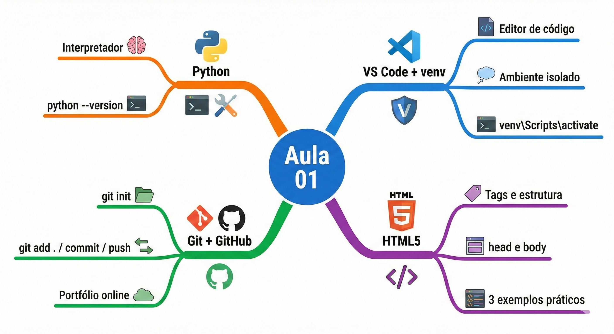

Na próxima aula, você vai instalar o Flask e ver pela primeira vez o Python respondendo requisições do navegador. O `index.html` que você criou hoje vai evoluir para um template dinâmico gerado pelo back-end — e essa será a primeira vez que você verá as três camadas da aplicação web trabalhando juntas.

---

## Referências e Leitura Complementar

O **MDN Web Docs** em `developer.mozilla.org` é a referência oficial para HTML, CSS e JavaScript — gratuito, excelente e com boa cobertura em português. Para Git, o livro **Pro Git** está disponível gratuitamente em `git-scm.com/book/pt-br` e cobre desde o básico até usos avançados, também em português.

---

## 🏆 Conquista da Aula

!!! success "Selo desbloqueado: 🧭 Explorador(a) da Web"
    Você configurou seu primeiro ambiente de desenvolvimento completo, fez seu primeiro commit no Git e escreveu suas primeiras páginas HTML5 válidas. Na próxima aula, o `index.html` que você criou vai ganhar vida: o Flask vai gerar essa página dinamicamente, e você vai ver o back-end e o front-end conversando pela primeira vez.

---

## 🔗 Navegação

➡️ [Próxima Aula: Flask e Bootstrap](Aula_02_Flask_e_Bootstrap.md)

---

## 📋 Gabarito dos Exercícios

Os mini-desafios de "🔎 Verifique seu Entendimento" espalhados ao longo desta aula têm as soluções comentadas reunidas em um único arquivo, organizado por bloco de conteúdo. Tente resolver cada desafio por conta própria antes de conferir.

➡️ [Gabarito — Aula 01](gabaritos/Aula_01_gabarito.md)

---

*Fatec Jahu · ILP951 · Prof. Ronan Adriel Zenatti · 2026*
