# Aula 02 — Flask e Bootstrap

> **Disciplina:** Programação para Internet (ILP951)  
> **Professor:** Ronan Adriel Zenatti  
> **Pré-requisitos:** Aula 01 concluída — Python instalado, VS Code configurado, ambiente virtual criado e ativado, repositório Git funcionando.

---

## 🎯 Objetivos da Aula

Ao final desta aula você deverá ser capaz de:

- **Explicar** a diferença entre uma página estática e uma dinâmica e o papel de um servidor web.
- **Instalar** o Flask com o `pip` e **registrar** as dependências do projeto em `requirements.txt`.
- **Identificar** as três camadas do padrão MVC e como elas se mapeiam em rotas, templates e models no Flask.
- **Criar** uma aplicação Flask com múltiplas rotas, incluindo rotas com variáveis na URL.
- **Separar** o HTML do Python usando `render_template`.
- **Estilizar** as páginas com Bootstrap 5 (navbar, grid, cards, botões e alertas).
- **Organizar e servir** arquivos estáticos próprios (CSS, JavaScript e imagens), sempre referenciados com `url_for('static', filename=...)`.

Na aula anterior você montou o ambiente e escreveu páginas HTML estáticas — arquivos que o navegador lê diretamente do disco, sem nenhuma lógica por trás. Hoje isso muda. Você vai instalar o Flask, entender o que é um servidor web, escrever seu primeiro "Hello World" dinâmico com Python e estilizar a página com Bootstrap. Pela primeira vez, você verá o back-end e o front-end conversando — e esse é o momento em que a programação web começa a fazer sentido de verdade.

---

## 🗺️ Mapa Mental da Aula

Antes de mergulhar no detalhe, veja o mapa dos cinco eixos de hoje. A ideia é criar a "moldura" onde cada conceito vai se encaixar: uma **requisição** chega, o **Flask** encontra a **rota** certa, ela devolve um **template** estilizado com **Bootstrap** e servido junto com os **arquivos estáticos**.

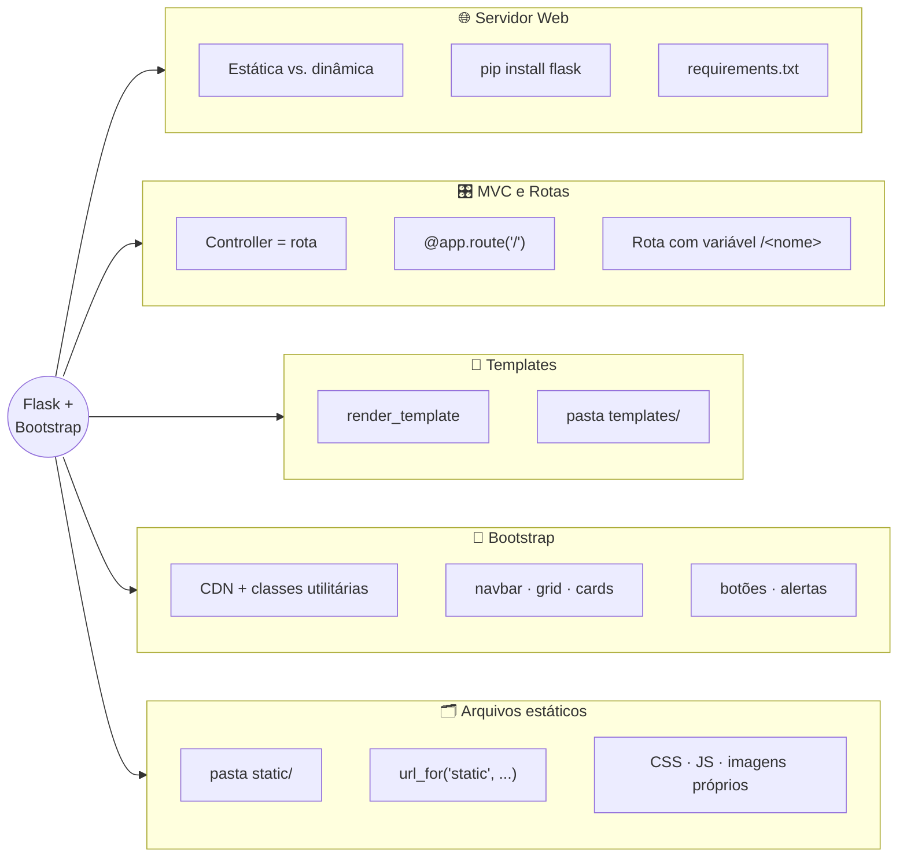

---

## Parte 1 — O que é um servidor web?

### A diferença entre uma página estática e uma dinâmica

Na Aula 01, quando você abriu o `index.html` no navegador, o que aconteceu foi simples: o navegador leu o arquivo do seu disco rígido e exibiu o conteúdo. Não havia nenhum processamento envolvido — o arquivo sempre mostraria a mesma coisa para qualquer pessoa que o abrisse. Isso é uma **página estática**.

Agora pense em um site como o seu banco. Quando você faz login, a página exibe seu nome, seu saldo, suas últimas transações. Essas informações são diferentes para cada usuário e mudam ao longo do tempo. Não é possível escrever isso em um arquivo HTML fixo — o conteúdo precisa ser **gerado no momento em que a página é solicitada**, com base em quem está pedindo e nos dados do banco de dados. Isso é uma **página dinâmica**.

Para gerar páginas dinâmicas, você precisa de um **servidor web**: um programa que fica aguardando pedidos (chamados de requisições) e responde a cada um com o conteúdo adequado, gerado em tempo real pelo código Python.

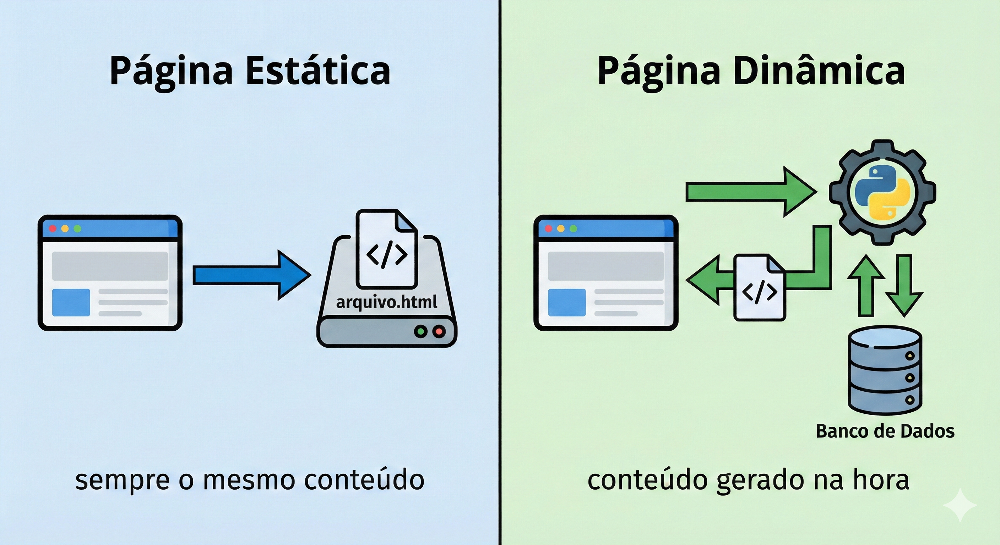

### Como o Flask se encaixa nessa história

O **Flask** é um microframework para Python que transforma o seu script Python em um servidor web. Quando você roda uma aplicação Flask, ela "escuta" em uma porta do seu computador (por padrão, a porta 5000) e responde a qualquer navegador que faça uma requisição para esse endereço.

O "micro" no nome não significa que o Flask é limitado — significa que ele começa enxuto, sem impor estrutura ou dependências desnecessárias. Você adiciona exatamente o que precisa. Isso o torna ideal para aprender, porque você consegue enxergar claramente o que está acontecendo em cada etapa.

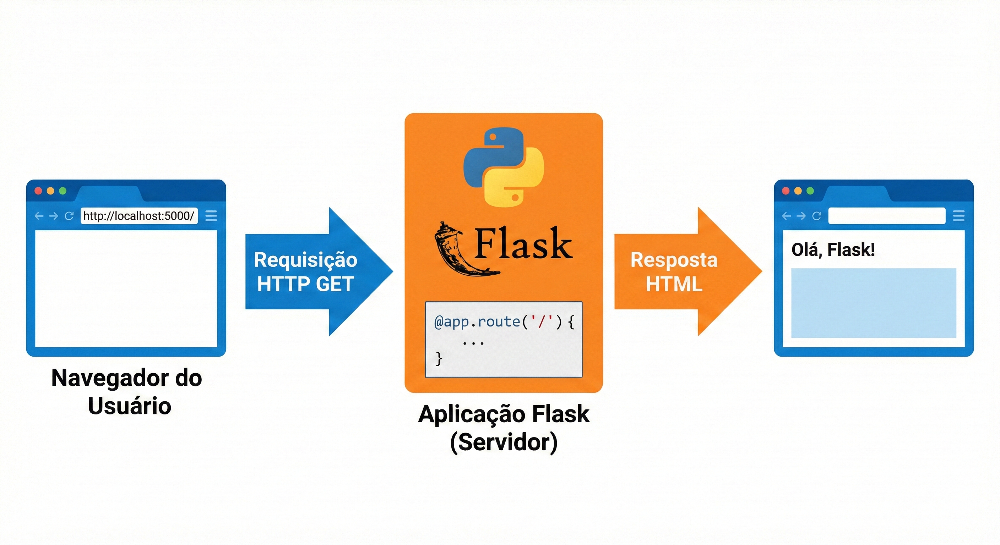

### 🔎 Verifique seu Entendimento

Pense em um assistente de estudos com IA: a tela de "Termos de Uso" é sempre idêntica para todo mundo, mas a tela "Meu histórico de perguntas" muda de aluno para aluno e a cada nova pergunta feita.

**Desafio:** Diga qual das duas telas é estática e qual é dinâmica, e explique em uma frase por que cada uma se encaixa nessa classificação, pensando no que precisa (ou não) ser gerado no momento da requisição.

> 💬 Tente por conta própria antes de seguir. A solução comentada está no gabarito desta aula (link na última seção da página).

---

## Parte 2 — Instalando o Flask

### pip: o instalador de pacotes do Python

O Python vem acompanhado de uma ferramenta chamada **pip** (Package Installer for Python). O pip é para o Python o que a App Store é para um smartphone: um repositório enorme de bibliotecas prontas que você pode instalar com um único comando. O Flask é uma dessas bibliotecas.

Antes de instalar qualquer coisa, verifique que o seu ambiente virtual está ativo. Lembre-se: o terminal deve mostrar o prefixo `(venv)` no início da linha. Se não estiver ativo, navegue até a pasta do projeto e execute `venv\Scripts\activate`.

Com o ambiente virtual ativo, instale o Flask:

```
pip install flask
```

Você verá o pip baixando e instalando o Flask e suas dependências (outras bibliotecas das quais o Flask precisa para funcionar). Quando terminar, confirme a instalação:

```
pip show flask
```

O comando `pip show` exibe informações sobre um pacote instalado — nome, versão, localização. Se você ver essas informações, o Flask está pronto.

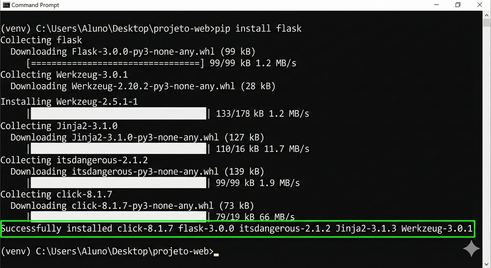

### O arquivo requirements.txt

Existe um problema prático importante: se outra pessoa quiser rodar seu projeto (ou se você mesmo precisar configurar o projeto em outro computador), ela precisará saber quais bibliotecas instalar. O **requirements.txt** é a solução — um arquivo que lista todas as dependências do projeto com suas versões.

Gere-o com um único comando:

```
pip freeze > requirements.txt
```

O comando `pip freeze` lista todos os pacotes instalados no ambiente virtual. O `>` redireciona essa saída para dentro do arquivo `requirements.txt`, criando-o automaticamente. Para instalar todas as dependências listadas em outro computador, basta executar `pip install -r requirements.txt`.

Faça um commit com essa adição:

```
git add requirements.txt
git commit -m "Aula 02: Flask instalado, requirements.txt gerado"
```

### 🔎 Verifique seu Entendimento

Você está montando o ambiente de um protótipo de app de bike-sharing e, além do Flask, também vai precisar da biblioteca `requests` (usada mais adiante para consultar serviços externos, como um mapa de estações).

**Desafio:** Escreva a sequência completa de comandos para instalar o `requests`, regravar o `requirements.txt` incluindo essa nova dependência, e commitar essa mudança no Git com uma mensagem adequada.

> 💬 Tente por conta própria antes de seguir. A solução comentada está no gabarito desta aula (link na última seção da página).

---

## Parte 3 — O padrão MVC: entendendo a arquitetura antes de codificar

Antes de escrever o primeiro código Flask, é fundamental entender o padrão arquitetural que estará por trás de toda a aplicação que vamos construir. Esse padrão se chama **MVC** — Model, View, Controller (Modelo, Visão e Controlador).

Pense em um restaurante. O **garçom** recebe o pedido do cliente e o leva para a cozinha — ele é o ponto de contato, sabe o que está disponível no cardápio e direciona os pedidos. A **cozinha** processa o pedido, prepara o prato com os ingredientes do **estoque**. O **prato finalizado** é o que chega à mesa do cliente.

No MVC: o **Controller** é o garçom — recebe as requisições do navegador e decide o que fazer com elas. O **Model** é a cozinha com o estoque — representa os dados e a lógica de negócio, geralmente conectada ao banco de dados. A **View** é o prato finalizado — o HTML que será apresentado ao usuário, montado com os dados fornecidos pelo Controller.

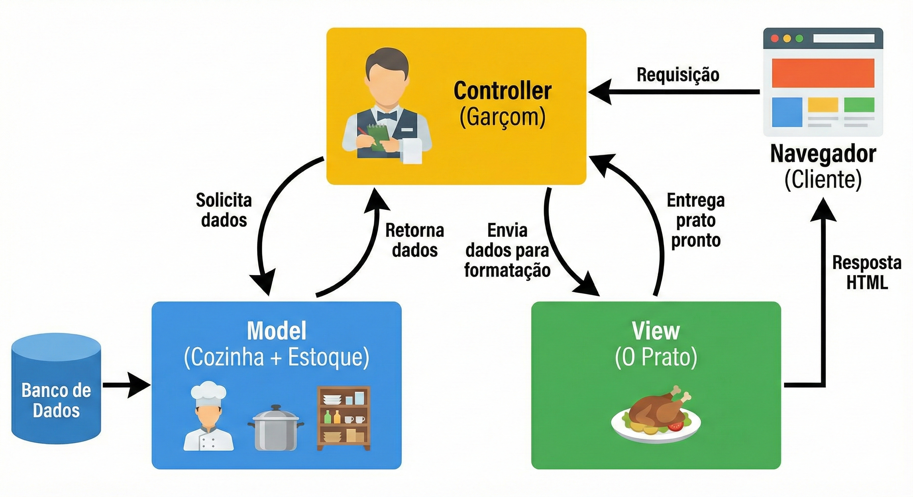

No Flask, essa separação fica assim: as **rotas** (funções Python decoradas com `@app.route`) são os Controllers. Os **templates HTML** (arquivos na pasta `templates/`) são as Views. Os **modelos de dados** (que criaremos a partir da Aula 05) são os Models. Hoje vamos trabalhar com Controllers e Views — o Model entra na Aula 05 quando conectarmos ao banco de dados.

### 🔎 Verifique seu Entendimento

Pense em um app de agendamento de coleta seletiva de bairro, construído em Flask.

**Desafio:** Sem escrever código, descreva em uma frase cada o que seria o Controller, a View e o Model desse app — aplicando a analogia do garçom, da cozinha e do prato a esse cenário específico, não à definição genérica de MVC.

> 💬 Tente por conta própria antes de seguir. A solução comentada está no gabarito desta aula (link na última seção da página).

---

## Parte 4 — A estrutura de pastas do projeto Flask

Antes de escrever código, vamos organizar a estrutura de pastas que usaremos. Uma boa estrutura facilita a manutenção do projeto à medida que ele cresce.

```
projeto-web/
│
├── app.py                  ← arquivo principal: inicia o servidor Flask
├── requirements.txt        ← lista de dependências
├── .gitignore              ← arquivos que o Git deve ignorar
├── venv/                   ← ambiente virtual (ignorado pelo Git)
│
├── templates/              ← arquivos HTML (as Views do MVC)
│   └── index.html
│
└── static/                 ← arquivos estáticos (CSS, JS, imagens)
    ├── css/
    ├── js/
    └── imgs/
```

A pasta `templates/` é especial para o Flask: por padrão, ele procura os arquivos HTML exatamente lá. Da mesma forma, `static/` é onde ficam os arquivos que não mudam — folhas de estilo, scripts JavaScript e imagens. Crie essa estrutura agora:

```
mkdir templates
mkdir static
mkdir static\css
mkdir static\js
mkdir static\imgs
```

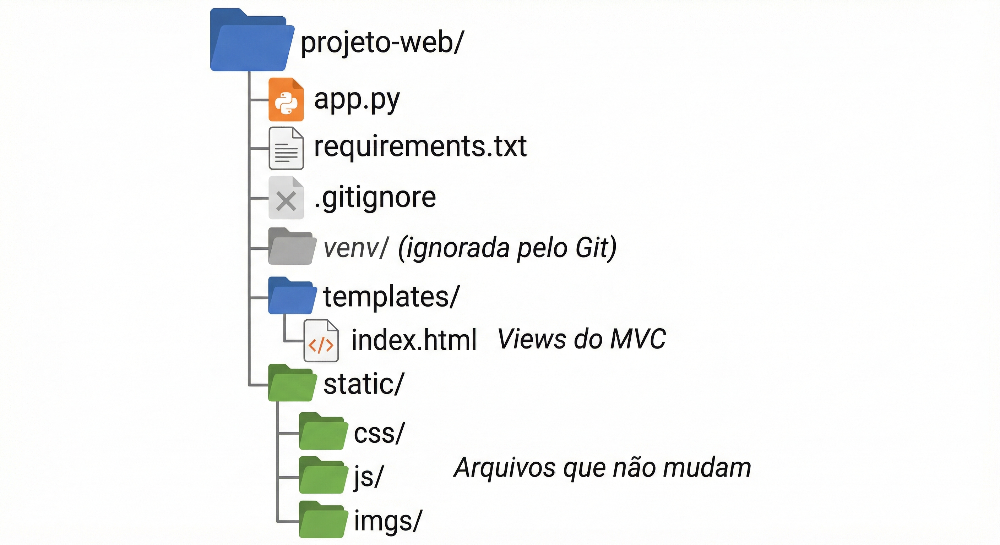

### 🔎 Verifique seu Entendimento

Você vai organizar, do zero, a estrutura de pastas do projeto de uma pequena loja on-line de um criador de conteúdo local.

**Desafio:** Escreva a sequência de comandos `mkdir` para criar, dentro da pasta do projeto, as pastas `templates/`, `static/`, `static/css`, `static/js` e `static/imgs` — na mesma estrutura que você acabou de ver.

> 💬 Tente por conta própria antes de seguir. A solução comentada está no gabarito desta aula (link na última seção da página).

---

## Parte 5 — Primeiro Hello World com Flask

Chegou o momento. Vamos escrever o primeiro arquivo Python que transforma o seu computador em um servidor web.

### Entendendo o código antes de escrevê-lo

Há quatro conceitos novos neste primeiro arquivo que merecem explicação antes do código em si.

O primeiro é a **importação**. Em Python, quando você quer usar uma biblioteca externa, precisa importá-la no topo do arquivo. É como pegar um livro da estante antes de começar a ler — você traz o que precisa para perto.

O segundo é a **instância da aplicação**. Toda aplicação Flask começa criando um objeto `app` a partir da classe `Flask`. Esse objeto é o coração da aplicação — ele conhece todas as rotas, todas as configurações e é responsável por receber as requisições.

O terceiro é o **decorador de rota** (`@app.route`). Um decorador é uma instrução especial do Python que fica na linha imediatamente acima de uma função e modifica seu comportamento. O `@app.route('/')` diz ao Flask: "quando alguém acessar o endereço `/`, execute a função logo abaixo". A barra `/` representa a raiz do site — o endereço principal.

O quarto é o **`if __name__ == '__main__'`**. Essa é uma convenção do Python: o bloco dentro desse `if` só é executado quando você roda o arquivo diretamente (com `python app.py`), e não quando ele é importado por outro arquivo. O `debug=True` ativa o modo de desenvolvimento, que recarrega automaticamente o servidor cada vez que você salva uma mudança no código — essencial durante o desenvolvimento.

### Exemplo prático 1 — O Hello World mais simples possível

Crie o arquivo `app.py` na raiz do projeto com o seguinte conteúdo:

```python
# Importa a classe Flask da biblioteca flask
# Sem essa linha, o Python não sabe o que é "Flask"
from flask import Flask

# Cria a instância da aplicação Flask
# __name__ é uma variável especial do Python que contém o nome do módulo atual
# O Flask usa isso para saber onde procurar os templates e arquivos estáticos
app = Flask(__name__)


# O decorador @app.route define qual URL aciona esta função
# '/' é a rota raiz — o endereço principal do site (ex: http://localhost:5000/)
@app.route('/')
def pagina_inicial():
    # Esta função retorna o que o navegador vai receber como resposta
    # Por enquanto, retornamos uma string HTML simples
    return '<h1>Olá, mundo!</h1><p>Meu primeiro servidor Flask está funcionando.</p>'


# Bloco de execução: só roda quando o arquivo é executado diretamente
if __name__ == '__main__':
    # debug=True ativa o recarregamento automático ao salvar o arquivo
    # NUNCA use debug=True em produção (servidor público)
    app.run(debug=True)
```

Com o ambiente virtual ativo e o terminal dentro da pasta `projeto-web`, execute:

```
python app.py
```

Você verá uma saída como esta:

```
 * Serving Flask app 'app'
 * Debug mode: on
 * Running on http://127.0.0.1:5000
Press CTRL+C to quit
```

Abra o navegador e acesse **http://127.0.0.1:5000** (ou **http://localhost:5000** — são equivalentes). Você verá o "Olá, mundo!" gerado pelo Python. Isso é histórico: pela primeira vez, o Python está respondendo ao seu navegador.

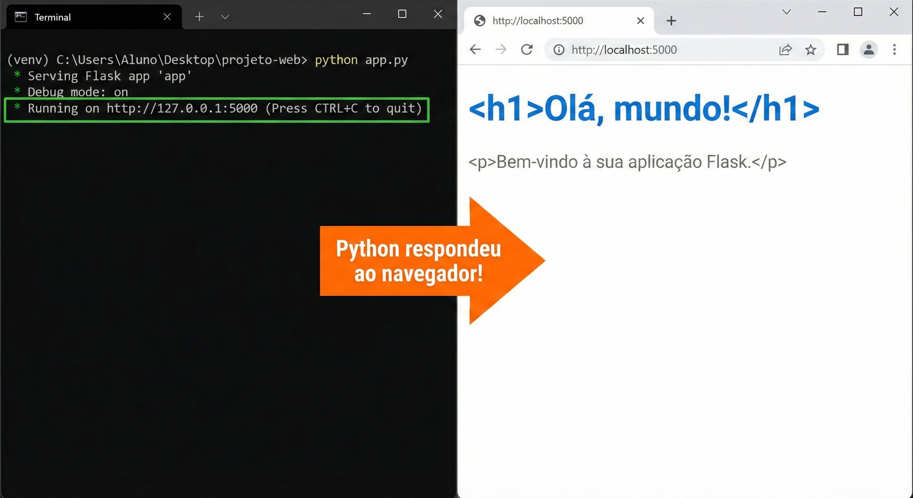

> 💡 **O que é localhost?** O endereço `127.0.0.1` (ou `localhost`) é um endereço especial que significa "este computador". Quando você acessa `localhost:5000`, o navegador está se comunicando com um servidor que está rodando no seu próprio computador — por isso ele é chamado de servidor de desenvolvimento.

> ⚠️ **Para parar o servidor:** pressione `CTRL + C` no terminal. O servidor para imediatamente. Para reiniciá-lo, execute `python app.py` novamente.

### Exemplo prático 2 — Múltiplas rotas

Uma aplicação web real tem várias páginas. Cada página corresponde a uma rota diferente no Flask. Vamos expandir o `app.py` para ter três rotas:

```python
from flask import Flask

app = Flask(__name__)


@app.route('/')
def pagina_inicial():
    # Rota raiz: exibida quando o usuário acessa http://localhost:5000/
    return '''
        <h1>Sistema de Gestão</h1>
        <p>Bem-vindo ao sistema.</p>
        <a href="/sobre">Sobre o sistema</a> |
        <a href="/contato">Contato</a>
    '''
    # Observe que usamos três aspas (''') para strings de múltiplas linhas em Python
    # Isso permite quebrar o HTML em várias linhas sem concatenação


@app.route('/sobre')
def sobre():
    # Rota /sobre: http://localhost:5000/sobre
    return '''
        <h1>Sobre o Sistema</h1>
        <p>Este sistema foi desenvolvido na disciplina Programação para Internet.</p>
        <a href="/">Voltar ao início</a>
    '''


@app.route('/contato')
def contato():
    # Rota /contato: http://localhost:5000/contato
    return '''
        <h1>Contato</h1>
        <p>Professor: Ronan Adriel Zenatti</p>
        <p>FATEC Jahu — Gestão da Tecnologia da Informação</p>
        <a href="/">Voltar ao início</a>
    '''


if __name__ == '__main__':
    app.run(debug=True)
```

Salve o arquivo. Como o `debug=True` está ativo, o servidor recarregará automaticamente. Acesse as três rotas no navegador e observe como a URL muda e cada função retorna um conteúdo diferente.

### Exemplo prático 3 — Rota com variável na URL

As rotas não precisam ser fixas. É possível criar rotas que aceitam partes variáveis na URL — como o ID de um produto ou o nome de um usuário. Adicione esta rota ao `app.py`:

```python
@app.route('/usuario/<nome>')
def perfil_usuario(nome):
    # <nome> na rota captura qualquer texto nessa posição da URL
    # Esse valor é passado automaticamente como parâmetro para a função
    # Exemplo: acessar /usuario/joao passa nome='joao' para esta função
    return f'<h1>Perfil do usuário: {nome}</h1><p>Olá, {nome}! Sua conta está ativa.</p>'
    # O 'f' antes das aspas cria uma f-string: permite inserir variáveis
    # Python diretamente no texto usando chaves {}
```

Acesse `http://localhost:5000/usuario/joao` e depois `http://localhost:5000/usuario/maria`. Veja como a página muda conforme o que está na URL. Esse mecanismo é fundamental — é assim que sistemas exibem páginas de perfil, detalhes de produtos, etc.

### 🔎 Verifique seu Entendimento

Um app de estudos com IA precisa mostrar, para cada aluno, quantos créditos de uso de IA generativa ele ainda tem disponíveis hoje.

**Desafio:** Adicione ao `app.py` uma nova rota `/creditos/<usuario>` que recebe o nome do usuário pela URL e devolve uma mensagem como "joao ainda tem 12 créditos de IA hoje" (o número pode ser fixo por enquanto).

> 💬 Tente por conta própria antes de seguir. A solução comentada está no gabarito desta aula (link na última seção da página).

---

## Parte 6 — Templates: separando o HTML do Python

### Por que misturar HTML no Python é um problema

Nos exemplos anteriores, o HTML estava escrito diretamente dentro das funções Python — dentro de strings. Isso funciona para exemplos simples, mas em um projeto real causa sérios problemas: páginas HTML têm centenas de linhas, e misturá-las com código Python torna ambos ilegíveis. Imagine tentar fazer manutenção em um arquivo com 500 linhas misturando Python e HTML desordenadamente.

A solução do Flask para isso são os **templates** — arquivos HTML separados que ficam na pasta `templates/`, com uma capacidade especial: eles podem receber variáveis do Python e exibi-las dinamicamente. O motor de templates que o Flask usa se chama **Jinja2**, e estudaremos ele com profundidade na Aula 03. Por agora, vamos aprender a usar a função `render_template`, que carrega um arquivo HTML da pasta `templates/` e o envia ao navegador.

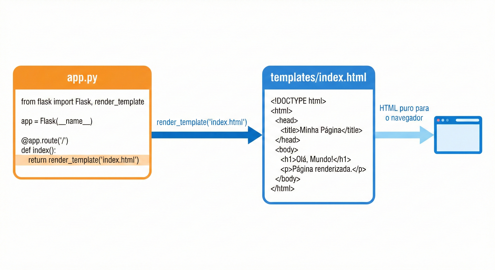

### Usando render_template

Crie o arquivo `templates/index.html` com este conteúdo:

```html
<!DOCTYPE html>
<html lang="pt-BR">
<head>
  <meta charset="UTF-8">
  <meta name="viewport" content="width=device-width, initial-scale=1.0">
  <title>Sistema de Gestão</title>
</head>
<body>
  <h1>Sistema de Gestão</h1>
  <p>Bem-vindo ao sistema desenvolvido com Flask.</p>
  <nav>
    <a href="/">Início</a> |
    <a href="/sobre">Sobre</a> |
    <a href="/contato">Contato</a>
  </nav>
</body>
</html>
```

Agora atualize o `app.py` para usar `render_template` em vez de retornar HTML em string:

```python
# Importa Flask e também a função render_template
from flask import Flask, render_template

app = Flask(__name__)


@app.route('/')
def pagina_inicial():
    # render_template busca o arquivo na pasta templates/
    # e retorna seu conteúdo como resposta HTTP
    return render_template('index.html')


@app.route('/sobre')
def sobre():
    return render_template('sobre.html')


@app.route('/contato')
def contato():
    return render_template('contato.html')


if __name__ == '__main__':
    app.run(debug=True)
```

Crie também os arquivos `templates/sobre.html` e `templates/contato.html` com estrutura HTML5 válida e conteúdo adequado. O código Python ficou muito mais limpo, e o HTML ficou em arquivos próprios onde pode ser editado com toda a ajuda do VS Code (autocompletar, validação de tags, etc.).

### 🔎 Verifique seu Entendimento

Um app de mobilidade urbana precisa de uma página `/rota-ativa` anunciando qual linha de ônibus elétrico está circulando no momento.

**Desafio:** Crie o arquivo `templates/rota_ativa.html` com uma estrutura HTML5 simples anunciando a linha, e uma rota `/rota-ativa` no `app.py` que usa `render_template` para servi-lo — nos mesmos moldes do que você acabou de fazer com `index.html`.

> 💬 Tente por conta própria antes de seguir. A solução comentada está no gabarito desta aula (link na última seção da página).

---

## Parte 7 — Bootstrap: estilizando sem escrever CSS do zero

### O problema do CSS puro para iniciantes

Até aqui, todas as nossas páginas estão com a aparência padrão do navegador — fundo branco, texto preto, fonte serifada, sem nenhum layout. Criar um design profissional do zero com CSS puro exige conhecimento profundo de estilos, responsividade, flexbox, grid e dezenas de outros conceitos. Isso não é o foco desta disciplina.

O **Bootstrap** resolve isso fornecendo um conjunto de estilos e componentes prontos que você ativa simplesmente adicionando classes CSS específicas nos seus elementos HTML. Com Bootstrap, você consegue criar uma página com aparência profissional e que funciona bem em celular e computador em questão de minutos.

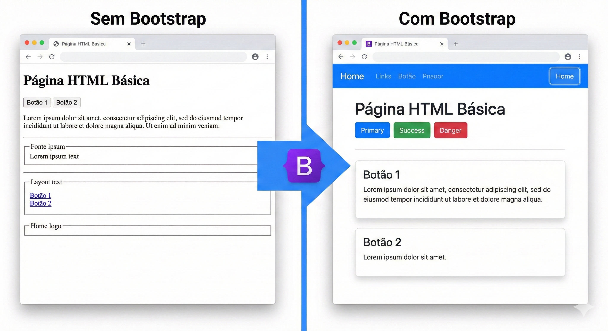

### Como incluir o Bootstrap via CDN

Existem duas formas de usar o Bootstrap: baixando os arquivos ou usando um **CDN** (Content Delivery Network — uma rede de servidores que hospeda bibliotecas populares para uso público). Usaremos o CDN por ser mais simples: basta adicionar uma linha de `<link>` no `<head>` do HTML.

A linha a seguir adiciona o Bootstrap 5 à sua página:

```html
<link href="https://cdn.jsdelivr.net/npm/bootstrap@5.3.0/dist/css/bootstrap.min.css"
      rel="stylesheet">
```

E opcionalmente, no final do `<body>`, o JavaScript do Bootstrap (necessário para componentes interativos como menus e modais):

```html
<script src="https://cdn.jsdelivr.net/npm/bootstrap@5.3.0/dist/js/bootstrap.bundle.min.js">
</script>
```

> 💡 **CDN vs. arquivo local:** usar o CDN significa que o computador do usuário precisa ter acesso à internet para carregar o Bootstrap. Em produção isso é ótimo (os arquivos são servidos rapidamente de servidores otimizados ao redor do mundo). Em desenvolvimento, se você estiver sem internet, o Bootstrap não carregará. Para o laboratório, sempre haverá conexão disponível.

### As classes utilitárias do Bootstrap

O Bootstrap funciona com **classes CSS utilitárias** — nomes predefinidos que, quando adicionados ao atributo `class` de um elemento HTML, aplicam estilos automaticamente. Você não escreve CSS, você escolhe classes. Veja como isso funciona na prática antes de ver o código completo.

### Exemplo prático 1 — Página simples com Bootstrap

Vamos reescrever o `templates/index.html` usando Bootstrap. Observe como as classes mudam completamente a aparência:

```html
<!DOCTYPE html>
<html lang="pt-BR">
<head>
  <meta charset="UTF-8">
  <meta name="viewport" content="width=device-width, initial-scale=1.0">
  <title>Sistema de Gestão</title>

  <!-- Bootstrap CSS via CDN: carrega todos os estilos do Bootstrap -->
  <link href="https://cdn.jsdelivr.net/npm/bootstrap@5.3.0/dist/css/bootstrap.min.css"
        rel="stylesheet">
</head>
<body>

  <!-- container: classe Bootstrap que centraliza o conteúdo e adiciona margens laterais -->
  <!-- mt-5: "margin-top 5" — adiciona espaço acima do elemento -->
  <div class="container mt-5">

    <!-- display-4: classe Bootstrap para títulos grandes e elegantes -->
    <h1 class="display-4">Sistema de Gestão</h1>

    <!-- lead: texto de introdução levemente maior e mais claro -->
    <p class="lead">Bem-vindo ao sistema desenvolvido na disciplina Programação para Internet.</p>

    <!-- hr: linha horizontal divisória -->
    <hr>

    <!-- d-flex gap-2: exibe os botões lado a lado com espaço entre eles -->
    <div class="d-flex gap-2">

      <!-- btn btn-primary: botão azul padrão do Bootstrap -->
      <a href="/" class="btn btn-primary">Início</a>

      <!-- btn btn-secondary: botão cinza -->
      <a href="/sobre" class="btn btn-secondary">Sobre</a>

      <!-- btn btn-outline-dark: botão com apenas borda, sem preenchimento -->
      <a href="/contato" class="btn btn-outline-dark">Contato</a>

    </div>

  </div>

  <!-- Bootstrap JS: necessário para componentes interativos (menus, modais, etc.) -->
  <script src="https://cdn.jsdelivr.net/npm/bootstrap@5.3.0/dist/js/bootstrap.bundle.min.js">
  </script>

</body>
</html>
```

Salve e acesse o navegador. A diferença em relação à versão sem Bootstrap é imediata — tipografia melhorada, botões estilizados, margens adequadas.

### Exemplo prático 2 — Navbar de navegação

A **navbar** é um dos componentes mais usados do Bootstrap — a barra de navegação no topo da página. Ela é responsiva: em telas grandes aparece como barra horizontal, e em celulares colapsa para um menu hamburguer. Vamos montá-la aos poucos, para você enxergar o que cada pedaço faz.

**Passo 1 — a barra e a marca.** Logo depois da tag `<body>` do `templates/index.html`, coloque só o esqueleto da navbar com o nome do sistema:

```html
<!-- navbar-expand-lg: em telas grandes (lg) a navbar fica expandida; em telas menores, colapsa -->
<!-- navbar-dark bg-dark: texto claro sobre fundo escuro -->
<nav class="navbar navbar-expand-lg navbar-dark bg-dark">
  <div class="container">
    <!-- navbar-brand: o "logo" ou nome da aplicação à esquerda -->
    <a class="navbar-brand" href="/">SistemaGestão</a>
  </div>
</nav>
```

Salve e recarregue. Note que já surge uma barra escura no topo, ocupando toda a largura, com o nome do sistema à esquerda — mas ainda sem links.

**Passo 2 — o botão hamburguer e o primeiro link.** Dentro do `<div class="container">`, logo depois do `navbar-brand`, acrescente o botão que aparece só em telas pequenas e o contêiner colapsável com um link:

```html
<!-- navbar-toggler: o botão hamburguer que aparece em telas pequenas -->
<!-- data-bs-toggle e data-bs-target: conectam o botão ao menu colapsável -->
<button class="navbar-toggler" type="button"
        data-bs-toggle="collapse" data-bs-target="#navbarNav">
  <span class="navbar-toggler-icon"></span>
</button>

<!-- collapse navbar-collapse: o conjunto de links que colapsa em telas pequenas -->
<!-- id="navbarNav": deve bater com o data-bs-target do botão acima -->
<div class="collapse navbar-collapse" id="navbarNav">
  <!-- navbar-nav ms-auto: lista de links, ms-auto empurra para a direita -->
  <ul class="navbar-nav ms-auto">
    <li class="nav-item">
      <!-- nav-link active: link ativo (página atual) fica destacado -->
      <a class="nav-link active" href="/">Início</a>
    </li>
  </ul>
</div>
```

Salve e recarregue. Em uma janela larga o link "Início" aparece à direita. Agora **estreite a janela do navegador** até ela ficar bem fina: note que o link some e surge o ícone de três tracinhos. Clique nele — o menu se abre e fecha. Esse comportamento responsivo é do Bootstrap; você não escreveu uma linha de JavaScript.

**Passo 3 — os demais links.** Dentro do mesmo `<ul>`, depois do item "Início", adicione mais dois itens:

```html
<li class="nav-item">
  <a class="nav-link" href="/sobre">Sobre</a>
</li>
<li class="nav-item">
  <a class="nav-link" href="/contato">Contato</a>
</li>
```

Salve, recarregue e confira os três links lado a lado.

**Passo 4 — o conteúdo principal.** Abaixo da tag `</nav>` (fora dela), adicione o conteúdo da página com um alerta e um botão grande:

```html
<!-- Conteúdo principal da página -->
<div class="container mt-5">
  <h1 class="display-4">Bem-vindo</h1>
  <p class="lead">
    Este é o sistema desenvolvido ao longo do semestre na disciplina
    Programação para Internet — FATEC Jahu.
  </p>

  <!-- alert alert-info: caixa de informação azul -->
  <div class="alert alert-info">
    <strong>Aula 02:</strong> Flask e Bootstrap funcionando juntos!
  </div>

  <a href="/sobre" class="btn btn-primary btn-lg">Saiba Mais</a>
</div>
```

Salve e recarregue: a caixa azul de `alert-info` destaca o aviso e o botão grande (`btn-lg`) convida ao próximo passo.

**Consolidação.** Juntando os quatro passos — e adicionando o `<script>` do Bootstrap no fim do `<body>` —, o `templates/index.html` completo desta etapa fica assim:

```html
<!DOCTYPE html>
<html lang="pt-BR">
<head>
  <meta charset="UTF-8">
  <meta name="viewport" content="width=device-width, initial-scale=1.0">
  <title>Sistema de Gestão</title>
  <link href="https://cdn.jsdelivr.net/npm/bootstrap@5.3.0/dist/css/bootstrap.min.css"
        rel="stylesheet">
</head>
<body>

  <!-- navbar: barra de navegação -->
  <!-- navbar-expand-lg: em telas grandes (lg) a navbar fica expandida; em telas menores, colapsa -->
  <!-- navbar-dark bg-dark: texto claro sobre fundo escuro -->
  <nav class="navbar navbar-expand-lg navbar-dark bg-dark">

    <!-- container: centraliza o conteúdo da navbar -->
    <div class="container">

      <!-- navbar-brand: o "logo" ou nome da aplicação à esquerda -->
      <a class="navbar-brand" href="/">SistemaGestão</a>

      <!-- navbar-toggler: o botão hamburguer que aparece em telas pequenas -->
      <!-- data-bs-toggle e data-bs-target: conectam o botão ao menu colapsável -->
      <button class="navbar-toggler" type="button"
              data-bs-toggle="collapse" data-bs-target="#navbarNav">
        <span class="navbar-toggler-icon"></span>
      </button>

      <!-- collapse navbar-collapse: o conjunto de links que colapsa em telas pequenas -->
      <!-- id="navbarNav": deve bater com o data-bs-target do botão acima -->
      <div class="collapse navbar-collapse" id="navbarNav">

        <!-- navbar-nav ms-auto: lista de links, ms-auto empurra para a direita -->
        <ul class="navbar-nav ms-auto">
          <li class="nav-item">
            <!-- nav-link active: link ativo (página atual) fica destacado -->
            <a class="nav-link active" href="/">Início</a>
          </li>
          <li class="nav-item">
            <a class="nav-link" href="/sobre">Sobre</a>
          </li>
          <li class="nav-item">
            <a class="nav-link" href="/contato">Contato</a>
          </li>
        </ul>

      </div>
    </div>
  </nav>

  <!-- Conteúdo principal da página -->
  <div class="container mt-5">
    <h1 class="display-4">Bem-vindo</h1>
    <p class="lead">
      Este é o sistema desenvolvido ao longo do semestre na disciplina
      Programação para Internet — FATEC Jahu.
    </p>

    <!-- alert alert-info: caixa de informação azul -->
    <div class="alert alert-info">
      <strong>Aula 02:</strong> Flask e Bootstrap funcionando juntos!
    </div>

    <a href="/sobre" class="btn btn-primary btn-lg">Saiba Mais</a>
  </div>

  <script src="https://cdn.jsdelivr.net/npm/bootstrap@5.3.0/dist/js/bootstrap.bundle.min.js">
  </script>

</body>
</html>
```

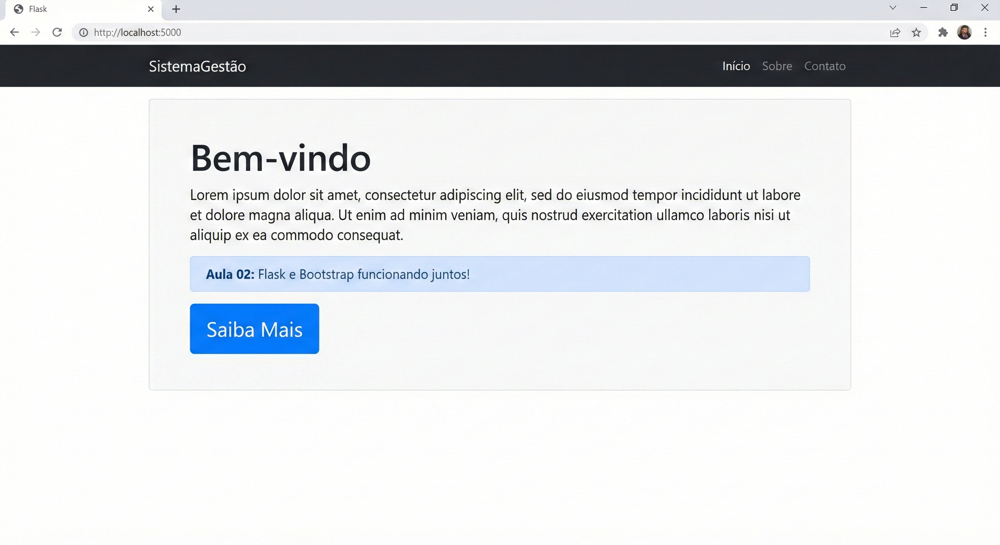

### Exemplo prático 3 — Grid e Cards

O **sistema de grid** é um dos recursos mais poderosos do Bootstrap. Ele divide a linha em 12 colunas, permitindo que você controle com precisão como o conteúdo se distribui em telas de diferentes tamanhos. Os **cards** são componentes versáteis para exibir informações agrupadas — com título, texto, imagem e botões.

Crie um arquivo `templates/sobre.html`:

```html
<!DOCTYPE html>
<html lang="pt-BR">
<head>
  <meta charset="UTF-8">
  <meta name="viewport" content="width=device-width, initial-scale=1.0">
  <title>Sobre — Sistema de Gestão</title>
  <link href="https://cdn.jsdelivr.net/npm/bootstrap@5.3.0/dist/css/bootstrap.min.css"
        rel="stylesheet">
</head>
<body>

  <nav class="navbar navbar-expand-lg navbar-dark bg-dark">
    <div class="container">
      <a class="navbar-brand" href="/">SistemaGestão</a>
    </div>
  </nav>

  <div class="container mt-5">

    <h2 class="mb-4">Tecnologias Utilizadas</h2>

    <!-- row: uma linha do sistema de grid do Bootstrap -->
    <div class="row">

      <!-- col-md-4: em telas médias (md) ou maiores, cada card ocupa 4 colunas
           (4 + 4 + 4 = 12 — três colunas iguais lado a lado)
           Em telas pequenas (celular), cada card ocupa a linha inteira -->
      <div class="col-md-4 mb-4">
        <!-- card: componente Bootstrap para conteúdo agrupado -->
        <div class="card h-100">
          <!-- card-body: área interna do card com padding automático -->
          <div class="card-body">
            <!-- card-title: título do card em negrito -->
            <h5 class="card-title">🐍 Python + Flask</h5>
            <!-- card-text: texto descritivo do card -->
            <p class="card-text">
              Linguagem de programação e microframework responsáveis pelo
              back-end da aplicação — processamento das requisições e lógica
              de negócio.
            </p>
          </div>
        </div>
      </div>

      <div class="col-md-4 mb-4">
        <div class="card h-100">
          <div class="card-body">
            <h5 class="card-title">🎨 Bootstrap 5</h5>
            <p class="card-text">
              Framework CSS que fornece componentes visuais prontos e um
              sistema de grid responsivo, permitindo criar interfaces
              profissionais rapidamente.
            </p>
          </div>
        </div>
      </div>

      <div class="col-md-4 mb-4">
        <div class="card h-100">
          <div class="card-body">
            <h5 class="card-title">🗄️ MySQL</h5>
            <p class="card-text">
              Sistema de banco de dados relacional onde serão armazenados
              todos os dados da aplicação — usuários, registros e
              informações gerenciais.
            </p>
          </div>
        </div>
      </div>

    </div>
    <!-- Fim da row -->

    <a href="/" class="btn btn-secondary">← Voltar</a>

  </div>

  <script src="https://cdn.jsdelivr.net/npm/bootstrap@5.3.0/dist/js/bootstrap.bundle.min.js">
  </script>

</body>
</html>
```

### 🔎 Verifique seu Entendimento

A página `/sobre` do seu projeto agora vai anunciar também um evento: o show de encerramento de um festival de música de 2026 que a equipe está patrocinando.

**Desafio:** Adicione um quarto `card` Bootstrap à `<div class="row">` de `sobre.html`, na mesma estrutura `col-md-4` / `card` / `card-body` / `card-title` / `card-text` dos três já existentes, anunciando esse evento.

> 💬 Tente por conta própria antes de seguir. A solução comentada está no gabarito desta aula (link na última seção da página).

---

## Parte 8 — O sistema de grid em detalhes

O grid do Bootstrap divide cada linha em 12 colunas. Você controla quantas colunas cada elemento ocupa adicionando classes como `col-4` (4 de 12 = um terço da largura) ou `col-6` (6 de 12 = metade da largura). O prefixo indica o breakpoint (tamanho de tela) a partir do qual a regra se aplica.

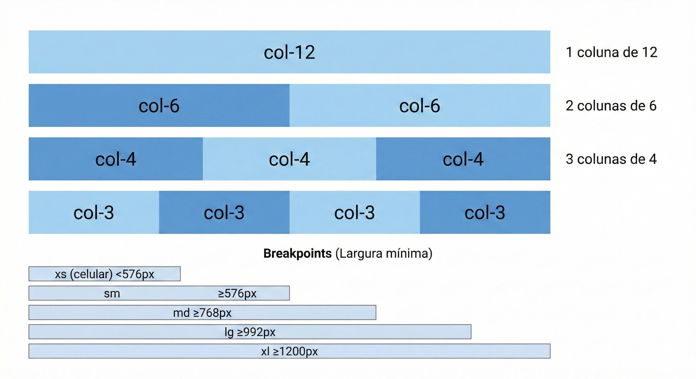

A tabela abaixo resume os breakpoints — os pontos de quebra onde o layout muda conforme o tamanho da tela:

| Prefixo | Tela | Largura mínima | Uso típico |
|---------|------|----------------|------------|
| (nenhum) | Todas | 0px | Mobile first |
| `sm` | Small | 576px | Celular grande |
| `md` | Medium | 768px | Tablet |
| `lg` | Large | 992px | Notebook |
| `xl` | Extra large | 1200px | Desktop |

Então quando você escreve `col-md-4`, está dizendo: "em telas médias ou maiores, ocupe 4 colunas; em telas menores que md, ocupe a linha inteira (comportamento padrão)". Isso é o que torna o Bootstrap responsivo sem que você escreva media queries manualmente.

### 🔎 Verifique seu Entendimento

Um painel de consumo de energia solar residencial precisa mostrar 4 indicadores (cards) lado a lado em telas grandes, 2 por linha em tablets, e 1 por linha no celular.

**Desafio:** Usando a tabela de breakpoints que você acabou de ver, escreva a combinação de classes `col-*` que cada card deve receber para atingir exatamente esse comportamento responsivo.

> 💬 Tente por conta própria antes de seguir. A solução comentada está no gabarito desta aula (link na última seção da página).

---

## Parte 9 — Arquivos estáticos: imagens, CSS e JavaScript próprios

### Por que a pasta `static/` existe

Até agora você usou o Bootstrap via CDN — os arquivos CSS e JS vêm da internet. Mas em qualquer projeto real você vai precisar de recursos próprios: um logotipo da empresa, um CSS personalizado para ajustar cores e fontes, ou um script JavaScript específico para alguma funcionalidade. Esses recursos ficam todos na pasta `static/`.

O Flask serve automaticamente qualquer arquivo que esteja em `static/` — basta referenciar o caminho correto. O que diferencia essa pasta das demais é que o Flask não a processa: arquivos lá são entregues ao navegador exatamente como estão, sem nenhuma transformação. São os chamados **arquivos estáticos**.

A estrutura recomendada dentro de `static/` organiza cada tipo de arquivo em sua própria subpasta:

```
static/
├── css/
│   └── estilo.css       ← seus estilos personalizados
├── js/
│   └── scripts.js       ← seu código JavaScript próprio
└── imgs/
    ├── logo.png         ← logotipo do sistema
    └── banner.jpg       ← outras imagens
```

### A função url_for com arquivos estáticos

A forma correta de referenciar um arquivo estático em um template Flask é usando a função `url_for` com o endpoint especial `'static'` e o parâmetro `filename` indicando o caminho **relativo à pasta `static/`**:

```html
<!-- Sintaxe geral -->
{{ url_for('static', filename='subpasta/arquivo.extensao') }}

<!-- Exemplos concretos -->
{{ url_for('static', filename='css/estilo.css') }}
{{ url_for('static', filename='js/scripts.js') }}
{{ url_for('static', filename='imgs/logo.png') }}
```

> ⚠️ **Por que não usar o caminho direto?** Você poderia escrever `href="/static/css/estilo.css"` e funcionaria na maioria dos casos. Mas se um dia você mover a aplicação para uma subpasta (ex: `http://servidor.com/meu-sistema/`), todos os caminhos absolutos quebrariam. O `url_for` ajusta o caminho automaticamente conforme o contexto da aplicação — sempre use-o.

### Exemplo prático 4 — CSS personalizado

Vamos criar um arquivo de estilos próprios que se somam ao Bootstrap. Em vez de colar tudo de uma vez, vamos escrever uma regra por vez e recarregar a página a cada passo para ver o efeito nascer.

**Passo 1 — variáveis de cor e a navbar.** Crie o arquivo `static/css/estilo.css` começando só com as variáveis e a regra da navbar:

```css
/* static/css/estilo.css */
/* Estilos personalizados do Sistema de Gestão */
/* Estes estilos complementam o Bootstrap — nunca substituem */

/* ── Variáveis de cor do sistema ─────────────────────────────────── */
/* Variáveis CSS permitem reutilizar valores e facilitar manutenção */
:root {
    --cor-primaria: #2c3e50;   /* azul-petróleo escuro para cabeçalhos */
    --cor-destaque: #e74c3c;   /* vermelho para alertas e ênfase */
    --cor-fundo: #f8f9fa;      /* cinza muito claro para fundos */
}

/* ── Estilo da navbar ─────────────────────────────────────────────── */
/* Sobrescreve a cor padrão bg-dark do Bootstrap */
.navbar {
    background-color: var(--cor-primaria) !important;
    /* !important garante que este estilo prevaleça sobre o Bootstrap */
    box-shadow: 0 2px 8px rgba(0,0,0,0.25);
    /* sombra sutil para dar profundidade */
}
```

O arquivo ainda não faz efeito nenhum, porque a página não sabe que ele existe. Para ligá-lo, adicione **dentro do `<head>` do `templates/index.html`, logo depois do `<link>` do Bootstrap**, esta linha:

```html
<!-- CSS próprio — carregado DEPOIS do Bootstrap para poder sobrescrever -->
<link rel="stylesheet" href="{{ url_for('static', filename='css/estilo.css') }}">
```

Salve os dois arquivos e recarregue. Note que a navbar deixou de ser preta e ganhou o tom azul-petróleo (`--cor-primaria`), com uma sombra sutil embaixo. Esse é o seu CSS sobrescrevendo o `bg-dark` do Bootstrap — e ele só consegue porque vem **depois** dele no `<head>`.

**Passo 2 — o rodapé.** Acrescente ao fim do `estilo.css` a regra do rodapé:

```css
/* ── Rodapé personalizado ─────────────────────────────────────────── */
footer {
    background-color: var(--cor-primaria);
    color: #ccc;
    padding: 1.5rem 0;
    margin-top: 3rem;
    text-align: center;
    font-size: 0.875rem;
}
```

Para vê-lo, adicione um `<footer>` logo antes do `<script>` do Bootstrap no `index.html`:

```html
<footer>
  <div class="container">
    &copy; 2026 SistemaGestão — FATEC Jahu
  </div>
</footer>
```

Salve e recarregue: agora há uma faixa escura no rodapé da página, com a mesma cor da navbar.

**Passo 3 — o efeito nos cards.** Adicione ao `estilo.css` a transição e o `:hover` dos cards:

```css
/* ── Cards com hover ──────────────────────────────────────────────── */
/* Efeito sutil ao passar o mouse sobre os cards */
.card {
    transition: transform 0.2s ease, box-shadow 0.2s ease;
    /* transition: define a animação suave ao mudar os valores */
}

.card:hover {
    transform: translateY(-4px);
    /* sobe levemente ao passar o mouse */
    box-shadow: 0 6px 20px rgba(0,0,0,0.12);
    /* sombra mais pronunciada */
}
```

Salve, recarregue e **passe o mouse por cima de um card**: ele sobe alguns pixels e ganha uma sombra maior. Um detalhe pequeno que dá muito polimento à interface.

**Passo 4 — o banner de boas-vindas.** Por fim, adicione a classe do banner com gradiente (e, de brinde, o estilo de tabela que usaremos mais adiante):

```css
/* ── Tabelas ──────────────────────────────────────────────────────── */
/* Cabeçalho de tabela com a cor primária do sistema */
.tabela-sistema thead {
    background-color: var(--cor-primaria);
    color: white;
}

/* ── Mensagens de boas-vindas ─────────────────────────────────────── */
.boas-vindas {
    background: linear-gradient(135deg, var(--cor-primaria), #34495e);
    color: white;
    border-radius: 12px;
    padding: 2.5rem;
    margin-bottom: 2rem;
}

.boas-vindas h1 {
    font-size: 2rem;
    font-weight: 700;
    margin-bottom: 0.5rem;
}
```

Salve. O `.boas-vindas` só aparece quando um elemento usar essa classe — é o que faremos ao montar a versão final do `index.html` a seguir, onde você verá o banner com o gradiente diagonal.

**Consolidação do `estilo.css`.** Reunindo os quatro passos, o arquivo `static/css/estilo.css` completo fica assim:

```css
/* static/css/estilo.css */
/* Estilos personalizados do Sistema de Gestão */
/* Estes estilos complementam o Bootstrap — nunca substituem */

/* ── Variáveis de cor do sistema ─────────────────────────────────── */
/* Variáveis CSS permitem reutilizar valores e facilitar manutenção */
:root {
    --cor-primaria: #2c3e50;   /* azul-petróleo escuro para cabeçalhos */
    --cor-destaque: #e74c3c;   /* vermelho para alertas e ênfase */
    --cor-fundo: #f8f9fa;      /* cinza muito claro para fundos */
}

/* ── Estilo da navbar ─────────────────────────────────────────────── */
/* Sobrescreve a cor padrão bg-dark do Bootstrap */
.navbar {
    background-color: var(--cor-primaria) !important;
    /* !important garante que este estilo prevaleça sobre o Bootstrap */
    box-shadow: 0 2px 8px rgba(0,0,0,0.25);
    /* sombra sutil para dar profundidade */
}

/* ── Rodapé personalizado ─────────────────────────────────────────── */
footer {
    background-color: var(--cor-primaria);
    color: #ccc;
    padding: 1.5rem 0;
    margin-top: 3rem;
    text-align: center;
    font-size: 0.875rem;
}

/* ── Cards com hover ──────────────────────────────────────────────── */
/* Efeito sutil ao passar o mouse sobre os cards */
.card {
    transition: transform 0.2s ease, box-shadow 0.2s ease;
    /* transition: define a animação suave ao mudar os valores */
}

.card:hover {
    transform: translateY(-4px);
    /* sobe levemente ao passar o mouse */
    box-shadow: 0 6px 20px rgba(0,0,0,0.12);
    /* sombra mais pronunciada */
}

/* ── Tabelas ──────────────────────────────────────────────────────── */
/* Cabeçalho de tabela com a cor primária do sistema */
.tabela-sistema thead {
    background-color: var(--cor-primaria);
    color: white;
}

/* ── Mensagens de boas-vindas ─────────────────────────────────────── */
.boas-vindas {
    background: linear-gradient(135deg, var(--cor-primaria), #34495e);
    color: white;
    border-radius: 12px;
    padding: 2.5rem;
    margin-bottom: 2rem;
}

.boas-vindas h1 {
    font-size: 2rem;
    font-weight: 700;
    margin-bottom: 0.5rem;
}
```

Agora vincule esse CSS ao template `templates/index.html`. Observe que o link do arquivo próprio vem **depois** do Bootstrap — isso garante que os seus estilos possam sobrescrever os do Bootstrap quando necessário:

```html
<!DOCTYPE html>
<html lang="pt-BR">
<head>
  <meta charset="UTF-8">
  <meta name="viewport" content="width=device-width, initial-scale=1.0">
  <title>Sistema de Gestão</title>

  <!-- 1º: Bootstrap (base de estilos) -->
  <link href="https://cdn.jsdelivr.net/npm/bootstrap@5.3.0/dist/css/bootstrap.min.css"
        rel="stylesheet">

  <!-- 2º: CSS próprio — carregado DEPOIS do Bootstrap para poder sobrescrever -->
  <!-- url_for('static', filename=...) gera o caminho correto automaticamente -->
  <link rel="stylesheet" href="{{ url_for('static', filename='css/estilo.css') }}">
</head>
<body>

  <nav class="navbar navbar-expand-lg navbar-dark">
    <div class="container">
      <a class="navbar-brand fw-bold" href="/">🖥️ SistemaGestão</a>
    </div>
  </nav>

  <div class="container mt-4">

    <!-- Usando a classe personalizada definida no estilo.css -->
    <div class="boas-vindas">
      <h1>Bem-vindo ao Sistema</h1>
      <p class="mb-0 opacity-75">
        Desenvolvido na disciplina Programação para Internet — FATEC Jahu
      </p>
    </div>

    <div class="row">
      <div class="col-md-4 mb-3">
        <div class="card h-100">
          <div class="card-body text-center">
            <div class="fs-1 mb-2">📦</div>
            <h5>Produtos</h5>
            <p class="text-muted small">Gerencie o catálogo</p>
          </div>
        </div>
      </div>
      <div class="col-md-4 mb-3">
        <div class="card h-100">
          <div class="card-body text-center">
            <div class="fs-1 mb-2">👥</div>
            <h5>Clientes</h5>
            <p class="text-muted small">Gerencie os clientes</p>
          </div>
        </div>
      </div>
      <div class="col-md-4 mb-3">
        <div class="card h-100">
          <div class="card-body text-center">
            <div class="fs-1 mb-2">📊</div>
            <h5>Relatórios</h5>
            <p class="text-muted small">Visualize os dados</p>
          </div>
        </div>
      </div>
    </div>

  </div>

  <footer>
    <div class="container">
      &copy; 2026 SistemaGestão — FATEC Jahu
    </div>
  </footer>

  <script src="https://cdn.jsdelivr.net/npm/bootstrap@5.3.0/dist/js/bootstrap.bundle.min.js">
  </script>
</body>
</html>
```

Acesse `http://localhost:5000` e veja a navbar com a cor personalizada, o banner de boas-vindas com gradiente, o rodapé e os cards com o efeito de elevação ao passar o mouse — tudo vindo do seu `estilo.css`.

### Exemplo prático 5 — Imagens da pasta static/

Imagens próprias do sistema — logotipo, ícones, banners — ficam em `static/imgs/`. Para exibir uma imagem em um template, use `url_for` no atributo `src` da tag ``:

```html
<!-- Sintaxe para imagens estáticas -->

```

Vamos colocar isso em prática. Primeiro, coloque qualquer imagem PNG na pasta `static/imgs/` e nomeie-a `logo.png`. Pode ser um ícone simples, uma foto ou qualquer imagem de teste. Depois, adicione o logotipo à navbar no template:

```html
<!-- Dentro da tag <nav>, substitua o texto do navbar-brand pela imagem -->
<a class="navbar-brand d-flex align-items-center gap-2" href="/">
  
  >
  SistemaGestão
</a>
```

> 💡 **Formatos recomendados:** Use `.png` para logotipos e ícones (suporta transparência), `.jpg` para fotografias (melhor compressão), e `.svg` para ícones vetoriais (escala sem perder qualidade). Evite imagens muito grandes — redimensione antes de colocar em `static/imgs/`.

Você também pode usar imagens dentro de cards, como capas de produtos ou avatares de usuários:

```html
<div class="card" style="max-width: 300px">
  <!-- card-img-top: imagem no topo do card, bordas arredondadas no topo -->
  
  <div class="card-body">
    <h5 class="card-title">Notebook Dell Inspiron</h5>
    <p class="card-text text-success fw-bold">R$ 3.499,90</p>
    <a href="#" class="btn btn-primary btn-sm">Ver detalhes</a>
  </div>
</div>
```

### Exemplo prático 6 — JavaScript próprio

Scripts JavaScript que você escreve ficam em `static/js/`. São incluídos no final do `<body>`, depois do Bootstrap JS, para não bloquear o carregamento da página:

```javascript
// static/js/scripts.js
// Scripts personalizados do Sistema de Gestão

// ── Confirmação antes de excluir ──────────────────────────────────────
// Esta função é chamada por botões de exclusão para pedir confirmação
function confirmarExclusao(mensagem) {
    // window.confirm() abre uma caixa de diálogo com OK e Cancelar
    // Retorna true se o usuário clicar OK, false se clicar Cancelar
    return window.confirm(mensagem || 'Tem certeza que deseja excluir este item?');
}

// ── Alerta automático que desaparece ──────────────────────────────────
// Fecha automaticamente os alertas Bootstrap após 5 segundos
document.addEventListener('DOMContentLoaded', function () {
    // DOMContentLoaded: executa quando o HTML terminou de carregar

    const alertas = document.querySelectorAll('.alert');
    // querySelectorAll: seleciona todos os elementos com a classe 'alert'

    alertas.forEach(function (alerta) {
        // Para cada alerta encontrado, agenda o fechamento após 5 segundos
        setTimeout(function () {
            // bootstrap.Alert.getOrCreateInstance cria (ou reutiliza)
            // a instância Bootstrap do alerta e chama close() para fechar
            const instancia = bootstrap.Alert.getOrCreateInstance(alerta);
            instancia.close();
        }, 5000); // 5000 milissegundos = 5 segundos
    });
});

// ── Destaca o link ativo na navbar ────────────────────────────────────
// Adiciona a classe 'active' ao link que corresponde à URL atual
document.addEventListener('DOMContentLoaded', function () {
    const urlAtual = window.location.pathname;
    // window.location.pathname: retorna o caminho da URL atual (ex: '/produtos')

    const links = document.querySelectorAll('.navbar-nav .nav-link');
    links.forEach(function (link) {
        if (link.getAttribute('href') === urlAtual) {
            link.classList.add('active');
            // classList.add: adiciona uma classe CSS ao elemento
        }
    });
});
```

Agora vincule este script ao template. Ele vai **depois** do Bootstrap JS:

```html
  <!-- Bootstrap JS (componentes interativos) -->
  <script src="https://cdn.jsdelivr.net/npm/bootstrap@5.3.0/dist/js/bootstrap.bundle.min.js">
  </script>

  <!-- Script próprio — carregado DEPOIS do Bootstrap para poder usar sua API -->
  <script src="{{ url_for('static', filename='js/scripts.js') }}"></script>

</body>
```

Para testar a função `confirmarExclusao`, adicione um botão que a chama:

```html
<!-- Botão que pede confirmação antes de agir -->
<button
  class="btn btn-danger btn-sm"
  onclick="return confirmarExclusao('Excluir este produto?')"
>
  🗑️ Excluir
</button>
<!-- onclick="return confirmarExclusao(...)":
     Se o usuário clicar Cancelar, confirmarExclusao retorna false,
     o 'return false' impede qualquer ação. Se clicar OK, retorna true
     e o navegador prossegue com o clique normalmente. -->
```

### Resumo: como referenciar cada tipo de arquivo estático

A tabela abaixo consolida a sintaxe correta para os três tipos de arquivo estático mais comuns:

| Tipo | Tag HTML | Atributo | Exemplo com url_for |
|------|----------|----------|---------------------|
| CSS | `<link>` | `href` | `href="{{ url_for('static', filename='css/estilo.css') }}"` |
| JavaScript | `<script>` | `src` | `src="{{ url_for('static', filename='js/scripts.js') }}"` |
| Imagem | `` | `src` | `src="{{ url_for('static', filename='imgs/logo.png') }}"` |

E a regra sobre **posicionamento** no HTML:

```
<head>
  ...
  [Bootstrap CSS]          ← 1º: base de estilos
  [Seu CSS personalizado]  ← 2º: seus estilos sobrescrevem o Bootstrap
</head>
<body>
  ...conteúdo da página...

  [Bootstrap JS]           ← 3º: scripts da biblioteca
  [Seu JS personalizado]   ← 4º: seus scripts usam o Bootstrap
</body>
```

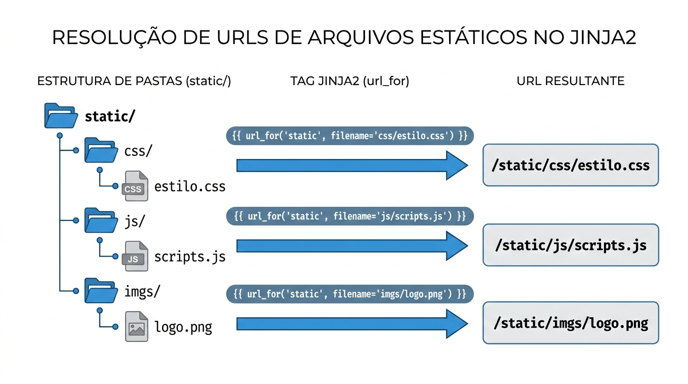

### 🔎 Verifique seu Entendimento

Um app de mobilidade urbana quer destacar, com uma cor diferente, qual rota está ativa no momento — e vai preparar um script próprio para isso mais adiante.

**Desafio:** Crie os arquivos `static/css/mobilidade.css` (com uma regra `.rota-ativa { color: green; }`) e `static/js/mapa.js` (por enquanto, só um comentário), e vincule os dois ao template correto usando `url_for` — o CSS no `<head>`, o JS no fim do `<body>`.

> 💬 Tente por conta própria antes de seguir. A solução comentada está no gabarito desta aula (link na última seção da página).

---

## Parte 10 — Atividade da Aula

### O que fazer

Nesta atividade você vai transformar a página inicial do seu projeto — o `index.html` criado na Aula 01 — em uma aplicação Flask real com Bootstrap e arquivos estáticos próprios.

Primeiro, crie o `app.py` com pelo menos três rotas: a rota `/` para a página inicial, uma rota `/sobre` descrevendo o sistema, e uma rota `/contato`. Segundo, mova o conteúdo do `index.html` para a pasta `templates/` e converta-o para usar `render_template`. Terceiro, adicione Bootstrap a todos os templates, incluindo uma navbar com links de navegação entre as páginas. Quarto, na página inicial, use o sistema de grid com cards para apresentar pelo menos três funcionalidades do seu sistema.

Em seguida, trabalhe com os arquivos estáticos:

- Crie `static/css/estilo.css` com pelo menos três regras personalizadas que complementem o Bootstrap (cor da navbar, estilo do rodapé, efeito nos cards)
- Coloque uma imagem qualquer em `static/imgs/` e exiba-a em algum lugar da página (logo na navbar, imagem em um card, banner no topo)
- Crie `static/js/scripts.js` com a função `confirmarExclusao` e o código de fechamento automático de alertas
- Certifique-se de que todos os arquivos estáticos são referenciados com `url_for('static', filename=...)` — nunca com caminhos fixos

Lembre-se de fazer commits a cada etapa concluída — não apenas no final:

```
git add .
git commit -m "Aula 02: Flask, Bootstrap e arquivos estáticos (CSS, JS, imagem)"
git push
```

---

## 🃏 Flashcards de Revisão

Tente responder mentalmente antes de clicar para revelar a resposta.

??? question "Qual a diferença entre uma página estática e uma página dinâmica?"
    A **estática** é um arquivo HTML fixo lido diretamente do disco — mostra sempre o mesmo conteúdo para todo mundo. A **dinâmica** é gerada em tempo real por um servidor (Flask) no momento da requisição, podendo variar conforme quem pede e os dados do banco.

??? question "O que o comando `pip freeze > requirements.txt` faz?"
    `pip freeze` lista todas as bibliotecas instaladas no ambiente virtual (com suas versões); o `>` grava essa lista no arquivo `requirements.txt`. Em outra máquina, `pip install -r requirements.txt` reinstala exatamente as mesmas dependências.

??? question "No padrão MVC aplicado ao Flask, o que são as rotas, os templates e os models?"
    As **rotas** (`@app.route`) são os **Controllers** — recebem a requisição e decidem o que fazer. Os **templates HTML** (pasta `templates/`) são as **Views** — o que o usuário vê. Os **models** são os dados/lógica de negócio (entram a partir da Aula 05, com o banco).

??? question "Como se cria uma rota que captura uma parte variável da URL?"
    Colocando o nome entre `<` e `>` no caminho e recebendo-o como parâmetro da função: `@app.route('/usuario/<nome>')` seguido de `def perfil_usuario(nome):`. Acessar `/usuario/maria` passa `nome='maria'` para a função.

??? question "Por que referenciar arquivos estáticos com `url_for('static', filename=...)` em vez do caminho fixo `/static/...`?"
    Porque o `url_for` gera o caminho correto automaticamente conforme o contexto da aplicação. Se um dia o app for movido para uma subpasta, os caminhos fixos quebrariam, mas o `url_for` se ajusta sozinho.

??? question "Pegadinha: o link do seu CSS próprio deve vir antes ou depois do Bootstrap no `<head>`? E por quê?"
    **Depois.** Quando duas regras têm a mesma especificidade, vence a que é declarada por último. Carregar o seu CSS depois do Bootstrap é o que permite que ele sobrescreva os estilos padrão (como a cor da navbar). O mesmo vale para o JS: o seu script vem depois do Bootstrap JS para poder usar a API dele.

---

## ✅ Quiz de Fixação

<quiz>
O que a função `render_template('index.html')` faz dentro de uma rota Flask?
- [ ] Cria um novo arquivo HTML na pasta `static/`
- [x] Busca o arquivo `index.html` na pasta `templates/` e o devolve como resposta ao navegador
- [ ] Converte o código Python em HTML automaticamente sem precisar de um arquivo
- [ ] Instala o Bootstrap na página

O `render_template` procura o arquivo indicado dentro da pasta `templates/` (o local padrão do Flask), o processa e envia o HTML resultante como resposta HTTP — separando o HTML do código Python.
</quiz>

<quiz>
Quais afirmações sobre arquivos estáticos e `url_for` estão corretas? (marque todas que se aplicam)
- [x] Arquivos em `static/` são entregues ao navegador sem nenhuma transformação
- [x] `url_for('static', filename='css/estilo.css')` gera o caminho correto para o arquivo
- [x] O CSS próprio deve ser ligado depois do Bootstrap para poder sobrescrevê-lo
- [ ] O parâmetro `filename` deve incluir o prefixo `static/` (ex: `static/css/estilo.css`)

As três primeiras são corretas. A última é falsa: o `filename` é o caminho **relativo à pasta `static/`**, então escreve-se `css/estilo.css` (sem repetir `static/`).
</quiz>

<quiz>
Ao acessar `http://localhost:5000/usuario/maria` com a rota `@app.route('/usuario/<nome>')`, o que acontece?
- [ ] O Flask retorna erro 404 porque a rota é fixa
- [x] A função recebe `nome='maria'` e pode usar esse valor na resposta
- [ ] O Flask cria automaticamente um usuário chamado "maria" no banco
- [ ] A variável `<nome>` é ignorada e a página fica em branco

O trecho `<nome>` captura qualquer texto naquela posição da URL e o entrega como argumento para a função — é o mecanismo por trás de páginas de perfil, detalhes de produto e afins.

</quiz>

<quiz>
No padrão MVC, qual componente corresponde ao "garçom" que recebe o pedido e decide o que fazer com ele?
- [x] O Controller (no Flask, a rota decorada com `@app.route`)
- [ ] A View (o template HTML)
- [ ] O Model (os dados e a lógica de negócio)
- [ ] O CDN do Bootstrap

O Controller é o ponto de contato: recebe a requisição do navegador e coordena a resposta. No Flask, esse papel é das rotas. A View (template) é o "prato finalizado" e o Model é a "cozinha com estoque".
</quiz>

<quiz>
Por que usamos o Bootstrap via CDN nesta aula?
- [ ] Porque o CDN funciona mesmo sem conexão com a internet
- [x] Porque basta adicionar uma linha `<link>` no `<head>`, sem baixar nenhum arquivo
- [ ] Porque o CDN substitui a necessidade de escrever HTML
- [ ] Porque o Flask exige o uso de CDN para servir páginas

O CDN hospeda a biblioteca publicamente, então uma única linha de `<link>` já traz todos os estilos do Bootstrap. A contrapartida é que, sem internet, os arquivos do CDN não carregam.
</quiz>

---

## Resumo da Aula

Hoje você deu um salto enorme: saiu de páginas HTML estáticas para uma aplicação web real com servidor Python. Instalou o Flask com pip e gerou o `requirements.txt`. Entendeu o padrão MVC e a separação entre controllers (rotas) e views (templates). Criou um servidor Flask com múltiplas rotas — incluindo rotas com variáveis dinâmicas na URL. Separou o HTML do Python usando `render_template`. Transformou a aparência das páginas com Bootstrap, usando navbar, grid, cards, botões e alertas. E aprendeu a organizar e servir arquivos estáticos próprios — CSS personalizado, JavaScript e imagens — todos referenciados com segurança via `url_for('static', filename=...)`.

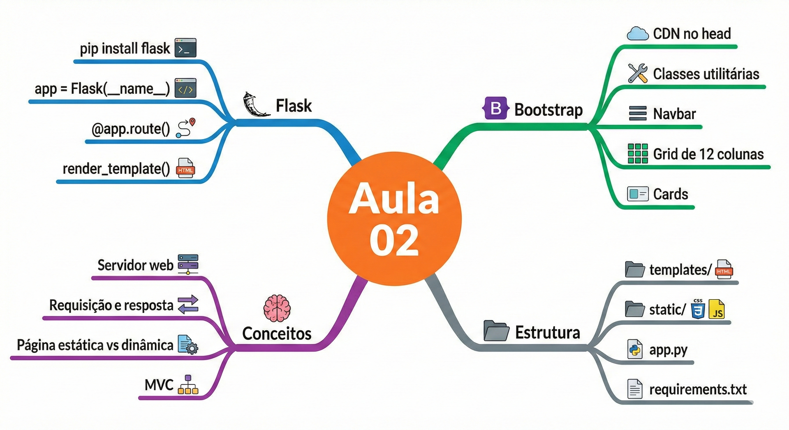

Na próxima aula você vai conhecer o **Jinja2**, o motor de templates do Flask, que vai permitir passar variáveis do Python para os templates HTML, criar estruturas condicionais e loops diretamente no HTML, e — o mais importante — criar um **template base** que todas as páginas herdam, eliminando a repetição da navbar e do cabeçalho em cada arquivo.

---

## Referências e Leitura Complementar

A documentação oficial do Flask está em `flask.palletsprojects.com` — é muito bem escrita e tem um tutorial de início rápido excelente. A documentação do Bootstrap 5 está em `getbootstrap.com/docs/5.3` — para qualquer componente que você queira usar, basta pesquisar lá e copiar o código de exemplo. O livro de referência da disciplina, **Desenvolvimento Web com Flask** de Miguel Grinberg (Novatec, 2019), cobre todo o conteúdo das próximas aulas com profundidade excelente.

---

## 🏆 Conquista da Aula

!!! success "Selo desbloqueado: 🧱 Construtor(a) de Aplicações"
    Você completou a Aula 02 e ergueu a primeira estrutura viva do semestre: um servidor Flask respondendo requisições, com páginas estilizadas em Bootstrap e arquivos estáticos próprios. Na Aula 03 você dá vida a esses templates com o Jinja2 — variáveis, condicionais e herança de layout.

---

## 🔗 Navegação

⬅️ [Aula 01 — Introdução, Git e HTML5](Aula_01_Introducao_Git_HTML5.md) · ➡️ [Aula 03 — Templates Jinja2 e Rotas](Aula_03_Templates_Jinja2_e_Rotas.md)

---

## 📋 Gabarito dos Exercícios

Os mini-desafios de "🔎 Verifique seu Entendimento" espalhados ao longo desta aula têm as soluções comentadas reunidas em um único arquivo, organizado por bloco de conteúdo. Tente resolver cada desafio por conta própria antes de conferir.

➡️ [Gabarito — Aula 02](gabaritos/Aula_02_gabarito.md)

---

*Fatec Jahu · ILP951 · Prof. Ronan Adriel Zenatti · 2026*
