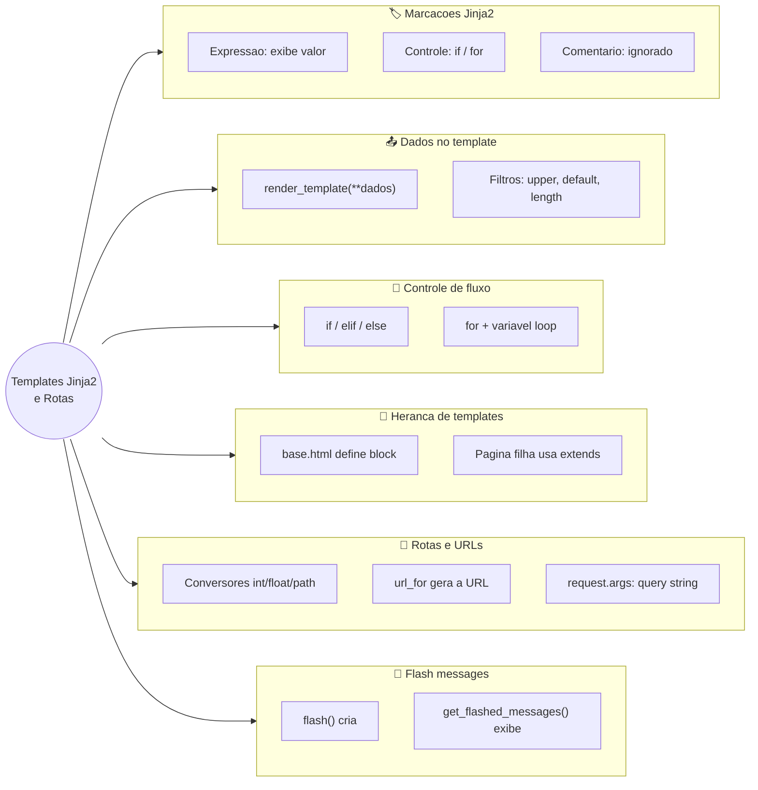
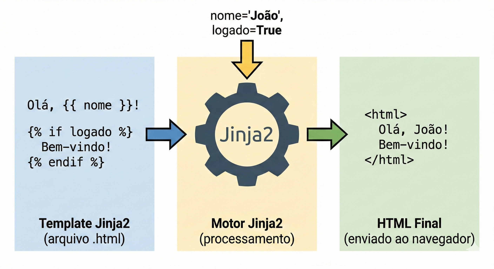
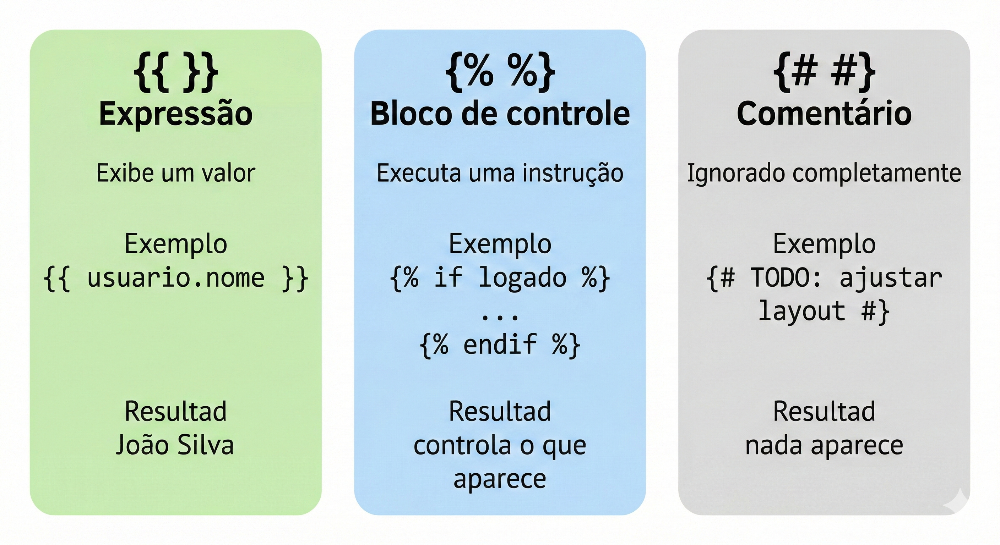
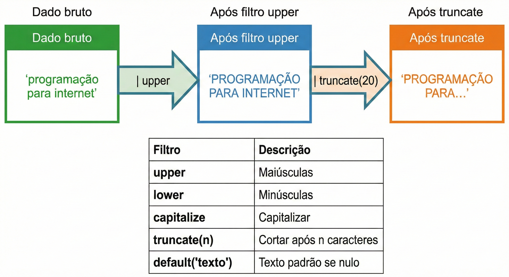
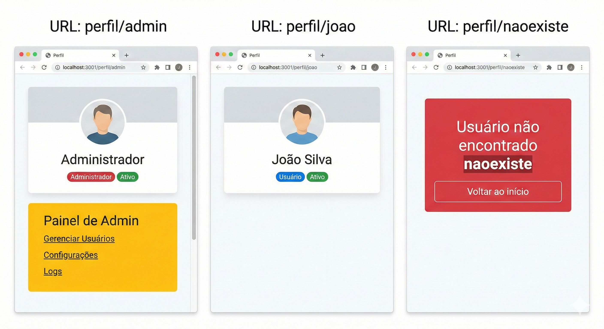
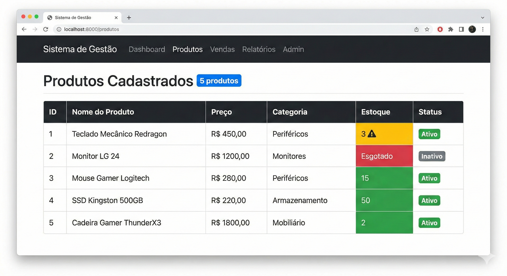
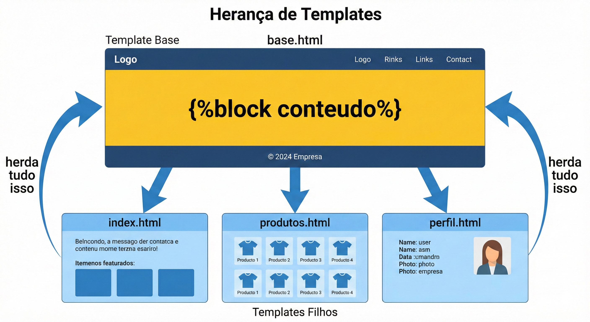
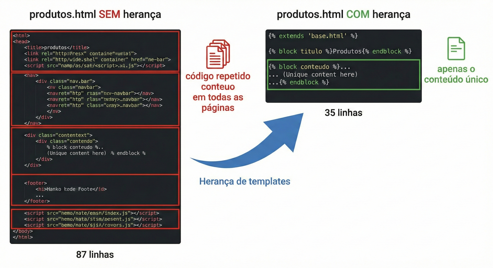
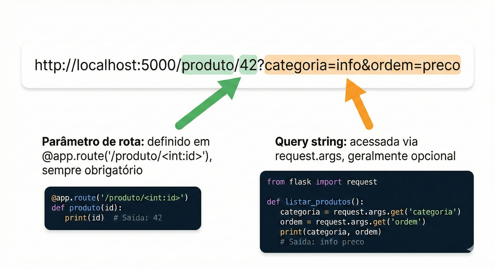
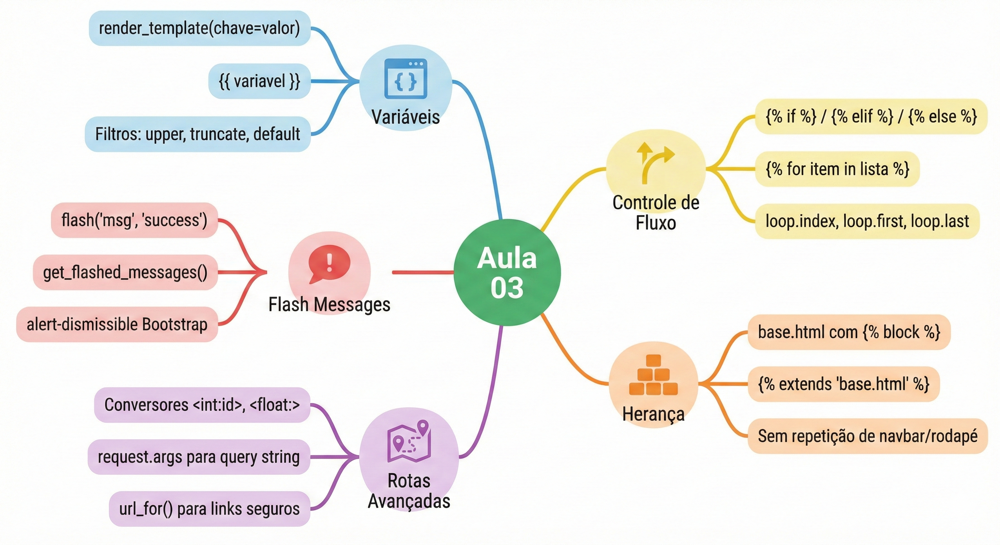

# Aula 03 — Templates Jinja2 e Rotas

**Disciplina:** Programação para Internet (ILP951)
**Professor:** Ronan Adriel Zenatti · ronan.zenatti@cps.sp.gov.br
**Fatec Jahu — 2º Semestre/2026**

> **Pré-requisitos:** Aula 02 concluída — Flask instalado, `app.py` com rotas básicas funcionando, Bootstrap aplicado nos templates.

---

## 🎯 Objetivos da Aula

Ao final desta aula você deverá ser capaz de:

- Passar variáveis do Python para os templates com `render_template` e exibi-las com `{{ }}`.
- Formatar dados diretamente no template usando **filtros** Jinja2 (`upper`, `default`, `length`, `round`…).
- Controlar o que aparece na página com `` e gerar HTML repetitivo com ``.
- Eliminar a repetição de código criando um **template base** com `` e páginas filhas com ``.
- Gerar URLs com segurança usando `url_for` em vez de escrevê-las manualmente.
- Criar rotas com **conversores de tipo** (`int`, `float`, `path`) e ler a **query string** com `request.args`.
- Comunicar o resultado de uma ação ao usuário com **flash messages**.

Na Aula 02 você criou rotas Flask e usou `render_template` para servir arquivos HTML. Mas os templates que criamos até agora são puramente estáticos — o mesmo HTML é entregue para qualquer pessoa que acesse a página. Hoje isso muda completamente. Você vai aprender a **passar variáveis do Python para o HTML**, criar **estruturas condicionais e loops dentro dos templates**, construir um **template base** que todas as páginas herdam — eliminando de vez a repetição de código — e dominar as **rotas com parâmetros** de forma aprofundada. Ao final desta aula, sua aplicação vai gerar páginas verdadeiramente dinâmicas, com conteúdo diferente dependendo dos dados recebidos.

---

## 🗺️ Mapa Mental da Aula

Antes de entrar no detalhe, veja o mapa dos conceitos de hoje. Toda página que geramos agora segue o mesmo fluxo: uma **requisição** chega a uma **rota**, a rota monta os **dados** em Python e entrega ao **template** Jinja2, que aplica marcações, controle de fluxo e herança para produzir o **HTML final** que volta ao navegador.



---

## Parte 1 — O que é Jinja2 e como ele se encaixa no Flask

### O problema que o Jinja2 resolve

Na Aula 02, quando precisávamos exibir o nome de um usuário na página, a solução era montar a string HTML inteira dentro do Python e devolvê-la como resposta. Isso funciona para coisas simples, mas imagine tentar montar uma tabela com 50 linhas de dados vindos do banco, ou exibir uma mensagem de "Bem-vindo, João!" apenas se o usuário estiver logado — tudo isso concatenando strings em Python. Rapidamente o código se torna incompreensível.

O que você realmente precisa é de uma forma de escrever o HTML de forma natural, mas com "espaços reservados" onde os dados do Python serão inseridos quando a página for gerada. É exatamente isso que o **Jinja2** oferece.

### O que é o Jinja2

**Jinja2** é o motor de templates padrão do Flask. Ele permite que você escreva arquivos HTML normais com a adição de uma sintaxe especial — marcações entre chaves `{{ }}` e `` — que o Jinja2 interpreta e substitui pelos dados reais antes de enviar o HTML ao navegador.

O processo funciona assim: o Flask chama `render_template('pagina.html', nome='João')`, o Jinja2 abre o arquivo `pagina.html`, encontra todas as marcações especiais, substitui `{{ nome }}` pelo valor `'João'`, e devolve o HTML final — puro, sem nenhuma marcação Jinja2 — para o navegador. O navegador nunca vê o Jinja2, só vê HTML.



### Os três tipos de marcação do Jinja2

Antes de ver código, é essencial entender que o Jinja2 tem três tipos distintos de marcação, cada uma com um propósito diferente. Confundi-las é o erro mais comum de quem está começando.

O primeiro tipo é a **expressão**, escrita com `{{ }}` (duplas chaves). Ela **exibe um valor** — seja uma variável, o resultado de uma operação ou o retorno de uma função. Tudo que você colocar entre `{{ }}` aparecerá na página.

O segundo tipo é o **bloco de controle**, escrito com `` (chave com porcentagem). Ele **executa uma instrução de controle** — como um `if`, um `for`, ou a definição de um bloco em herança. Ele não exibe nada diretamente; ele controla o fluxo de geração do HTML.

O terceiro tipo é o **comentário**, escrito com `{# #}`. Ele é completamente ignorado pelo Jinja2 e nunca aparece no HTML final — nem como comentário HTML. É útil para anotações internas nos templates que você não quer que apareçam no código-fonte da página.



### 🔎 Verifique seu Entendimento

Um painel mostra quantos créditos de uso de IA generativa um aluno ainda tem hoje — a variável já existe no Python e se chama `creditos`.

**Desafio:** Escreva a marcação Jinja2 correta para exibir o valor de `creditos` no HTML, e escreva também um comentário Jinja2 (que não deve aparecer no HTML final) avisando o próximo colega que mexer nesse template que esse valor vem da API de créditos de IA.

> 💬 Tente por conta própria antes de seguir. A solução comentada está no gabarito desta aula (link na última seção da página).

---

## Parte 2 — Passando variáveis do Python para o template

### Como enviar dados com render_template

A função `render_template` aceita, além do nome do arquivo, qualquer número de argumentos nomeados. Cada argumento nomeado se torna uma variável disponível no template. A sintaxe é simples:

```python
return render_template('pagina.html', nome='João', idade=22, logado=True)
```

Dentro do template, `{{ nome }}` exibe `João`, `{{ idade }}` exibe `22`, e `{{ logado }}` exibe `True`. Esses valores podem ser strings, números, booleanos, listas, dicionários, ou qualquer objeto Python.

### Exemplo prático 1 — Exibindo variáveis simples

Vamos construir esse exemplo em pequenos passos. Comece adicionando **uma única variável** à rota inicial do seu `app.py` e veja ela aparecer na página antes de crescer o resto.

**Passo 1 — passe uma variável.** No `app.py`, ajuste a rota inicial para enviar um título:

```python
from flask import Flask, render_template

app = Flask(__name__)


@app.route('/')
def pagina_inicial():
    # Um único dado, para começar
    return render_template('index.html', titulo='Sistema de Gestão')
```

No `templates/index.html`, use esse título dentro do `<title>` e em um `<h1>`:

```html
<title>{{ titulo }}</title>
...
<h1 class="display-4">{{ titulo }}</h1>
```

Salve os dois arquivos e recarregue `http://localhost:5000`. Observe que a aba do navegador e o título grande da página agora mostram exatamente o texto que está no Python — mude `'Sistema de Gestão'` para outra coisa, salve e recarregue: a página acompanha, sem você tocar no HTML.

**Passo 2 — envie vários dados de uma vez.** Digitar `titulo=..., subtitulo=..., versao=...` fica cansativo quando são muitos valores. A forma organizada é montar um **dicionário** e desempacotá-lo com `**`:

```python
@app.route('/')
def pagina_inicial():
    dados = {
        'titulo': 'Sistema de Gestão',
        'subtitulo': 'Desenvolvido com Python e Flask',
        'versao': '1.0.0',
    }
    # O ** "desempacota" o dicionário em argumentos nomeados
    return render_template('index.html', **dados)
```

Acrescente `{{ subtitulo }}` e `{{ versao }}` em algum ponto do `index.html`, salve e recarregue. Note que cada chave do dicionário virou uma variável no template — `dados['versao']` está disponível como `{{ versao }}`.

**Consolidação — o `app.py` completo desta etapa.** Agora junte tudo. Este é o `app.py` da rota inicial com todos os dados que vamos exibir:

```python
from flask import Flask, render_template

app = Flask(__name__)


@app.route('/')
def pagina_inicial():
    # Dados que serão passados para o template
    # Podem ser qualquer tipo Python: strings, números, listas, dicionários...
    dados = {
        'titulo': 'Sistema de Gestão',
        'subtitulo': 'Desenvolvido com Python e Flask',
        'versao': '1.0.0',
        'autor': 'FATEC Jahu — Turma GTI 2026',
        'total_usuarios': 128,
        'sistema_ativo': True
    }
    # Os dados são passados como argumentos nomeados para render_template
    # O nome do argumento vira o nome da variável no template
    return render_template('index.html', **dados)
    # O ** "desempacota" o dicionário: é equivalente a escrever
    # render_template('index.html', titulo=dados['titulo'], subtitulo=dados['subtitulo'], ...)


if __name__ == '__main__':
    app.run(debug=True)
```

E o `templates/index.html` completo que consome todas essas variáveis:

```html
<!DOCTYPE html>
<html lang="pt-BR">
<head>
  <meta charset="UTF-8">
  <meta name="viewport" content="width=device-width, initial-scale=1.0">

  {# O título da aba usa a variável 'titulo' passada pelo Python #}
  {# Comentários Jinja2 não aparecem no HTML final — nem no código-fonte #}
  <title>{{ titulo }}</title>

  <link href="https://cdn.jsdelivr.net/npm/bootstrap@5.3.0/dist/css/bootstrap.min.css"
        rel="stylesheet">
</head>
<body>

  <nav class="navbar navbar-dark bg-dark">
    <div class="container">
      {# navbar-brand usa a variável 'titulo' #}
      <a class="navbar-brand" href="/">{{ titulo }}</a>
    </div>
  </nav>

  <div class="container mt-5">

    {# display-4 para o título principal vindo do Python #}
    <h1 class="display-4">{{ titulo }}</h1>

    {# lead para o subtítulo #}
    <p class="lead">{{ subtitulo }}</p>

    <hr>

    {# Exibindo dados menores em badges Bootstrap #}
    <p>
      Versão:
      {# badge = componente Bootstrap para exibir informações em destaque #}
      <span class="badge bg-secondary">{{ versao }}</span>
    </p>

    <p>
      Desenvolvido por:
      <strong>{{ autor }}</strong>
    </p>

    <p>
      Usuários cadastrados:
      {# bg-primary = badge azul #}
      <span class="badge bg-primary">{{ total_usuarios }}</span>
    </p>

    {# Exibindo o valor booleano — por enquanto só mostramos True/False #}
    {# Na próxima seção aprenderemos a usar isso para mostrar/esconder conteúdo #}
    <p>
      Status do sistema:
      <span class="badge bg-success">{{ sistema_ativo }}</span>
    </p>

  </div>

  <script src="https://cdn.jsdelivr.net/npm/bootstrap@5.3.0/dist/js/bootstrap.bundle.min.js">
  </script>
</body>
</html>
```

Acesse `http://localhost:5000` e veja as variáveis Python sendo exibidas no HTML. Tente mudar os valores no `app.py`, salve e recarregue o navegador — a página reflete imediatamente as mudanças, sem tocar no HTML.

### 🔎 Verifique seu Entendimento

Um app de mobilidade urbana (bike-sharing) precisa exibir na página inicial: quantas estações existem, quantas bicicletas estão livres agora, e a tarifa por hora.

**Desafio:** Escreva a rota Flask que monta um dicionário com essas três informações (`estacoes`, `bicicletas_livres`, `tarifa_hora`) e o envia ao template com `**dados`, e escreva as três marcações `{{ }}` correspondentes que exibiriam esses valores no HTML.

> 💬 Tente por conta própria antes de seguir. A solução comentada está no gabarito desta aula (link na última seção da página).

---

## Parte 3 — Filtros Jinja2: formatando os dados exibidos

Às vezes o dado que você recebe do Python precisa de uma transformação antes de ser exibido — formatar um número, colocar em maiúsculas, truncar um texto longo, ou tratar o caso em que o valor é vazio. O Jinja2 oferece **filtros** para isso: funções de formatação aplicadas diretamente na expressão usando o caractere `|` (pipe).

A sintaxe é `{{ variavel | filtro }}`. Você pode encadear múltiplos filtros: `{{ variavel | filtro1 | filtro2 }}`.



Os filtros mais usados no dia a dia são: `upper` (converte para maiúsculas), `lower` (minúsculas), `capitalize` (primeira letra maiúscula), `title` (primeira letra de cada palavra maiúscula), `truncate(n)` (corta o texto em n caracteres adicionando "..."), `default('valor')` (exibe um valor padrão se a variável for vazia ou indefinida), `length` (retorna o tamanho de uma lista ou string), e `round(n)` (arredonda números).

Experimente **um filtro por vez** no seu `index.html`. Comece só com o `upper`:

```html
{# upper: tudo em maiúsculas #}
<p>{{ titulo | upper }}</p>
```

Salve e recarregue: o título aparece todo em maiúsculas, mas a variável `titulo` no Python continua intacta — o filtro só muda a exibição. Agora adicione o `default`, que é o mais útil para evitar espaços em branco na tela quando um dado não veio:

```html
{# default: se 'apelido' não existir ou for vazio, exibe "Sem apelido" #}
<p>{{ apelido | default('Sem apelido') }}</p>
```

Como você ainda não passou `apelido` pela rota, recarregue e observe que aparece "Sem apelido" em vez de um erro ou de um espaço vazio. Com a ideia entendida, veja os demais filtros reunidos:

```html
{# Exemplos de filtros em uso #}

{# upper: tudo em maiúsculas #}
<p>{{ titulo | upper }}</p>

{# capitalize: primeira letra maiúscula, resto minúsculo #}
<p>{{ autor | capitalize }}</p>

{# truncate: exibe no máximo 30 caracteres e adiciona "..." se necessário #}
<p>{{ descricao | truncate(30) }}</p>

{# default: se 'apelido' não existir ou for vazio, exibe "Sem apelido" #}
<p>{{ apelido | default('Sem apelido') }}</p>

{# length: conta quantos itens há em uma lista #}
<p>Total de itens: {{ lista_produtos | length }}</p>

{# Encadeando filtros: trunca E depois capitaliza #}
<p>{{ descricao | truncate(50) | capitalize }}</p>
```

### 🔎 Verifique seu Entendimento

Uma página de um evento de sustentabilidade recebe duas variáveis do Python: `nome_evento` (que às vezes não é enviado) e `pegada_carbono` (um número com várias casas decimais, ex.: `2.4371`).

**Desafio:** Escreva a expressão Jinja2 que exibe `nome_evento` em maiúsculas com o valor padrão `'Evento sem nome'` caso ele não exista, e a expressão que exibe `pegada_carbono` arredondado para 1 casa decimal.

> 💬 Tente por conta própria antes de seguir. A solução comentada está no gabarito desta aula (link na última seção da página).

---

## Parte 4 — Estruturas de controle: if, for e o poder dos loops

### O bloco if: exibindo conteúdo condicionalmente

Um dos recursos mais valiosos do Jinja2 é o ``, que permite mostrar ou esconder partes do HTML com base em condições — exatamente como um `if` no Python, mas dentro do template. A estrutura é idêntica ao Python, exceto que cada bloco termina com uma tag de fechamento explícita (``).

Antes de ver código, pense em três situações reais onde você precisaria disso: mostrar um botão "Editar" apenas para administradores; exibir uma mensagem "Nenhum resultado encontrado" quando uma lista está vazia; colorir um item em vermelho se o estoque estiver abaixo do mínimo. Todas essas situações são resolvidas com `` no template.

Lembra da variável `sistema_ativo` que exibimos como `True`/`False` na Parte 2? Vamos usá-la para mostrar ou esconder conteúdo. Substitua a linha do badge de status por este bloco:

```html
{# Sintaxe básica do if no Jinja2 #}


  {# Este bloco só aparece se sistema_ativo for True (ou qualquer valor "truthy") #}
  <div class="alert alert-success">
    ✅ Sistema operacional e funcionando normalmente.
  </div>

  {# Este bloco aparece se sistema_ativo for False (ou qualquer valor "falsy") #}
  <div class="alert alert-danger">
    ❌ Sistema em manutenção. Tente novamente mais tarde.
  </div>

{# IMPORTANTE: todo  DEVE ter um  correspondente #}
```

Salve e recarregue. Como `sistema_ativo` é `True`, aparece o alerta verde. Volte ao `app.py`, troque para `'sistema_ativo': False`, salve e recarregue: agora o alerta vermelho toma o lugar — o mesmo template, dois resultados diferentes conforme o dado.

O Jinja2 também suporta `` para múltiplas condições:

```html

  <span class="badge bg-success">Grande porte</span>

  <span class="badge bg-warning text-dark">Médio porte</span>

  <span class="badge bg-secondary">Pequeno porte</span>

  <span class="badge bg-danger">Sem usuários</span>

```

### Exemplo prático 2 — Página de perfil com if

Vamos criar uma rota que simula um sistema de perfil, mostrando informações diferentes conforme o nível do usuário. No `app.py`, adicione:

```python
@app.route('/perfil/<nome>')
def perfil(nome):
    # Simulando um banco de dados com um dicionário de usuários
    # Na Aula 05 isso virá do MySQL de verdade
    usuarios = {
        'admin': {
            'nome': 'Administrador',
            'email': 'admin@fatec.br',
            'nivel': 'administrador',
            'ativo': True,
            'posts': 47
        },
        'joao': {
            'nome': 'João Silva',
            'email': 'joao@email.com',
            'nivel': 'usuario',
            'ativo': True,
            'posts': 12
        },
        'maria': {
            'nome': 'Maria Souza',
            'email': 'maria@email.com',
            'nivel': 'moderador',
            'ativo': False,
            'posts': 31
        }
    }

    # Busca o usuário pelo nome na URL — .get() retorna None se não existir
    usuario = usuarios.get(nome)

    # Passa o usuário (ou None) para o template
    return render_template('perfil.html', usuario=usuario, nome_buscado=nome)
```

Antes de escrever a página inteira, entenda o esqueleto do template: a primeira decisão é **se o usuário foi encontrado**. Comece o `templates/perfil.html` só com essa casca condicional:

```html
{# 'usuario' será None se o nome da URL não existir no dicionário #}

  <h2>{{ usuario.nome }}</h2>
  {# Acesso a chaves do dicionário usa ponto (.) no Jinja2 — mais limpo que ['chaves'] #}

  <div class="alert alert-danger">Usuário não encontrado.</div>

```

Salve e teste `http://localhost:5000/perfil/admin` e depois `http://localhost:5000/perfil/naoexiste`. Observe: o primeiro mostra o nome, o segundo cai no ``. A partir dessa base, vamos preencher cada ramo com o conteúdo real — badges de nível, badge de status e o painel de admin condicional. Crie o `templates/perfil.html` completo:

```html
<!DOCTYPE html>
<html lang="pt-BR">
<head>
  <meta charset="UTF-8">
  <meta name="viewport" content="width=device-width, initial-scale=1.0">
  <title>Perfil</title>
  <link href="https://cdn.jsdelivr.net/npm/bootstrap@5.3.0/dist/css/bootstrap.min.css"
        rel="stylesheet">
</head>
<body>
  <nav class="navbar navbar-dark bg-dark">
    <div class="container">
      <a class="navbar-brand" href="/">Sistema de Gestão</a>
    </div>
  </nav>

  <div class="container mt-5">

    {# Verifica se o usuário foi encontrado #}
    {# 'usuario' será None se o nome da URL não existir no dicionário #}
    

      {# Cabeçalho do perfil #}
      <div class="card">
        <div class="card-body">

          <h2 class="card-title">{{ usuario.nome }}</h2>
          {# Acesso a chaves do dicionário usa ponto (.) no Jinja2 — mais limpo que ['chaves'] #}

          <p class="text-muted">{{ usuario.email }}</p>

          {# Badge de nível: cor diferente para cada nível #}
          
            <span class="badge bg-danger">Administrador</span>
          
            <span class="badge bg-warning text-dark">Moderador</span>
          
            <span class="badge bg-primary">Usuário</span>
          

          {# Badge de status: verde se ativo, vermelho se inativo #}
          
            <span class="badge bg-success ms-2">Ativo</span>
          
            <span class="badge bg-secondary ms-2">Inativo</span>
          

          <hr>

          <p>Total de postagens: <strong>{{ usuario.posts }}</strong></p>

          {# Botão de edição visível apenas para administradores #}
          
            <div class="alert alert-warning">
              <strong>Painel de Admin:</strong> Você tem acesso total ao sistema.
            </div>
            <a href="#" class="btn btn-danger">Gerenciar Sistema</a>
          

        </div>
      </div>

    
      {# Exibido quando o usuário não é encontrado #}
      <div class="alert alert-danger">
        <h4>Usuário não encontrado</h4>
        <p>
          Não existe nenhum usuário com o nome
          <strong>{{ nome_buscado }}</strong> neste sistema.
        </p>
      </div>
      <a href="/" class="btn btn-secondary">Voltar ao início</a>
    

  </div>

  <script src="https://cdn.jsdelivr.net/npm/bootstrap@5.3.0/dist/js/bootstrap.bundle.min.js">
  </script>
</body>
</html>
```

Teste acessando `http://localhost:5000/perfil/admin`, `http://localhost:5000/perfil/joao` e `http://localhost:5000/perfil/naoexiste`. Observe como a página é completamente diferente para cada caso — tudo com o mesmo template.



### O bloco for: iterando sobre listas

O `` do Jinja2 permite percorrer listas e dicionários para gerar HTML repetitivo de forma automática. Sem ele, para exibir uma tabela com 50 produtos você precisaria escrever 50 linhas `<tr>` manualmente. Com ``, você escreve uma linha e o Jinja2 a repete para cada item da lista.

A estrutura espelha o `for` do Python, e também requer um `` de fechamento:

```html

  {# Este bloco HTML será repetido uma vez para cada item da lista #}
  <p>{{ item }}</p>

```

O Jinja2 ainda oferece a variável especial `loop` dentro de um bloco ``, com informações úteis sobre a iteração atual:

```html

  {# loop.index: número da iteração atual (começa em 1) #}
  {# loop.index0: número da iteração atual (começa em 0) #}
  {# loop.first: True se for o primeiro item #}
  {# loop.last: True se for o último item #}
  {# loop.length: total de itens na lista #}

  <tr class="{% if loop.index % 2 == 0 %}table-light">
    {# Alterna o fundo da linha: linhas pares ficam com fundo cinza claro #}
    <td>{{ loop.index }}</td>
    <td>{{ produto.nome }}</td>
  </tr>

```

O bloco `` também suporta ``, que é executado quando a lista está vazia — um recurso muito útil:

```html

  <li>{{ produto }}</li>

  {# Executado apenas se 'produtos' for uma lista vazia #}
  <li class="text-muted">Nenhum produto cadastrado ainda.</li>

```

### Exemplo prático 3 — Tabela de produtos com for

Adicione esta rota ao `app.py`:

```python
@app.route('/produtos')
def lista_produtos():
    # Lista de dicionários simulando registros do banco de dados
    # Cada dicionário representa um produto com seus atributos
    produtos = [
        {'id': 1, 'nome': 'Notebook Dell Inspiron',   'preco': 3499.90, 'estoque': 15, 'ativo': True},
        {'id': 2, 'nome': 'Mouse Logitech MX Master',  'preco':  299.90, 'estoque': 42, 'ativo': True},
        {'id': 3, 'nome': 'Teclado Mecânico Redragon', 'preco':  189.90, 'estoque':  3, 'ativo': True},
        {'id': 4, 'nome': 'Monitor LG 24"',             'preco': 1199.90, 'estoque':  0, 'ativo': False},
        {'id': 5, 'nome': 'Headset HyperX Cloud',      'preco':  349.90, 'estoque': 27, 'ativo': True},
    ]
    # Passa a lista de produtos e a contagem total para o template
    return render_template('produtos.html', produtos=produtos, total=len(produtos))
```

Vamos montar o `templates/produtos.html` por partes. Primeiro, só o **coração do loop** — uma linha de tabela que se repete para cada produto:

```html

<tr>
  {# loop.index começa em 1 — número da linha na tabela #}
  <td>{{ loop.index }}</td>
  <td>{{ produto.nome }}</td>
  <td>R$ {{ produto.preco }}</td>
</tr>

```

Coloque isso dentro de um `<table class="table"><tbody> ... </tbody></table>` mínimo, salve e recarregue `http://localhost:5000/produtos`. Você já vê uma linha por produto, numeradas de 1 a 5 pelo `loop.index`. Agora vamos **colorir a célula de estoque** conforme o nível, com um `` dentro do ``:

```html

  <td class="table-danger text-center"><strong>Esgotado</strong></td>

  <td class="table-warning text-center">{{ produto.estoque }} ⚠️</td>

  <td class="table-success text-center">{{ produto.estoque }}</td>

```

Salve e recarregue: o Monitor (estoque 0) fica vermelho com "Esgotado", o Teclado (estoque 3) fica amarelo com o aviso, e os demais ficam verdes. Repare como a lógica de cor está **dentro** do loop, aplicada a cada item automaticamente. Com as peças entendidas, veja o `templates/produtos.html` completo:

```html
<!DOCTYPE html>
<html lang="pt-BR">
<head>
  <meta charset="UTF-8">
  <meta name="viewport" content="width=device-width, initial-scale=1.0">
  <title>Produtos</title>
  <link href="https://cdn.jsdelivr.net/npm/bootstrap@5.3.0/dist/css/bootstrap.min.css"
        rel="stylesheet">
</head>
<body>
  <nav class="navbar navbar-dark bg-dark">
    <div class="container">
      <a class="navbar-brand" href="/">Sistema de Gestão</a>
      <div class="navbar-nav flex-row gap-3">
        <a class="nav-link text-white" href="/">Início</a>
        <a class="nav-link text-white active" href="/produtos">Produtos</a>
      </div>
    </div>
  </nav>

  <div class="container mt-4">

    {# Cabeçalho com contador total #}
    <div class="d-flex justify-content-between align-items-center mb-3">
      <h2>Produtos Cadastrados</h2>
      <span class="badge bg-primary fs-6">{{ total }} produtos</span>
      {# fs-6 = font-size 6 no Bootstrap: tamanho padrão de parágrafo #}
    </div>

    {# Tabela responsiva: em telas pequenas permite rolagem horizontal #}
    <div class="table-responsive">
      <table class="table table-bordered table-hover">
        {# table-bordered: bordas em todas as células #}
        {# table-hover: destaca a linha ao passar o mouse #}
        <thead class="table-dark">
          <tr>
            <th>#</th>
            <th>Nome do Produto</th>
            <th>Preço</th>
            <th>Estoque</th>
            <th>Status</th>
          </tr>
        </thead>
        <tbody>

          {# Loop sobre a lista de produtos passada pelo Python #}
          
          <tr>
            {# loop.index começa em 1 — número da linha na tabela #}
            <td>{{ loop.index }}</td>

            <td>{{ produto.nome }}</td>

            {# Formatando o preço: duas casas decimais com o filtro round #}
            {# Nota: para formatação monetária completa (R$, vírgula) usaremos #}
            {# Python no app.py a partir da próxima aula #}
            <td>R$ {{ produto.preco }}</td>

            {# Colorindo a célula de estoque conforme o nível #}
            
              <td class="table-danger text-center">
                <strong>Esgotado</strong>
              </td>
            
              <td class="table-warning text-center">
                {{ produto.estoque }} ⚠️
              </td>
            
              <td class="table-success text-center">
                {{ produto.estoque }}
              </td>
            

            {# Badge de status ativo/inativo #}
            <td class="text-center">
              
                <span class="badge bg-success">Ativo</span>
              
                <span class="badge bg-secondary">Inativo</span>
              
            </td>
          </tr>
          
            {# Exibido apenas se a lista 'produtos' estiver vazia #}
            <tr>
              <td colspan="5" class="text-center text-muted py-4">
                Nenhum produto cadastrado. Adicione o primeiro produto!
              </td>
            </tr>
          

        </tbody>
      </table>
    </div>

  </div>

  <script src="https://cdn.jsdelivr.net/npm/bootstrap@5.3.0/dist/js/bootstrap.bundle.min.js">
  </script>
</body>
</html>
```

Acesse `http://localhost:5000/produtos`. Você verá uma tabela profissional gerada dinamicamente, com cores diferentes para cada nível de estoque — tudo definido pelo `` dentro do ``.



### 🔎 Verifique seu Entendimento

Um ranking de e-sports precisa exibir os jogadores em ordem, com uma medalha 🥇 destacando quem está em primeiro lugar.

**Desafio:** Escreva a rota `/ranking-esports` com uma lista de pelo menos 3 dicionários (`nome`, `pontos`) e o trecho de template que usa `` para listar a posição de cada jogador com `loop.index`, e `` com `loop.first` para exibir 🥇 só ao lado do primeiro colocado.

> 💬 Tente por conta própria antes de seguir. A solução comentada está no gabarito desta aula (link na última seção da página).

---

## Parte 5 — Herança de templates: o template base

### O maior problema de repetição no desenvolvimento web

Observe o código dos templates que criamos até agora: todos eles começam com o mesmo bloco `<!DOCTYPE html>`, o mesmo `<head>` com o link do Bootstrap, a mesma `<nav>` e o mesmo `<script>` no final. Isso é um problema grave chamado de **duplicação de código**.

Imagine que você tem 10 páginas no seu sistema e decide mudar a cor da navbar de escura para azul. Você precisaria abrir os 10 arquivos e fazer a mesma alteração em cada um — e inevitavelmente esqueceria algum, gerando inconsistência. Em sistemas reais com dezenas de páginas, isso se torna impraticável.

A solução do Jinja2 é a **herança de templates** (template inheritance). Você cria um único arquivo chamado de **template base** que contém a estrutura comum a todas as páginas — o HTML, o cabeçalho, a navbar, o rodapé. Dentro desse template base, você define **blocos** (com ``) que são espaços reservados onde cada página filha injeta seu conteúdo específico.



### Criando o template base

Antes do arquivo completo, entenda a peça central da herança: o ``. Um bloco é um "buraco" nomeado no template base que as páginas filhas vão preencher. Crie o `templates/base.html` começando com apenas o essencial e **um** bloco de conteúdo:

```html
<!DOCTYPE html>
<html lang="pt-BR">
<head>
  <meta charset="UTF-8">
  <title>Sistema de Gestão</title>
  <link href="https://cdn.jsdelivr.net/npm/bootstrap@5.3.0/dist/css/bootstrap.min.css"
        rel="stylesheet">
</head>
<body>
  <main class="container mt-4">
    
  </main>
</body>
</html>
```

Repare em dois blocos: `titulo` (com um valor padrão entre as tags, usado se a filha não redefinir) e `conteudo` (vazio, sempre preenchido pela filha). Guarde esse arquivo — ele ainda não aparece sozinho no navegador, porque um template base não é acessado diretamente; ele é herdado. Agora vamos crescê-lo até o esqueleto real da aplicação, com navbar, rodapé e blocos extras para estilos e scripts. Este é o `templates/base.html` completo:

```html
<!DOCTYPE html>
<html lang="pt-BR">
<head>
  <meta charset="UTF-8">
  <meta name="viewport" content="width=device-width, initial-scale=1.0">

  {# O bloco 'titulo' permite que cada página defina seu próprio título na aba #}
  {# O conteúdo entre as tags é o valor padrão, usado se a página não redefinir #}
  <title>Sistema de Gestão</title>

  {# Bootstrap CSS — carregado uma única vez, em todas as páginas #}
  <link href="https://cdn.jsdelivr.net/npm/bootstrap@5.3.0/dist/css/bootstrap.min.css"
        rel="stylesheet">

  {# Bloco para CSS adicional específico de cada página #}
  {# Por padrão está vazio — páginas filhas podem adicionar estilos extras #}
  
</head>
<body>

  {# ===== NAVBAR — aparece em TODAS as páginas ===== #}
  <nav class="navbar navbar-expand-lg navbar-dark bg-dark">
    <div class="container">
      <a class="navbar-brand fw-bold" href="/">🖥️ SistemaGestão</a>

      <button class="navbar-toggler" type="button"
              data-bs-toggle="collapse" data-bs-target="#navbarNav">
        <span class="navbar-toggler-icon"></span>
      </button>

      <div class="collapse navbar-collapse" id="navbarNav">
        <ul class="navbar-nav ms-auto">
          <li class="nav-item">
            <a class="nav-link" href="/">Início</a>
          </li>
          <li class="nav-item">
            <a class="nav-link" href="/produtos">Produtos</a>
          </li>
          <li class="nav-item">
            <a class="nav-link" href="/sobre">Sobre</a>
          </li>
        </ul>
      </div>
    </div>
  </nav>
  {# ===== FIM DA NAVBAR ===== #}


  {# ===== CONTEÚDO PRINCIPAL ===== #}
  {# Este é o bloco mais importante: cada página filha coloca seu conteúdo aqui #}
  <main class="container mt-4 mb-5">
    
    {# Conteúdo padrão vazio — sempre será substituído pela página filha #}
    
  </main>
  {# ===== FIM DO CONTEÚDO ===== #}


  {# ===== RODAPÉ — aparece em TODAS as páginas ===== #}
  <footer class="bg-dark text-white text-center py-3 mt-auto">
    <div class="container">
      <small>
        &copy; 2026 SistemaGestão — FATEC Jahu — Programação para Internet
      </small>
    </div>
  </footer>
  {# ===== FIM DO RODAPÉ ===== #}


  {# Bootstrap JS — carregado uma única vez, em todas as páginas #}
  <script src="https://cdn.jsdelivr.net/npm/bootstrap@5.3.0/dist/js/bootstrap.bundle.min.js">
  </script>

  {# Bloco para scripts JavaScript adicionais específicos de cada página #}
  

</body>
</html>
```

### Criando páginas filhas que herdam do base

Com o template base pronto, cada página filha precisa apenas de duas coisas: declarar qual template está herdando (com ``) e preencher os blocos. Observe como o `index.html` fica drasticamente mais enxuto:

```html
{# extends DEVE ser a primeira linha do arquivo — sem exceções #}
{# Indica que este template herda toda a estrutura de base.html #}



{# Redefine o bloco 'titulo': aparece na aba do navegador #}
Início — Sistema de Gestão


{# Redefine o bloco 'conteudo': é aqui que fica o conteúdo único desta página #}


  <div class="row">

    <div class="col-12 mb-4">
      <h1 class="display-5">Bem-vindo ao Sistema de Gestão</h1>
      <p class="lead text-muted">
        Desenvolvido na disciplina Programação para Internet — FATEC Jahu
      </p>
      <hr>
    </div>

    {# Três cards de resumo usando o grid do Bootstrap #}
    <div class="col-md-4 mb-3">
      <div class="card border-primary h-100">
        <div class="card-body text-center">
          <div class="display-4 mb-2">📦</div>
          <h5 class="card-title">Produtos</h5>
          <p class="card-text text-muted">Gerencie o cadastro de produtos do sistema.</p>
          <a href="/produtos" class="btn btn-primary">Acessar</a>
        </div>
      </div>
    </div>

    <div class="col-md-4 mb-3">
      <div class="card border-success h-100">
        <div class="card-body text-center">
          <div class="display-4 mb-2">👥</div>
          <h5 class="card-title">Usuários</h5>
          <p class="card-text text-muted">Visualize e gerencie os perfis de usuários.</p>
          <a href="/perfil/admin" class="btn btn-success">Acessar</a>
        </div>
      </div>
    </div>

    <div class="col-md-4 mb-3">
      <div class="card border-warning h-100">
        <div class="card-body text-center">
          <div class="display-4 mb-2">📊</div>
          <h5 class="card-title">Relatórios</h5>
          <p class="card-text text-muted">Consulte dados gerenciais e dashboards.</p>
          <a href="#" class="btn btn-warning">Em breve</a>
        </div>
      </div>
    </div>

  </div>


```

Salve e recarregue `http://localhost:5000`. A navbar e o rodapé aparecem — mas eles não estão escritos neste arquivo! Vieram do `base.html`, através do ``. Esse é o ponto central da herança: o comum mora num lugar só.

Agora atualize o `templates/produtos.html` para herdar do base — observe o quanto o arquivo encolhe:

```html


Produtos — Sistema de Gestão



  <div class="d-flex justify-content-between align-items-center mb-3">
    <h2>Produtos Cadastrados</h2>
    <span class="badge bg-primary fs-6">{{ total }} produtos</span>
  </div>

  <div class="table-responsive">
    <table class="table table-bordered table-hover">
      <thead class="table-dark">
        <tr>
          <th>#</th>
          <th>Nome do Produto</th>
          <th>Preço</th>
          <th>Estoque</th>
          <th>Status</th>
        </tr>
      </thead>
      <tbody>
        
        <tr>
          <td>{{ loop.index }}</td>
          <td>{{ produto.nome }}</td>
          <td>R$ {{ produto.preco }}</td>
          
            <td class="table-danger text-center"><strong>Esgotado</strong></td>
          
            <td class="table-warning text-center">{{ produto.estoque }} ⚠️</td>
          
            <td class="table-success text-center">{{ produto.estoque }}</td>
          
          <td class="text-center">
            
              <span class="badge bg-success">Ativo</span>
            
              <span class="badge bg-secondary">Inativo</span>
            
          </td>
        </tr>
        
          <tr>
            <td colspan="5" class="text-center text-muted py-4">
              Nenhum produto cadastrado.
            </td>
          </tr>
        
      </tbody>
    </table>
  </div>


```

Compare este `produtos.html` com a versão da Parte 4: todo o `<!DOCTYPE>`, `<head>`, navbar, `<script>` sumiram — ficaram só no `base.html`. Salve, recarregue `http://localhost:5000/produtos` e confirme que a página continua idêntica, mas o arquivo tem menos da metade das linhas.



### 🔎 Verifique seu Entendimento

Retome a página de créditos de IA da Parte 1 (a que mostra `{{ creditos }}`).

**Desafio:** Escreva o `templates/creditos.html` como página filha de `base.html`: a linha ``, o bloco `titulo` com "Meus Créditos de IA", e o bloco `conteudo` exibindo a variável `creditos`.

> 💬 Tente por conta própria antes de seguir. A solução comentada está no gabarito desta aula (link na última seção da página).

---

## Parte 6 — A função url_for: gerando URLs com segurança

### O problema de escrever URLs manualmente

Nos templates que criamos, os links estão escritos "na mão": `href="/produtos"`, `href="/perfil/admin"`. Isso parece inofensivo, mas cria um problema sutil e perigoso: se você um dia decidir renomear a rota `/produtos` para `/catalogo`, você precisaria encontrar e alterar manualmente todos os `href="/produtos"` espalhados por todos os templates — e garantia não teria de que encontrou todos.

O Flask oferece a função `url_for` para resolver isso. Em vez de escrever a URL diretamente, você referencia o **nome da função Python** que corresponde à rota. Se a URL mudar, o `url_for` se adapta automaticamente. É uma prática que separa a navegação da estrutura das URLs.

A sintaxe no Jinja2 é: `{{ url_for('nome_da_funcao') }}`. Para rotas com parâmetros: `{{ url_for('nome_da_funcao', parametro='valor') }}`.

```html
{# ❌ Forma frágil — URL escrita manualmente #}
<a href="/produtos">Ver Produtos</a>
<a href="/perfil/joao">Ver Perfil</a>

{# ✅ Forma correta — usando url_for com o nome da função #}
<a href="{{ url_for('lista_produtos') }}">Ver Produtos</a>
<a href="{{ url_for('perfil', nome='joao') }}">Ver Perfil</a>

{# url_for também funciona para arquivos estáticos #}
{# Isto gera automaticamente o caminho correto para a pasta static/ #}
<link href="{{ url_for('static', filename='css/estilos.css') }}" rel="stylesheet">

```

Vamos aplicar isso **um link por vez** no `base.html`. Comece só pelo `navbar-brand`, trocando o `href="/"` fixo pela função da rota inicial:

```html
<a class="navbar-brand fw-bold" href="{{ url_for('pagina_inicial') }}">
  🖥️ SistemaGestão
</a>
```

Salve e recarregue: visualmente nada muda — e é esse o ponto. Passe o mouse sobre o "SistemaGestão" e veja no rodapé do navegador que a URL gerada é a mesma `/`. A diferença é que agora ela vem do **nome da função**, não de um texto fixo. Terminado o brand, atualize os demais links da navbar:

```html
{# Dentro da navbar do base.html, substitua os hrefs fixos por url_for #}

<a class="navbar-brand fw-bold" href="{{ url_for('pagina_inicial') }}">
  🖥️ SistemaGestão
</a>

{# ... #}

<a class="nav-link" href="{{ url_for('pagina_inicial') }}">Início</a>
<a class="nav-link" href="{{ url_for('lista_produtos') }}">Produtos</a>
<a class="nav-link" href="{{ url_for('sobre') }}">Sobre</a>
```

### 🔎 Verifique seu Entendimento

Um app de bike-sharing tem duas rotas Python já definidas: `def estacoes():` (mapeada em `/estacoes`) e `def minha_bike():` (mapeada em `/minha-bike`).

**Desafio:** Escreva os dois links de navbar para essas páginas usando `url_for` — nunca escrevendo `/estacoes` ou `/minha-bike` diretamente no `href`.

> 💬 Tente por conta própria antes de seguir. A solução comentada está no gabarito desta aula (link na última seção da página).

---

## Parte 7 — Rotas avançadas: tipos de parâmetros e métodos

### Tipos de dados nos parâmetros de rota

Na Aula 02, vimos que `<nome>` na URL captura qualquer string. O Flask permite especificar o tipo do parâmetro, o que além de garantir o tipo correto, faz com que URLs com o tipo errado retornem automaticamente um erro 404. Os conversores disponíveis são `string` (padrão), `int` (número inteiro), `float` (número decimal) e `path` (string que aceita barras `/`).

Adicione **um conversor por vez** ao seu `app.py` e teste o comportamento na URL antes de seguir. Comece com o `int`:

```python
# Com conversor int: só aceita números inteiros
# /produto/42 → funciona | /produto/abc → 404 automaticamente
@app.route('/produto/<int:id>')
def produto_por_id(id):
    # 'id' já chega como inteiro Python, não como string
    return f'Produto ID: {id} — Tipo: {type(id).__name__}'
```

Salve e acesse `http://localhost:5000/produto/42` — funciona e mostra `Tipo: int`. Agora acesse `http://localhost:5000/produto/abc`: o Flask devolve um **404 automático**, porque `abc` não é inteiro. Foi o conversor `<int:...>` que barrou a URL antes mesmo de a função rodar. Com essa ideia clara, veja os quatro conversores lado a lado:

```python
# Sem conversor: aceita qualquer texto (comportamento padrão)
@app.route('/produto/<nome>')
def produto_por_nome(nome):
    return f'Produto: {nome}'

# Com conversor int: só aceita números inteiros
# /produto/42 → funciona | /produto/abc → 404 automaticamente
@app.route('/produto/<int:id>')
def produto_por_id(id):
    # 'id' já chega como inteiro Python, não como string
    return f'Produto ID: {id} — Tipo: {type(id).__name__}'

# Com conversor float: aceita números decimais
@app.route('/preco/<float:valor>')
def buscar_por_preco(valor):
    return f'Buscando produtos com preço R$ {valor:.2f}'

# Com conversor path: aceita barras na URL
# Útil para caminhos de arquivo ou categorias aninhadas
@app.route('/categoria/<path:caminho>')
def categoria(caminho):
    # /categoria/informatica/notebooks/gamer
    # caminho = 'informatica/notebooks/gamer'
    return f'Categoria: {caminho}'
```

### Múltiplas URLs para a mesma função

Uma função pode responder a múltiplas URLs simplesmente empilhando decoradores `@app.route`:

```python
# Ambas as URLs /inicio e / chamam a mesma função
@app.route('/')
@app.route('/inicio')
def pagina_inicial():
    return render_template('index.html')
```

### Rotas com parâmetros opcionais via query string

Além dos parâmetros na URL (`/produto/42`), o HTTP permite parâmetros na **query string** — aquela parte da URL depois do `?`. Por exemplo: `http://localhost:5000/produtos?categoria=informatica&ordem=preco`. No Flask, você acessa esses valores com `request.args`.

```python
# Não se esqueça de importar request!
from flask import Flask, render_template, request

@app.route('/busca')
def busca():
    # request.args é um dicionário com os parâmetros da query string
    # .get('chave', 'valor_padrao') retorna o valor padrão se a chave não existir
    termo = request.args.get('q', '')
    categoria = request.args.get('categoria', 'todas')
    pagina = request.args.get('pagina', 1, type=int)
    # type=int converte automaticamente o valor para inteiro

    # Simulando resultados de busca
    todos_produtos = ['Notebook', 'Mouse', 'Teclado', 'Monitor', 'Headset']
    resultados = [p for p in todos_produtos if termo.lower() in p.lower()]

    return render_template(
        'busca.html',
        termo=termo,
        categoria=categoria,
        pagina=pagina,
        resultados=resultados,
        total=len(resultados)
    )
```


### 🔎 Verifique seu Entendimento

Um app de coleta seletiva quer duas coisas: uma página de detalhe para cada estação de reciclagem, identificada por um número; e uma busca que filtra estações por tipo de material, informado como parâmetro opcional na URL.

**Desafio:** Escreva a rota `/estacao/<int:id>`, que só aceita IDs numéricos, e a rota `/buscar-pontos`, que lê o parâmetro `material` da query string com `request.args`, usando `'todos'` como valor padrão quando ele não for informado.

> 💬 Tente por conta própria antes de seguir. A solução comentada está no gabarito desta aula (link na última seção da página).

---

## Parte 8 — Flash messages: comunicando o resultado de ações

### O que são flash messages

Quando um usuário salva um formulário, o sistema precisa informar se deu certo ou errado. A técnica mais comum para isso é a **flash message** — uma mensagem que é armazenada temporariamente na sessão do usuário e exibida na próxima página que ele acessar. Depois de exibida, a mensagem desaparece automaticamente.

O Flask tem suporte nativo para flash messages com as funções `flash()` (para criar a mensagem) e `get_flashed_messages()` (para exibi-las no template).

No `app.py`, você precisa definir uma `SECRET_KEY` para que o Flask possa usar sessões:

```python
from flask import Flask, render_template, request, flash, redirect, url_for

app = Flask(__name__)
# A secret_key é necessária para o Flask usar sessions e flash messages
# Em produção, deve ser uma string longa e aleatória — NUNCA compartilhe
app.secret_key = 'chave-secreta-fatec-2026'


@app.route('/acao')
def simular_acao():
    # flash() recebe a mensagem e opcionalmente uma categoria
    # As categorias mapeiam para classes Bootstrap: success, danger, warning, info
    flash('Operação realizada com sucesso!', 'success')
    flash('Atenção: alguns campos estavam vazios.', 'warning')

    # redirect() redireciona para outra rota após a ação
    # url_for() gera a URL da função pagina_inicial
    return redirect(url_for('pagina_inicial'))
```

No `templates/base.html`, adicione o bloco de flash messages logo após a navbar:

```html
{# Bloco de flash messages — posicionado logo após a navbar, antes do conteúdo #}
{# with_categories=True retorna tuplas (categoria, mensagem) #}

  
    <div class="container mt-3">
      
        {# A categoria vira a classe Bootstrap: alert-success, alert-danger, etc. #}
        <div class="alert alert-{{ categoria }} alert-dismissible fade show" role="alert">
          {{ mensagem }}
          {# Botão X para fechar o alerta manualmente #}
          <button type="button" class="btn-close" data-bs-dismiss="alert"></button>
        </div>
      
    </div>
  

```

Salve tudo e acesse `http://localhost:5000/acao`. Observe que a rota não renderiza uma página própria — ela chama `flash()` duas vezes e faz `redirect` para a inicial. Ao chegar na página inicial, os dois alertas (verde e amarelo) aparecem logo abaixo da navbar. Recarregue a página: os alertas somem, porque uma flash message é exibida **uma única vez** e depois é descartada.

### 🔎 Verifique seu Entendimento

Uma plataforma de venda de ingressos para shows de 2026 acabou de processar a compra de um ingresso, mas o método de pagamento escolhido cobra uma taxa extra que o comprador precisa saber.

**Desafio:** Escreva a rota `/comprar-ingresso`, que chama `flash()` duas vezes — uma mensagem de sucesso confirmando a compra e uma de aviso sobre a taxa extra — e depois redireciona para a página inicial com `redirect(url_for(...))`.

> 💬 Tente por conta própria antes de seguir. A solução comentada está no gabarito desta aula (link na última seção da página).

---

## 🃏 Flashcards de Revisão

Tente responder mentalmente antes de clicar para revelar.

??? question "Quais são os três tipos de marcação do Jinja2 e para que serve cada um?"
    `{{ }}` **expressão** — exibe um valor na página. `` **bloco de controle** — executa `if`, `for`, `block` (não exibe nada por si só). `{# #}` **comentário** — é ignorado e nunca aparece no HTML final.

??? question "Qual a diferença entre `` e `` na herança de templates?"
    `` (primeira linha da página filha) declara **de quem** o template herda. `...` define, no base, os **espaços reservados** que as filhas preenchem — e, na filha, o **conteúdo** que vai nesses espaços.

??? question "Por que usar `url_for('lista_produtos')` em vez de escrever `href=\"/produtos\"`?"
    Porque `url_for` referencia o **nome da função** da rota, não a URL literal. Se a URL mudar (ex.: `/produtos` → `/catalogo`), todos os links se ajustam sozinhos. Escrever a URL na mão exige caçar e trocar cada `href` manualmente.

??? question "O que o conversor `<int:id>` faz numa rota, além de converter o tipo?"
    Ele também **valida** a URL: `/produto/42` funciona e `id` chega como inteiro Python; `/produto/abc` retorna **404 automático**, porque `abc` não é inteiro. A validação acontece antes de a função rodar.

??? question "Qual erro típico acontece ao escrever um `` ou `` no Jinja2?"
    Esquecer a tag de fechamento. Todo `` precisa de `` e todo `` precisa de `` — ao contrário do Python, o Jinja2 não usa indentação para saber onde o bloco termina.

??? question "Qual a diferença entre um parâmetro de rota (`/produto/42`) e a query string (`?q=mouse`)?"
    O parâmetro de rota faz parte do caminho e é capturado pela função (`<int:id>`). A query string vem depois do `?`, é opcional e é lida com `request.args.get('q', '')`. Use rota para identificar um recurso; query string para filtros/opções.

---

## ✅ Quiz de Fixação

<quiz>
Qual marcação Jinja2 você usa para **exibir o valor** de uma variável na página?
- [ ] ``
> Não. `` é bloco de controle (if, for), não exibe valor.
- [x] `{{ variavel }}`
> Correto. `{{ }}` é a marcação de **expressão**, usada para exibir valores na página.
- [ ] `{# variavel #}`
> Não. `{# #}` é comentário — é ignorado e nunca aparece na página.
- [ ] `<< variavel >>`
> Essa sintaxe não existe no Jinja2.
</quiz>

<quiz>
Sobre **herança de templates**, marque TODAS as afirmações corretas:
- [x] `` deve ser a primeira linha do template filho
> Sim — o `extends` precisa ser a primeira coisa do arquivo.
- [x] Um `` no base pode ter conteúdo padrão, usado se a filha não o redefinir
> Sim — o texto entre `` e `` no base é o valor padrão.
- [x] A herança elimina a repetição da navbar, cabeçalho e rodapé em cada página
> Sim — esse é justamente o objetivo do template base.
- [ ] O template base é acessado diretamente pelo navegador por uma rota própria
> Não. O base **não** tem rota nem é acessado diretamente — ele é herdado pelas filhas via ``.
</quiz>

<quiz>
Qual rota aceita `http://localhost:5000/produto/42` mas retorna **404** para `http://localhost:5000/produto/abc`?
- [ ] `@app.route('/produto/<nome>')`
> Não. Sem conversor, `<nome>` aceita qualquer texto, inclusive `abc`.
- [x] `@app.route('/produto/<int:id>')`
> Correto. O conversor `<int:id>` só aceita inteiros; qualquer texto não numérico gera 404 automático.
- [ ] `@app.route('/produto/<path:id>')`
> Não. `path` aceita até barras — `abc` passaria.
- [ ] `@app.route('/produto/42')`
> Não. Essa é uma rota fixa que só responde exatamente a `/produto/42`.
</quiz>

<quiz>
Dentro de um ``, o que a variável `loop.index` fornece?
- [ ] A lista completa de produtos
> Não — a lista é a própria `produtos`.
- [ ] O total de itens da lista
> Esse é o `loop.length`.
- [x] O número da iteração atual, começando em 1
> Correto. `loop.index` começa em **1** (útil para numerar linhas).
- [ ] O índice atual começando em 0
> Esse é o `loop.index0`.
</quiz>

<quiz>
Para que serve a `app.secret_key` no contexto desta aula?
- [ ] Para criptografar o banco de dados MySQL
> Não — nesta aula ainda não há banco de dados.
- [x] Para o Flask conseguir usar sessões e, com isso, as flash messages
> Correto. As flash messages ficam guardadas na **sessão**, e o Flask só usa sessões com uma `secret_key` definida.
- [ ] Para definir a senha de login do administrador
> Não — não tem relação com login de usuário.
- [ ] Para conectar o Flask ao Bootstrap via CDN
> Não — o Bootstrap vem por um `<link>` no HTML, sem relação com a secret_key.
</quiz>

---

## 📝 Resumo

Hoje a sua aplicação Flask ganhou inteligência real. Você aprendeu a passar variáveis do Python para os templates usando `render_template`, a usar filtros Jinja2 para formatar dados, a criar estruturas condicionais com `` e loops com `` diretamente no HTML. Construiu um template base com `` que eliminou toda a repetição de código, e converteu as páginas para usar ``. Aprendeu a usar `url_for` para gerar URLs com segurança, a criar rotas com conversores de tipo, a acessar query string com `request.args` e a implementar flash messages para comunicar o resultado de ações ao usuário. O fio condutor é sempre o mesmo: a requisição chega à rota, a rota monta os dados, o Jinja2 transforma dados em HTML.



---

## Parte 9 — Atividade da Aula

### O que fazer

Esta atividade é a mais rica até agora — você vai transformar completamente a estrutura da sua aplicação.

Comece criando o `templates/base.html` com a estrutura completa: navbar com links usando `url_for`, bloco de flash messages e rodapé. Depois converta todos os templates existentes (`index.html`, `sobre.html`, `contato.html`, `produtos.html`) para herdar do base usando `` e ``.

Em seguida, crie a rota `/catalogo` no `app.py` com uma lista de pelo menos 6 itens do seu sistema (os dados do sistema que você escolheu no início do semestre). Passe a lista para um template que use `` para gerar uma tabela. Dentro do loop, use `` para destacar visualmente pelo menos um atributo dos itens (estoque baixo, status inativo, valor acima de um limite — o que fizer sentido para o seu sistema).

Adicione também uma rota `/item/<int:id>` que receba um ID inteiro e exiba os detalhes do item correspondente, com uma mensagem "Item não encontrado" usando `` para quando o ID não existir.

Finalmente, certifique-se de que toda a navegação usa `url_for` em vez de URLs escritas manualmente.

```
git add .
git commit -m "Aula 03: Jinja2, herança de templates e rotas avançadas"
git push
```

---

## 🏆 Conquista da Aula

!!! success "Selo desbloqueado: 🗺️ Navegador(a) de Rotas"
    Você completou a Aula 03. Suas páginas deixaram de ser HTML fixo e passaram a ser geradas dinamicamente, com herança, controle de fluxo e URLs seguras. Na próxima aula você vai abrir a porta de entrada dos dados do usuário: formulários e o protocolo HTTP.

---

## 🔗 Navegação

⬅️ [Aula 02 — Flask e Bootstrap](Aula_02_Flask_e_Bootstrap.md) · 🔒 Aula 04 — em breve.

---

## Referências e Leitura Complementar

A documentação oficial do Jinja2 está em `jinja.palletsprojects.com/en/3.x/templates` — é a referência completa para todos os filtros, testes e recursos da linguagem de templates. O capítulo 3 do livro **Desenvolvimento Web com Flask** de Miguel Grinberg cobre herança de templates com uma profundidade excelente, incluindo macros e imports de templates — recursos que usaremos nas aulas finais do semestre.

Na próxima aula você vai aprender sobre **formulários e o protocolo HTTP** com profundidade: a diferença entre GET e POST, como receber dados enviados pelo usuário via `request.form`, como validar esses dados no back-end e como dar feedback visual quando algo está errado. Os formulários são a porta de entrada de todos os dados que o usuário vai fornecer ao sistema — e o CRUD completo começa lá.

---

## 📋 Gabarito dos Exercícios

Os mini-desafios de "🔎 Verifique seu Entendimento" espalhados ao longo desta aula têm as soluções comentadas reunidas em um único arquivo, organizado por bloco de conteúdo. Tente resolver cada desafio por conta própria antes de conferir.

➡️ [Gabarito — Aula 03](gabaritos/Aula_03_gabarito.md)

---

*Fatec Jahu · ILP951 · Prof. Ronan Adriel Zenatti · 2026*
