# Aula 04 — Formulários e HTTP

**Disciplina:** Programação para Internet (ILP951)
**Professor:** Ronan Adriel Zenatti · ronan.zenatti@cps.sp.gov.br
**Fatec Jahu — 2º Semestre/2026**

> **Pré-requisitos:** Aula 03 concluída — Jinja2 dominado, template base criado com herança, rotas com parâmetros funcionando.

---

## 🎯 Objetivos da Aula

Ao final desta aula você deverá ser capaz de:

- Explicar a estrutura de uma requisição e de uma resposta HTTP (método, URL, headers, body) e reconhecer os códigos de status mais comuns.
- Diferenciar os métodos GET e POST e escolher o método correto para cada situação.
- Construir formulários HTML completos com Bootstrap, usando o tipo de campo adequado a cada dado.
- Processar dados enviados pelo formulário no Flask com `request.form` e `request.args`.
- Implementar validação de dados no servidor, coletando e exibindo múltiplos erros de uma só vez.
- Aplicar o padrão PRG (Post-Redirect-Get) para evitar o reenvio acidental de um formulário.
- Usar o painel Network do navegador para inspecionar requisições HTTP reais.

Até aqui, a comunicação entre o navegador e o Flask foi de mão única: o usuário digita uma URL, o servidor responde com uma página. Mas aplicações reais precisam receber dados do usuário — um nome de cadastro, uma senha de login, a descrição de um produto, um filtro de busca. O mecanismo para isso são os **formulários HTML**, e o protocolo que governa como esses dados trafegam pela internet é o **HTTP**. Hoje você vai entender como o HTTP funciona de verdade, aprender a diferença fundamental entre os métodos GET e POST, criar formulários completos com validação visual usando Bootstrap, e processar os dados recebidos no back-end com Flask. Ao final desta aula, seu sistema será capaz de receber informações do usuário e responder com inteligência.

---

## 🗺️ Mapa Mental da Aula

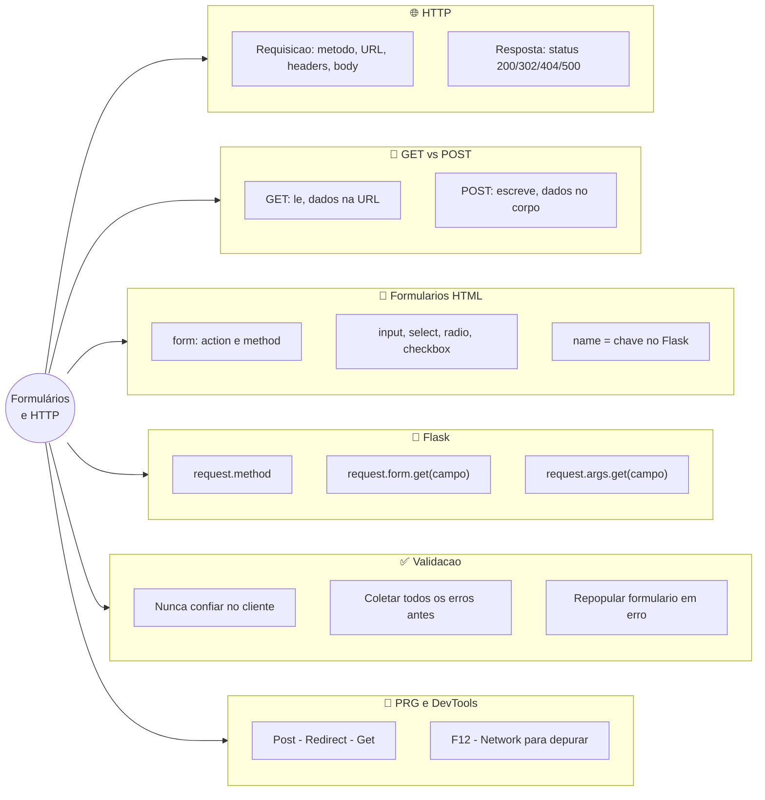

---

## Parte 1 — O protocolo HTTP por dentro

### O que é o HTTP e por que você precisa entendê-lo

**HTTP** (HyperText Transfer Protocol) é o protocolo de comunicação que governa toda a troca de informações entre navegadores e servidores web. Toda vez que você acessa um site, baixa uma imagem, envia um formulário ou faz login em algum serviço, existe uma conversa HTTP acontecendo por baixo dos panos.

Entender o HTTP não é opcional para um desenvolvedor web — é a gramática do idioma que você vai falar pelo resto da sua carreira. Quando algo não funciona (e eventualmente algo sempre não funciona), saber ler uma requisição HTTP é o que permite diagnosticar o problema com precisão, em vez de tentar adivinhar o que está errado.

A analogia mais precisa é a de uma carta formal. Quando você escreve uma carta, ela tem uma estrutura definida: o destinatário no envelope, um cabeçalho com data e assunto, o corpo com o conteúdo, e uma assinatura. Uma requisição HTTP tem estrutura muito similar: uma linha de requisição dizendo o que quer e para onde, cabeçalhos (headers) com metadados sobre a requisição, e opcionalmente um corpo com dados.

### A anatomia de uma requisição HTTP

Uma requisição HTTP tem quatro partes principais. A primeira é o **método** — um verbo que indica a intenção da requisição (GET, POST, PUT, DELETE, entre outros). A segunda é a **URL** — o endereço do recurso solicitado. A terceira são os **cabeçalhos (headers)** — informações adicionais sobre a requisição, como o tipo de navegador, que formatos de resposta o cliente aceita, e dados de autenticação. A quarta é o **corpo (body)** — presente apenas em alguns métodos (como POST), contém os dados enviados ao servidor.

A resposta do servidor também tem estrutura definida: um **código de status** indicando o resultado (200 para sucesso, 404 para não encontrado, 500 para erro interno), cabeçalhos de resposta, e o corpo com o conteúdo — geralmente o HTML da página.

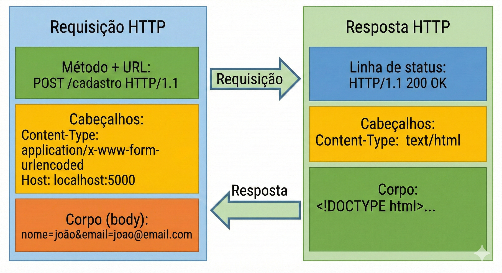

### Os códigos de status HTTP mais importantes

Os códigos de status são números de três dígitos que o servidor envia para indicar o resultado de uma requisição. Eles são divididos em cinco categorias pelo primeiro dígito. Os da série 2xx indicam sucesso. Os da série 3xx indicam redirecionamento. Os da série 4xx indicam erros causados pelo cliente. Os da série 5xx indicam erros no servidor.

Os mais importantes para o desenvolvimento web do dia a dia são o **200 OK** (a requisição foi bem-sucedida e o conteúdo está no corpo da resposta), o **301 Moved Permanently** e o **302 Found** (redirecionamentos — o recurso foi movido), o **404 Not Found** (o recurso não existe naquele endereço), o **405 Method Not Allowed** (você usou GET em uma rota que aceita apenas POST, ou vice-versa) e o **500 Internal Server Error** (algo deu errado no código do servidor).

No Flask, o modo `debug=True` exibe os erros 500 com o traceback completo do Python no próprio navegador, o que facilita muito a depuração durante o desenvolvimento.

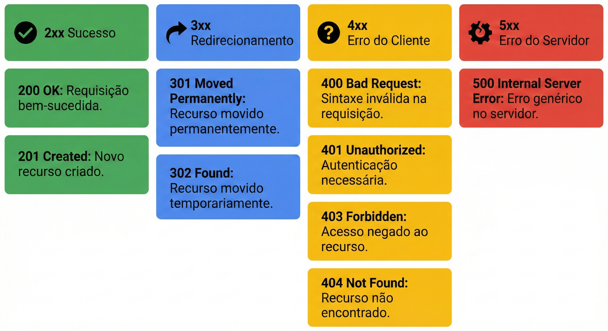

### 🔎 Verifique seu Entendimento

Um assistente de estudos com IA generativa mostra, no rodapé da página, quantos créditos de uso a pessoa ainda tem hoje e se a última chamada à API deu certo.

**Desafio:** Se essa chamada à API de créditos falhar por sobrecarga no servidor, qual categoria de código de status HTTP (2xx, 3xx, 4xx ou 5xx) o painel deveria esperar receber, e qual código específico dessa categoria faz mais sentido usar? Justifique em uma frase.

> 💬 Tente por conta própria antes de seguir. A solução comentada está no gabarito desta aula (link na última seção da página).

---

## Parte 2 — GET vs. POST: a diferença que muda tudo

### Dois métodos com propósitos completamente diferentes

GET e POST são os dois métodos HTTP que você usará em praticamente todo o desenvolvimento web. Eles parecem similares à primeira vista — ambos fazem o navegador se comunicar com o servidor — mas têm propósitos, comportamentos e implicações de segurança radicalmente diferentes. Confundi-los é um dos erros mais comuns (e às vezes mais perigosos) de iniciantes.

O **método GET** é usado para **buscar informações**. Quando você digita uma URL no navegador e pressiona Enter, está fazendo um GET. Quando você clica em um link, está fazendo um GET. Os dados de uma requisição GET são enviados diretamente na URL, depois do símbolo `?`, como query string. Por exemplo: `https://google.com/search?q=flask+python`. As consequências disso são importantes: os dados ficam visíveis na barra de endereços, ficam salvos no histórico do navegador, podem ser guardados como favorito, e são registrados nos logs do servidor. GET deve ser usado apenas para operações que **não modificam dados** no servidor.

O **método POST** é usado para **enviar dados para processamento** — criar um cadastro, fazer login, salvar um formulário, enviar uma mensagem. Os dados de um POST são enviados no **corpo da requisição**, invisíveis na URL. Eles não aparecem na barra de endereços, não ficam no histórico, e não podem ser "favoritados". POST deve ser usado para qualquer operação que **modifica dados** no servidor.

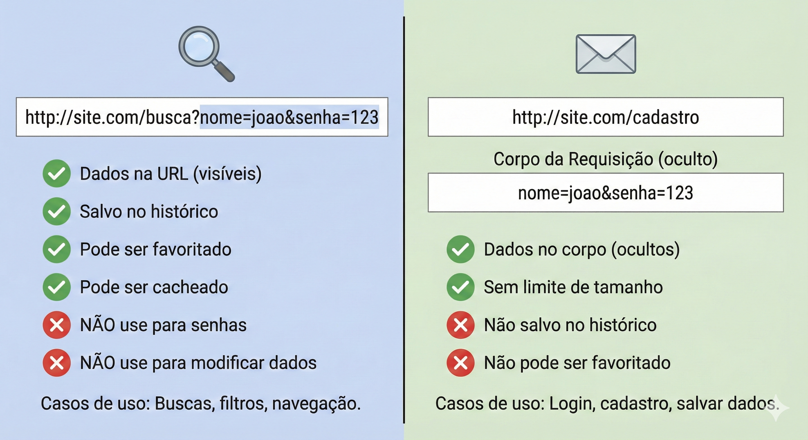

### Quando usar cada um — a regra prática

A regra mais simples e eficaz é esta: **se a ação lê dados, use GET; se a ação escreve, modifica ou deleta dados, use POST**. Aplicando essa regra: uma página de busca usa GET (você está lendo resultados, e faz sentido poder compartilhar o link da busca com alguém). Um formulário de login usa POST (você está enviando uma senha — ela nunca deve aparecer na URL). Um formulário de cadastro de produto usa POST (você está criando um novo registro no banco). Um filtro de listagem usa GET (você está lendo com parâmetros de filtro, e faz sentido poder copiar a URL filtrada).

Existe também uma razão técnica importante: navegadores têm limites de tamanho para URLs (em torno de 2000 caracteres), enquanto o corpo de um POST não tem limite prático. Enviar um arquivo de imagem via GET seria impossível; via POST, é trivial.

### 🔎 Verifique seu Entendimento

Um app de mobilidade urbana tem duas telas: uma que mostra as estações de bike-sharing filtradas por bairro (o usuário escolhe o bairro em um `<select>`), e outra que confirma o desbloqueio de uma bicicleta específica.

**Desafio:** Diga qual método HTTP (GET ou POST) cada uma dessas duas telas deveria usar, e explique em uma frase por que compartilhar o link da tela de filtro por bairro faz sentido, mas compartilhar o link da tela de desbloqueio não faria.

> 💬 Tente por conta própria antes de seguir. A solução comentada está no gabarito desta aula (link na última seção da página).

---

## Parte 3 — Formulários HTML: construindo a interface de entrada

### Os elementos essenciais de um formulário

Um formulário HTML é criado com a tag `<form>`, que tem dois atributos fundamentais: `action` (para onde os dados serão enviados, geralmente a URL de uma rota Flask) e `method` (GET ou POST). Dentro do formulário, os campos de entrada são criados com `<input>`, `<textarea>` e `<select>`, cada um com o atributo `name` que define a chave com que o dado chegará ao servidor.

O atributo `name` é crítico: é ele que o Flask usa para identificar cada campo. Se você tem `<input name="email">` no formulário, o Flask acessa esse valor com `request.form['email']`. Se o `name` estiver errado ou ausente, o dado não chegará.

Vamos construir um formulário de cadastro completo, mas em incrementos pequenos — um campo por vez — em vez de escrever tudo de uma vez.

### Exemplo prático 1 — Formulário de cadastro, peça por peça

**Passo 1 — a rota que aceita os dois métodos.** No `app.py`, crie a rota `/cadastro` já preparada para GET e POST, mas por enquanto só cuidando do GET:

```python
from flask import Flask, render_template, request, flash, redirect, url_for

app = Flask(__name__)
app.secret_key = 'chave-secreta-fatec-2026'


@app.route('/cadastro', methods=['GET', 'POST'])
def cadastro():
    # methods=['GET', 'POST'] informa ao Flask que esta rota aceita AMBOS os métodos.
    # GET: exibe o formulário vazio (quando o usuário chega na página).
    # POST: processa os dados enviados (quando o usuário clica em "Enviar").
    # Sem essa declaração, Flask aceita apenas GET por padrão.

    # Por enquanto, tratamos só o GET — o processamento do POST vem no Passo 8.
    return render_template('cadastro.html')
```

**Passo 2 — o esqueleto do template.** Crie `templates/cadastro.html` só com o card e o `<form>` vazio, sem nenhum campo ainda:

```html


Cadastro — Sistema de Gestão



  <div class="row justify-content-center">
    <div class="col-md-6">
    {# justify-content-center + col-md-6: centraliza o formulário na tela #}

      <div class="card shadow-sm">
      {# shadow-sm: sombra sutil no card para dar profundidade #}

        <div class="card-header bg-primary text-white">
          <h4 class="mb-0">📋 Novo Cadastro</h4>
        </div>

        <div class="card-body">

          {# action: para onde os dados vão — rota 'cadastro' #}
          {# method="post": envia os dados no corpo da requisição (não na URL) #}
          <form action="{{ url_for('cadastro') }}" method="post">

            {# Os campos entram aqui, um de cada vez, nos próximos passos #}

          </form>

        </div>
      </div>
    </div>
  </div>


```

Salve os dois arquivos e acesse `http://localhost:5000/cadastro`. Você já vê o card com o cabeçalho "Novo Cadastro" — vazio por dentro, porque ainda não adicionamos nenhum campo.

**Passo 3 — campo Nome.** O atributo `required` faz o navegador impedir o envio se o campo estiver vazio; `minlength` controla o comprimento mínimo. Essas são validações do lado do cliente — rápidas e convenientes, mas que nunca substituem a validação no servidor, porque qualquer usuário pode desabilitá-las (voltaremos a isso na Parte 5). Adicione dentro do `<form>`:

```html
{# ===== CAMPO NOME ===== #}
<div class="mb-3">
{# mb-3: margin-bottom 3 — espaçamento abaixo do grupo de campo #}

  <label for="nome" class="form-label">
    Nome Completo <span class="text-danger">*</span>
  </label>
  {# form-label: estilo Bootstrap para rótulos de formulário #}
  {# asterisco vermelho indica campo obrigatório #}

  <input
    type="text"
    class="form-control"
    {# form-control: estiliza o input com visual Bootstrap #}
    id="nome"
    name="nome"
    {# id deve bater com o 'for' do label acima #}
    {# name é a chave que o Flask usa: request.form['nome'] #}
    placeholder="Digite seu nome completo"
    required
    {# required: o navegador não permite enviar se vazio #}
    minlength="3"
    {# minlength: mínimo de 3 caracteres #}
  >
</div>
```

Salve e recarregue. Tente clicar em "Enviar" sem digitar nada — como ainda não há botão de envio, nada acontece por enquanto, mas repare que o campo já aparece estilizado pelo Bootstrap, com o rótulo e o asterisco de obrigatório.

**Passo 4 — campo E-mail.** O `type="email"` faz o navegador validar o formato automaticamente:

```html
{# ===== CAMPO EMAIL ===== #}
<div class="mb-3">
  <label for="email" class="form-label">
    E-mail <span class="text-danger">*</span>
  </label>
  <input
    type="email"
    {# type="email": navegador valida formato de e-mail automaticamente #}
    class="form-control"
    id="email"
    name="email"
    placeholder="seu@email.com"
    required
  >
  {# form-text: texto auxiliar menor abaixo do campo #}
  <div class="form-text">Nunca compartilharemos seu e-mail.</div>
</div>
```

Salve e recarregue: agora o formulário tem dois campos de texto, cada um com seu próprio tipo de validação nativa.

**Passo 5 — campo Cidade (select).** A tag `<select>` cria um menu de opções. Cada `<option>` tem um atributo `value` (o que é enviado ao servidor) e um texto visível (o que o usuário lê) — eles podem ser diferentes, por exemplo `value="SP"` com texto "São Paulo":

```html
{# ===== CAMPO CIDADE (SELECT) ===== #}
<div class="mb-3">
  <label for="cidade" class="form-label">Cidade</label>
  <select class="form-select" id="cidade" name="cidade">
  {# form-select: estiliza o select com visual Bootstrap #}
    <option value="">-- Selecione --</option>
    {# value="" para a opção padrão: permite verificar se o usuário selecionou algo #}
    <option value="jahu">Jaú</option>
    <option value="bauru">Bauru</option>
    <option value="botucatu">Botucatu</option>
    <option value="marilia">Marília</option>
    <option value="outra">Outra</option>
  </select>
</div>
```

Salve e recarregue: clique no select e veja as cinco opções aparecerem, com "-- Selecione --" marcada por padrão.

**Passo 6 — campos Perfil (radio) e Aceite dos Termos (checkbox).** Radio buttons (`type="radio"`) permitem selecionar apenas uma opção de um grupo — todos os radios do mesmo grupo compartilham o mesmo `name`. Checkboxes (`type="checkbox"`) permitem selecionar opções independentes:

```html
{# ===== CAMPO PERFIL (RADIO) ===== #}
<div class="mb-3">
  <label class="form-label">Perfil de Acesso</label>
  <div>
    <div class="form-check form-check-inline">
    {# form-check-inline: radio buttons lado a lado #}
      <input class="form-check-input" type="radio"
             name="perfil" id="perfil_usuario" value="usuario" checked>
      {# checked: opção marcada por padrão #}
      <label class="form-check-label" for="perfil_usuario">Usuário</label>
    </div>
    <div class="form-check form-check-inline">
      <input class="form-check-input" type="radio"
             name="perfil" id="perfil_editor" value="editor">
      <label class="form-check-label" for="perfil_editor">Editor</label>
    </div>
    <div class="form-check form-check-inline">
      <input class="form-check-input" type="radio"
             name="perfil" id="perfil_admin" value="admin">
      <label class="form-check-label" for="perfil_admin">Administrador</label>
    </div>
  </div>
</div>

{# ===== CAMPO ACEITE DOS TERMOS (CHECKBOX) ===== #}
<div class="mb-3 form-check">
  <input type="checkbox" class="form-check-input"
         id="termos" name="termos" value="sim" required>
  <label class="form-check-label" for="termos">
    Concordo com os <a href="#">termos de uso</a>
  </label>
</div>
```

Salve e recarregue: agora o formulário tem os três perfis lado a lado (com "Usuário" pré-selecionado) e a caixa de aceite dos termos.

**Passo 7 — botões de ação.** Falta só o botão que realmente envia o formulário:

```html
{# ===== BOTÕES DE AÇÃO ===== #}
<div class="d-flex gap-2">
  <button type="submit" class="btn btn-primary">
    ✔ Cadastrar
  </button>
  {# type="reset": limpa todos os campos do formulário #}
  <button type="reset" class="btn btn-outline-secondary">
    ↺ Limpar
  </button>
  <a href="{{ url_for('pagina_inicial') }}" class="btn btn-outline-danger">
    ✖ Cancelar
  </a>
</div>
```

Salve, recarregue, preencha o formulário e clique em "Cadastrar". Nada visível acontece ainda — o Flask recebe o POST, mas a rota `cadastro()` só sabe tratar o GET. É isso que resolvemos a seguir.

**Passo 8 — processando o POST no `app.py`.** Complete a rota para ler os dados quando o método for POST:

```python
@app.route('/cadastro', methods=['GET', 'POST'])
def cadastro():
    if request.method == 'POST':
        # Este bloco só executa quando o formulário foi enviado (método POST).

        # request.form é um dicionário com todos os campos do formulário.
        # A chave é o atributo 'name' do campo HTML.
        nome = request.form['nome']
        email = request.form['email']
        cidade = request.form['cidade']

        # Por enquanto apenas imprimimos no terminal — banco de dados vem na Aula 05.
        print(f'Novo cadastro recebido: {nome} | {email} | {cidade}')

        # flash() envia uma mensagem de feedback para o próximo template renderizado.
        flash(f'Cadastro de {nome} realizado com sucesso!', 'success')

        # redirect() + url_for() redireciona para outra rota após processar o POST.
        # Este padrão (POST → redirect → GET) é chamado de PRG pattern e evita
        # que o navegador reenvie o formulário ao recarregar a página.
        return redirect(url_for('pagina_inicial'))

    # Se o método for GET (ou seja, se chegamos aqui sem ser por POST):
    # apenas renderizamos o formulário vazio.
    return render_template('cadastro.html')
```

Salve e envie o formulário novamente. Agora observe no terminal do VS Code que os dados aparecem no `print()`, e que após o envio você é redirecionado para a página inicial com a flash message de sucesso.

**Consolidação — os dois arquivos completos desta seção.** Com cada peça testada individualmente, este é o `app.py` completo:

```python
from flask import Flask, render_template, request, flash, redirect, url_for

app = Flask(__name__)
app.secret_key = 'chave-secreta-fatec-2026'


@app.route('/cadastro', methods=['GET', 'POST'])
def cadastro():
    # methods=['GET', 'POST'] informa ao Flask que esta rota aceita AMBOS os métodos.
    # GET: exibe o formulário vazio (quando o usuário chega na página).
    # POST: processa os dados enviados (quando o usuário clica em "Enviar").
    # Sem essa declaração, Flask aceita apenas GET por padrão.

    if request.method == 'POST':
        # Este bloco só executa quando o formulário foi enviado (método POST).

        # request.form é um dicionário com todos os campos do formulário.
        # A chave é o atributo 'name' do campo HTML.
        nome = request.form['nome']
        email = request.form['email']
        cidade = request.form['cidade']

        # Por enquanto apenas imprimimos no terminal — banco de dados vem na Aula 05.
        print(f'Novo cadastro recebido: {nome} | {email} | {cidade}')

        # flash() envia uma mensagem de feedback para o próximo template renderizado.
        flash(f'Cadastro de {nome} realizado com sucesso!', 'success')

        # redirect() + url_for() redireciona para outra rota após processar o POST.
        # Este padrão (POST → redirect → GET) é chamado de PRG pattern e evita
        # que o navegador reenvie o formulário ao recarregar a página.
        return redirect(url_for('pagina_inicial'))

    # Se o método for GET (ou seja, se chegamos aqui sem ser por POST):
    # apenas renderizamos o formulário vazio.
    return render_template('cadastro.html')
```

E o `templates/cadastro.html` completo:

```html


Cadastro — Sistema de Gestão



  <div class="row justify-content-center">
    <div class="col-md-6">
      <div class="card shadow-sm">
        <div class="card-header bg-primary text-white">
          <h4 class="mb-0">📋 Novo Cadastro</h4>
        </div>

        <div class="card-body">

          <form action="{{ url_for('cadastro') }}" method="post">

            {# ===== CAMPO NOME ===== #}
            <div class="mb-3">
              <label for="nome" class="form-label">
                Nome Completo <span class="text-danger">*</span>
              </label>
              <input
                type="text"
                class="form-control"
                id="nome"
                name="nome"
                placeholder="Digite seu nome completo"
                required
                minlength="3"
              >
            </div>

            {# ===== CAMPO EMAIL ===== #}
            <div class="mb-3">
              <label for="email" class="form-label">
                E-mail <span class="text-danger">*</span>
              </label>
              <input
                type="email"
                class="form-control"
                id="email"
                name="email"
                placeholder="seu@email.com"
                required
              >
              <div class="form-text">Nunca compartilharemos seu e-mail.</div>
            </div>

            {# ===== CAMPO CIDADE (SELECT) ===== #}
            <div class="mb-3">
              <label for="cidade" class="form-label">Cidade</label>
              <select class="form-select" id="cidade" name="cidade">
                <option value="">-- Selecione --</option>
                <option value="jahu">Jaú</option>
                <option value="bauru">Bauru</option>
                <option value="botucatu">Botucatu</option>
                <option value="marilia">Marília</option>
                <option value="outra">Outra</option>
              </select>
            </div>

            {# ===== CAMPO PERFIL (RADIO) ===== #}
            <div class="mb-3">
              <label class="form-label">Perfil de Acesso</label>
              <div>
                <div class="form-check form-check-inline">
                  <input class="form-check-input" type="radio"
                         name="perfil" id="perfil_usuario" value="usuario" checked>
                  <label class="form-check-label" for="perfil_usuario">Usuário</label>
                </div>
                <div class="form-check form-check-inline">
                  <input class="form-check-input" type="radio"
                         name="perfil" id="perfil_editor" value="editor">
                  <label class="form-check-label" for="perfil_editor">Editor</label>
                </div>
                <div class="form-check form-check-inline">
                  <input class="form-check-input" type="radio"
                         name="perfil" id="perfil_admin" value="admin">
                  <label class="form-check-label" for="perfil_admin">Administrador</label>
                </div>
              </div>
            </div>

            {# ===== CAMPO ACEITE DOS TERMOS (CHECKBOX) ===== #}
            <div class="mb-3 form-check">
              <input type="checkbox" class="form-check-input"
                     id="termos" name="termos" value="sim" required>
              <label class="form-check-label" for="termos">
                Concordo com os <a href="#">termos de uso</a>
              </label>
            </div>

            {# ===== BOTÕES DE AÇÃO ===== #}
            <div class="d-flex gap-2">
              <button type="submit" class="btn btn-primary">
                ✔ Cadastrar
              </button>
              <button type="reset" class="btn btn-outline-secondary">
                ↺ Limpar
              </button>
              <a href="{{ url_for('pagina_inicial') }}" class="btn btn-outline-danger">
                ✖ Cancelar
              </a>
            </div>

          </form>

        </div>
      </div>
    </div>
  </div>


```

Acesse `http://localhost:5000/cadastro`, preencha o formulário e envie. Observe no terminal do VS Code que os dados aparecem no `print()`. Observe também que após o envio você é redirecionado para a página inicial com a flash message de sucesso.

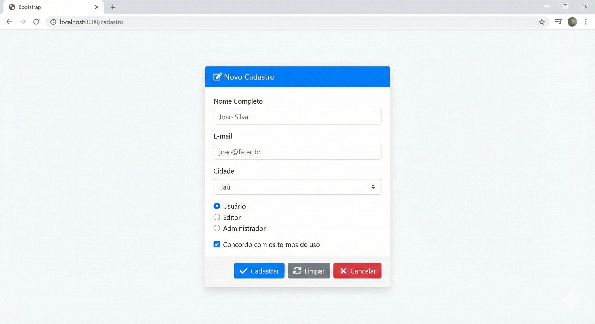

### 🔎 Verifique seu Entendimento

Uma cooperativa de coleta seletiva quer cadastrar pontos de entrega de recicláveis: nome do ponto, tipo de material aceito (só um por ponto) e um checkbox de "aceita coleta domiciliar".

**Desafio:** Diga qual tipo de campo HTML (`<select>`, `<input type="radio">` ou `<input type="checkbox">`) você usaria para "tipo de material aceito" e qual usaria para "aceita coleta domiciliar", justificando com base em quantas opções cada campo permite marcar ao mesmo tempo.

> 💬 Tente por conta própria antes de seguir. A solução comentada está no gabarito desta aula (link na última seção da página).

---

## Parte 4 — Processando dados no Flask com request.form

### Acessando os dados recebidos

Quando o usuário envia um formulário com método POST, o Flask disponibiliza todos os dados no objeto `request.form`, que funciona como um dicionário Python. Existem duas formas de acessar um campo, e elas têm comportamentos diferentes em casos de erro.

A forma com colchetes `request.form['nome']` levanta uma exceção `KeyError` se o campo `nome` não existir no formulário — o que causa um erro 400 se não for tratado. A forma com `.get()` retorna `None` (ou um valor padrão que você especifica) se o campo não existir, sem lançar exceção. Para campos obrigatórios, a exceção pode ser desejável pois sinaliza claramente que algo está errado. Para campos opcionais, use sempre `.get()`.

```python
@app.route('/processar', methods=['POST'])
def processar():
    # Forma 1: colchetes — lança KeyError se o campo não existir
    nome = request.form['nome']

    # Forma 2: .get() — retorna None se o campo não existir (mais seguro)
    apelido = request.form.get('apelido')

    # Forma 3: .get() com valor padrão — retorna 'usuario' se 'perfil' não existir
    perfil = request.form.get('perfil', 'usuario')

    # Checkboxes: se o checkbox não estiver marcado, o campo NÃO aparece no form.
    # Por isso usamos .get() com valor padrão 'nao'.
    aceito_termos = request.form.get('termos', 'nao')

    # Convertendo tipos: request.form sempre retorna strings.
    # Para trabalhar com números, você precisa converter explicitamente.
    idade_str = request.form.get('idade', '0')
    idade = int(idade_str)  # converte string para inteiro

    return f'Dados recebidos: {nome}, {perfil}, termos: {aceito_termos}'
```

Teste essa rota apontando o `action` do formulário de cadastro temporariamente para `/processar` (ou enviando um POST pelo painel Network, que veremos na Parte 9) e compare os dois comportamentos: remova o campo `nome` do HTML e recarregue — o colchete `request.form['nome']` quebra com erro 400; troque para `request.form.get('nome')` no mesmo teste e o campo ausente simplesmente vira `None`, sem derrubar a página.

### 🔎 Verifique seu Entendimento

Uma plataforma de venda de ingressos para um festival de 2026 tem um campo opcional "cupom de desconto" e um campo obrigatório "quantidade de ingressos".

**Desafio:** Escreva as duas linhas de `request.form` que leem esses campos — uma usando a forma que faz mais sentido para o campo opcional, outra para o obrigatório — e explique em uma frase por que a escolha é diferente entre os dois.

> 💬 Tente por conta própria antes de seguir. A solução comentada está no gabarito desta aula (link na última seção da página).

---

## Parte 5 — Validação no servidor: nunca confie no cliente

### Por que validar no servidor é obrigatório

Os atributos HTML `required`, `type="email"`, `minlength` e similares são convenientes — eles dão feedback imediato ao usuário sem precisar de uma requisição ao servidor. Mas eles são apenas a **primeira linha de defesa**, e uma linha que pode ser facilmente contornada.

Qualquer pessoa com conhecimento básico pode abrir as ferramentas de desenvolvedor do navegador, remover o `required` de um campo, e enviar o formulário vazio. Ou pode usar ferramentas como Postman ou curl para enviar uma requisição POST diretamente ao servidor sem passar pelo formulário HTML. Se o servidor confiar cegamente nos dados recebidos, o sistema fica vulnerável a dados inválidos, corrompidos ou maliciosos.

A regra é simples e absoluta: **toda validação do cliente é para conforto do usuário; toda validação do servidor é para segurança do sistema**. Você faz as duas, mas nunca abre mão da segunda.

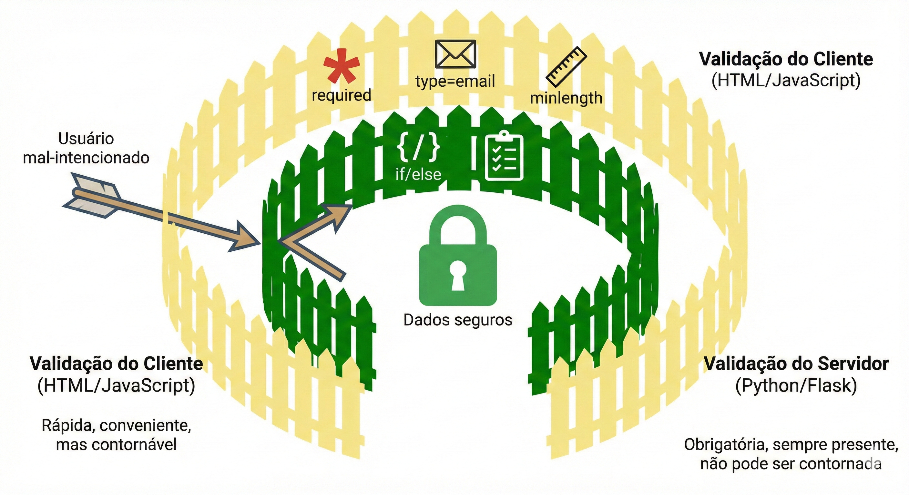

### Exemplo prático 2 — Formulário com validação completa no servidor

Vamos evoluir a rota `/cadastro` da Parte 3 para validar de verdade, também em incrementos pequenos.

**Passo 1 — coleta dos dados com `.strip()`.** Comece trocando a coleta de dados do Passo 8 anterior por esta versão, que já usa `.get()` com valor padrão e remove espaços em branco:

```python
if request.method == 'POST':

    # ===== COLETA DOS DADOS =====
    nome   = request.form.get('nome', '').strip()
    email  = request.form.get('email', '').strip()
    cidade = request.form.get('cidade', '')
    perfil = request.form.get('perfil', 'usuario')
    termos = request.form.get('termos')
    # .strip() remove espaços em branco do início e fim.
    # Evita cadastros com "   " (espaços) como nome.

    erros = []
    # Coletamos TODOS os erros antes de exibir qualquer mensagem.
    # Isso permite mostrar todos os problemas de uma vez,
    # em vez de um por um (o que irrita o usuário).

    print(f'Recebido: {nome} | {email} | {cidade} | {perfil} | termos={termos}')
    return redirect(url_for('pagina_inicial'))
```

Salve, envie o formulário com um nome só de espaços (`"   "`) e observe no terminal que o `print` mostra `nome` vazio — o `.strip()` já eliminou os espaços antes de chegarmos à validação.

**Passo 2 — validação do nome e do e-mail.** Substitua a linha `print(...)` por estas checagens, que só adicionam mensagens à lista `erros` sem interromper o fluxo:

```python
if not nome:
    erros.append('O nome é obrigatório.')
elif len(nome) < 3:
    erros.append('O nome deve ter pelo menos 3 caracteres.')

if not email:
    erros.append('O e-mail é obrigatório.')
elif '@' not in email or '.' not in email:
    # Validação básica de e-mail: contém @ e ponto
    erros.append('Digite um e-mail válido.')
```

**Passo 3 — validação de cidade e termos.** Complete com as duas checagens restantes:

```python
if not cidade:
    erros.append('Selecione uma cidade.')

if not termos:
    erros.append('Você deve aceitar os termos de uso.')
```

Salve e envie o formulário sem selecionar cidade e sem marcar o checkbox de termos (desmarque o `required` deles pelo DevTools para conseguir enviar vazio). Ainda não há nada exibindo os erros na tela — é isso que o próximo passo resolve.

**Passo 4 — decidir entre mostrar erros ou processar.** Finalize o bloco `if request.method == 'POST':` com a decisão: se há erros, mostra cada um como flash `danger` e re-renderiza o formulário com os dados já digitados; se não há erros, processa e redireciona:

```python
    # ===== PROCESSAMENTO OU EXIBIÇÃO DE ERROS =====
    if erros:
        # Há erros: envia cada mensagem de erro como flash 'danger'
        for erro in erros:
            flash(erro, 'danger')
        # Re-renderiza o formulário com os dados que o usuário já digitou.
        # Isso evita que o usuário precise digitar tudo de novo.
        return render_template('cadastro.html',
                               nome=nome,
                               email=email,
                               cidade=cidade,
                               perfil=perfil)

    # Se chegamos até aqui, todos os dados são válidos.
    # Processamento bem-sucedido (banco de dados vem na Aula 05).
    print(f'✅ Cadastro válido: {nome} | {email} | {cidade} | {perfil}')
    flash(f'Cadastro de {nome} realizado com sucesso!', 'success')
    return redirect(url_for('pagina_inicial'))
```

Salve e teste de novo com campos vazios: agora os erros aparecem como alertas vermelhos — só que, por enquanto, o formulário volta zerado, porque o template ainda não sabe reaproveitar os dados enviados. É o que resolvemos a seguir.

**Consolidação da rota.** Junte os quatro passos acima na rota completa:

```python
@app.route('/cadastro', methods=['GET', 'POST'])
def cadastro():

    if request.method == 'POST':

        # ===== COLETA DOS DADOS =====
        nome   = request.form.get('nome', '').strip()
        email  = request.form.get('email', '').strip()
        cidade = request.form.get('cidade', '')
        perfil = request.form.get('perfil', 'usuario')
        termos = request.form.get('termos')
        # .strip() remove espaços em branco do início e fim.
        # Evita cadastros com "   " (espaços) como nome.

        # ===== VALIDAÇÃO =====
        # Coletamos TODOS os erros antes de exibir qualquer mensagem.
        # Isso permite mostrar todos os problemas de uma vez,
        # em vez de um por um (o que irrita o usuário).
        erros = []

        if not nome:
            erros.append('O nome é obrigatório.')
        elif len(nome) < 3:
            erros.append('O nome deve ter pelo menos 3 caracteres.')

        if not email:
            erros.append('O e-mail é obrigatório.')
        elif '@' not in email or '.' not in email:
            # Validação básica de e-mail: contém @ e ponto
            erros.append('Digite um e-mail válido.')

        if not cidade:
            erros.append('Selecione uma cidade.')

        if not termos:
            erros.append('Você deve aceitar os termos de uso.')

        # ===== PROCESSAMENTO OU EXIBIÇÃO DE ERROS =====
        if erros:
            for erro in erros:
                flash(erro, 'danger')
            return render_template('cadastro.html',
                                   nome=nome,
                                   email=email,
                                   cidade=cidade,
                                   perfil=perfil)

        # Se chegamos até aqui, todos os dados são válidos.
        print(f'✅ Cadastro válido: {nome} | {email} | {cidade} | {perfil}')
        flash(f'Cadastro de {nome} realizado com sucesso!', 'success')
        return redirect(url_for('pagina_inicial'))

    # Método GET: exibe o formulário vazio
    return render_template('cadastro.html')
```

### Re-populando o formulário após erro

Agora vamos ensinar o template a reaproveitar os dados enviados. Isso é feito com o filtro `default`, que exibe uma string vazia quando a variável ainda não existe (primeiro acesso via GET).

**Passo 5 — repopular o campo Nome.** No `templates/cadastro.html`, adicione o atributo `value` ao input de nome:

```html
<input
  type="text"
  class="form-control"
  id="nome"
  name="nome"
  placeholder="Digite seu nome completo"
  value="{{ nome | default('') }}"
  {# value: preenche o campo com o dado enviado anteriormente.
     Se 'nome' não existir (primeiro acesso), usa string vazia. #}
>
```

Salve, force um erro (deixe o e-mail vazio) e observe que agora o campo Nome mantém o que você digitou, mesmo com a página recarregada pelo erro.

**Passo 6 — repopular o campo E-mail.** Mesmo princípio:

```html
<input
  type="email"
  class="form-control"
  id="email"
  name="email"
  placeholder="seu@email.com"
  value="{{ email | default('') }}"
>
```

**Passo 7 — repopular o Select de cidade.** Para um `<select>`, a repopulação compara o valor de cada `<option>` com o dado recebido e adiciona `selected` quando bate:

```html
<select class="form-select" id="cidade" name="cidade">
  <option value="">-- Selecione --</option>
  {# Para o select, comparamos o valor de cada option com o recebido #}
  <option value="jahu"     selected>Jaú</option>
  <option value="bauru"    selected>Bauru</option>
  <option value="botucatu" selected>Botucatu</option>
  <option value="marilia"  selected>Marília</option>
  <option value="outra"    selected>Outra</option>
</select>
```

**Passo 8 — repopular o Radio de perfil.** Mesma lógica, comparando o valor de cada radio com o perfil recebido (o padrão `usuario` cobre o primeiro acesso):

```html
<div class="form-check form-check-inline">
  <input class="form-check-input" type="radio"
         name="perfil" id="perfil_usuario" value="usuario"
         checked>
  <label class="form-check-label" for="perfil_usuario">Usuário</label>
</div>
<div class="form-check form-check-inline">
  <input class="form-check-input" type="radio"
         name="perfil" id="perfil_editor" value="editor"
         checked>
  <label class="form-check-label" for="perfil_editor">Editor</label>
</div>
<div class="form-check form-check-inline">
  <input class="form-check-input" type="radio"
         name="perfil" id="perfil_admin" value="admin"
         checked>
  <label class="form-check-label" for="perfil_admin">Admin</label>
</div>
```

Salve, force um erro de novo e confirme: agora nome, e-mail, cidade e perfil voltam preenchidos exatamente como você havia digitado — só os termos (checkbox) precisam ser marcados de novo, o que é aceitável para um campo de aceite.

**Consolidação — `templates/cadastro.html` completo com repopulação:**

```html

Cadastro


<div class="row justify-content-center">
  <div class="col-md-6">
    <div class="card shadow-sm">
      <div class="card-header bg-primary text-white">
        <h4 class="mb-0">📋 Novo Cadastro</h4>
      </div>
      <div class="card-body">
        <form action="{{ url_for('cadastro') }}" method="post">

          <div class="mb-3">
            <label for="nome" class="form-label">
              Nome Completo <span class="text-danger">*</span>
            </label>
            <input
              type="text"
              class="form-control"
              id="nome"
              name="nome"
              placeholder="Digite seu nome completo"
              value="{{ nome | default('') }}"
            >
          </div>

          <div class="mb-3">
            <label for="email" class="form-label">
              E-mail <span class="text-danger">*</span>
            </label>
            <input
              type="email"
              class="form-control"
              id="email"
              name="email"
              placeholder="seu@email.com"
              value="{{ email | default('') }}"
            >
          </div>

          <div class="mb-3">
            <label for="cidade" class="form-label">Cidade</label>
            <select class="form-select" id="cidade" name="cidade">
              <option value="">-- Selecione --</option>
              <option value="jahu"     selected>Jaú</option>
              <option value="bauru"    selected>Bauru</option>
              <option value="botucatu" selected>Botucatu</option>
              <option value="marilia"  selected>Marília</option>
              <option value="outra"    selected>Outra</option>
            </select>
          </div>

          <div class="mb-3">
            <label class="form-label">Perfil de Acesso</label>
            <div>
              <div class="form-check form-check-inline">
                <input class="form-check-input" type="radio"
                       name="perfil" id="perfil_usuario" value="usuario"
                       checked>
                <label class="form-check-label" for="perfil_usuario">Usuário</label>
              </div>
              <div class="form-check form-check-inline">
                <input class="form-check-input" type="radio"
                       name="perfil" id="perfil_editor" value="editor"
                       checked>
                <label class="form-check-label" for="perfil_editor">Editor</label>
              </div>
              <div class="form-check form-check-inline">
                <input class="form-check-input" type="radio"
                       name="perfil" id="perfil_admin" value="admin"
                       checked>
                <label class="form-check-label" for="perfil_admin">Admin</label>
              </div>
            </div>
          </div>

          <div class="mb-3 form-check">
            <input type="checkbox" class="form-check-input"
                   id="termos" name="termos" value="sim">
            <label class="form-check-label" for="termos">
              Concordo com os <a href="#">termos de uso</a>
            </label>
          </div>

          <div class="d-flex gap-2">
            <button type="submit" class="btn btn-primary">✔ Cadastrar</button>
            <button type="reset"  class="btn btn-outline-secondary">↺ Limpar</button>
            <a href="{{ url_for('pagina_inicial') }}" class="btn btn-outline-danger">
              ✖ Cancelar
            </a>
          </div>

        </form>
      </div>
    </div>
  </div>
</div>

```

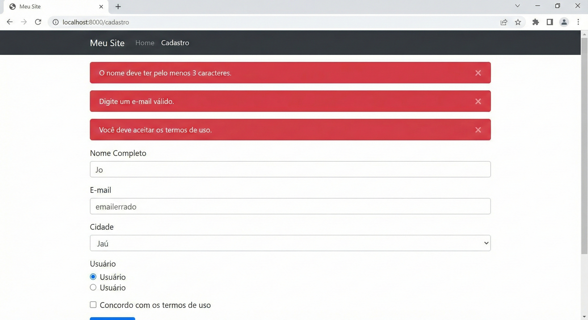

### 🔎 Verifique seu Entendimento

Um painel de créditos de uso de IA generativa tem um formulário para o usuário resgatar um "código promocional" — o código precisa ter exatamente 8 caracteres e não pode estar vazio.

**Desafio:** Escreva o trecho Python que coleta o campo `codigo` com `.strip()` e as duas validações (vazio e comprimento diferente de 8) adicionando mensagens à lista `erros`, seguindo exatamente o padrão desta seção.

> 💬 Tente por conta própria antes de seguir. A solução comentada está no gabarito desta aula (link na última seção da página).

---

## Parte 6 — O padrão PRG: Post-Redirect-Get

### O problema do reenvio de formulário

Imagine que o usuário envia um formulário de cadastro com sucesso. O servidor processa os dados e renderiza diretamente uma página de confirmação — sem redirecionar. Agora o usuário pressiona F5 para recarregar a página. O que acontece? O navegador exibe uma janela de confirmação perguntando se ele quer reenviar os dados do formulário. Se ele confirmar, o cadastro é feito duas vezes. Se isso acontecer com um pedido de compra ou uma transferência bancária, o resultado é desastroso.

O padrão **PRG (Post-Redirect-Get)** resolve esse problema com uma sequência de três etapas. O navegador faz um **POST** com os dados do formulário. O servidor processa os dados e, em vez de renderizar uma página diretamente, envia um **Redirect** (código HTTP 302) apontando para outra URL. O navegador segue o redirecionamento e faz um **GET** para essa nova URL, que renderiza a página de confirmação. Agora, se o usuário pressionar F5, ele apenas recarrega o GET final — sem reenviar nenhum dado.

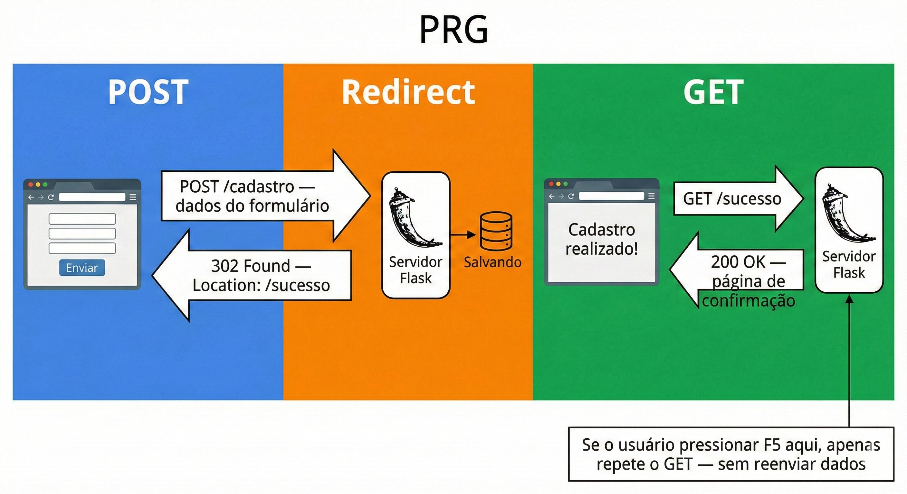

No Flask, o PRG já está implementado na rota `/cadastro` que construímos: `return redirect(url_for('pagina_inicial'))` ao final do processamento POST bem-sucedido. Nunca use `render_template()` ao final de um POST bem-sucedido — sempre use `redirect()`.

```python
@app.route('/cadastro', methods=['GET', 'POST'])
def cadastro():
    if request.method == 'POST':
        # ... processa os dados ...

        # ✅ CORRETO: redireciona após POST bem-sucedido (padrão PRG)
        flash('Cadastro realizado!', 'success')
        return redirect(url_for('pagina_inicial'))

        # ❌ ERRADO: renderizar diretamente após POST (causa problema de reenvio)
        # return render_template('sucesso.html')

    return render_template('cadastro.html')
```

Para ver o problema na prática antes de confirmar a solução: comente temporariamente a linha do `redirect` e troque por `return render_template('cadastro.html')`, salve, envie o formulário com sucesso e pressione F5. O navegador vai perguntar se você quer reenviar os dados — é exatamente esse aviso que o PRG elimina. Desfaça a alteração antes de seguir.

### 🔎 Verifique seu Entendimento

Um app de mobilidade urbana confirma o aluguel de um veículo elétrico compartilhado assim que o pagamento é aprovado.

**Desafio:** Explique, em termos do padrão PRG, o que aconteceria de errado se a rota de confirmação de aluguel usasse `render_template('confirmacao.html')` diretamente ao final do POST em vez de `redirect(url_for(...))`, e o que o PRG evita nesse cenário específico.

> 💬 Tente por conta própria antes de seguir. A solução comentada está no gabarito desta aula (link na última seção da página).

---

## Parte 7 — Feedback visual avançado com Bootstrap

### Estados de validação nos campos

O Bootstrap oferece classes específicas para indicar visualmente se um campo passou ou falhou na validação: `is-valid` (borda verde, ícone de check) e `is-invalid` (borda vermelha, ícone de X). Junto com os elementos `<div class="valid-feedback">` e `<div class="invalid-feedback">`, você pode criar formulários com feedback inline muito mais elegante do que apenas flash messages gerais.

Vamos construir esse padrão em uma nova rota, `/cadastro-avancado`, também aos poucos.

**Passo 1 — o campo Nome com classes condicionais.** Comece só com um campo, decidindo a classe via Jinja2 conforme a variável `erros` (um dicionário, não mais uma lista) e a variável `nome`:

```html
{# Campo com estado de validação do Bootstrap #}

<div class="mb-3">
  <label for="nome" class="form-label">Nome Completo</label>

  {# A classe is-invalid é adicionada condicionalmente pelo Jinja2 #}
  {# 'erros.nome' é a mensagem de erro deste campo específico, se houver #}
  <input
    type="text"
    class="form-control is-invalidis-valid"
    {# is-invalid: borda vermelha quando há erro #}
    {# is-valid: borda verde quando o campo está preenchido corretamente #}
    id="nome"
    name="nome"
    value="{{ nome | default('') }}"
  >

  {# invalid-feedback: exibido apenas quando o input tem a classe is-invalid #}
  
    <div class="invalid-feedback">{{ erros.nome }}</div>
  
    {# valid-feedback: exibido apenas quando tem is-valid #}
    <div class="valid-feedback">Parece bom!</div>
  
</div>
```

Para testar esse campo isoladamente, você ainda precisa da rota enviando `erros` como dicionário — é o próximo passo.

**Passo 2 — a rota com erros granulares por campo.** Diferente da Parte 5 (que usava uma lista `erros`), aqui usamos um **dicionário**, onde a chave é o nome do campo:

```python
@app.route('/cadastro-avancado', methods=['GET', 'POST'])
def cadastro_avancado():

    # Dicionário de erros: chave = nome do campo, valor = mensagem de erro
    erros = {}
    # Dicionário de dados: para re-popular o formulário em caso de erro
    dados = {}

    if request.method == 'POST':
        nome  = request.form.get('nome', '').strip()
        email = request.form.get('email', '').strip()
        dados = {'nome': nome, 'email': email}

        # Validação com erros granulares por campo
        if not nome:
            erros['nome'] = 'O nome é obrigatório.'
        elif len(nome) < 3:
            erros['nome'] = 'Mínimo de 3 caracteres.'

        if not email:
            erros['email'] = 'O e-mail é obrigatório.'
        elif '@' not in email:
            erros['email'] = 'Digite um e-mail válido.'

        if not erros:
            flash('Cadastro realizado com sucesso!', 'success')
            return redirect(url_for('pagina_inicial'))

    # Passa tanto os dados quanto os erros para o template
    return render_template('cadastro_avancado.html', erros=erros, **dados)
```

Salve os dois arquivos, crie `templates/cadastro_avancado.html` estendendo `base.html` com só o campo Nome dentro de um `<form method="post">`, e teste enviando o formulário vazio: o campo fica com borda vermelha e a mensagem de erro aparece logo abaixo — sem precisar de flash message para esse campo específico.

**Passo 3 — repita o padrão para o campo E-mail** (mesmo princípio do Passo 1, trocando `nome` por `email`) e adicione o botão de envio, consolidando o restante do `templates/cadastro_avancado.html` a partir do que você já criou na Parte 3 (herança de `base.html`, título e estrutura de card).

### 🔎 Verifique seu Entendimento

Um formulário de adesão a um programa de energia solar residencial pede a "potência desejada em kWp", um campo numérico que precisa ser maior que zero.

**Desafio:** Escreva a condição Jinja2 (`class="form-control ..."`) que aplica `is-invalid` a esse campo quando `erros.potencia` existir, e o bloco `` que exibe `erros.potencia` dentro de um `invalid-feedback`, seguindo o padrão desta seção.

> 💬 Tente por conta própria antes de seguir. A solução comentada está no gabarito desta aula (link na última seção da página).

---

## Parte 8 — Formulário de busca com GET

Nem todo formulário usa POST. Formulários de busca e filtros usam GET, porque faz sentido que a URL resultante possa ser copiada e compartilhada. Se você buscar por "Notebook" e a URL for `/busca?q=notebook`, você pode enviar esse link para outra pessoa e ela verá os mesmos resultados.

### Exemplo prático 3 — Barra de busca funcional

**Passo 1 — a rota lendo a query string, sem filtrar ainda.** Em um formulário GET, os dados chegam via query string (`request.args`), não via `request.form` — porque não há corpo de requisição em um GET. Comece só lendo os parâmetros e devolvendo a lista inteira:

```python
@app.route('/busca')
def busca():
    termo = request.args.get('q', '').strip()
    categoria = request.args.get('categoria', 'todos')

    # Base de dados simulada
    todos_itens = [
        {'nome': 'Notebook Dell Inspiron',    'categoria': 'informatica', 'preco': 3499.90},
        {'nome': 'Mouse Logitech MX Master',  'categoria': 'informatica', 'preco':  299.90},
        {'nome': 'Mesa de Escritório',        'categoria': 'moveis',      'preco':  850.00},
        {'nome': 'Cadeira Ergonômica',        'categoria': 'moveis',      'preco': 1200.00},
        {'nome': 'Teclado Mecânico',          'categoria': 'informatica', 'preco':  189.90},
        {'nome': 'Luminária de Mesa',         'categoria': 'moveis',      'preco':   95.00},
    ]

    # Por enquanto, sem filtro — só devolve tudo, para testar a leitura da query string
    return render_template('busca.html',
                           termo=termo,
                           categoria=categoria,
                           resultados=todos_itens,
                           total=len(todos_itens))
```

**Passo 2 — o esqueleto do template, com o campo de busca.** Crie `templates/busca.html` com o formulário GET e uma tabela simples listando `resultados`:

```html


Busca — Sistema de Gestão



  <h2 class="mb-4">🔍 Buscar Itens</h2>

  {# Formulário de busca com método GET #}
  {# action aponta para a mesma rota '/busca' — o formulário "recarrega" a própria página com filtros #}
  <form action="{{ url_for('busca') }}" method="get" class="row g-3 mb-4">
  {# method="get": os dados vão para a URL como query string #}

    <div class="col-md-6">
      <label for="q" class="form-label">Termo de busca</label>
      <input
        type="search"
        class="form-control"
        id="q"
        name="q"
        placeholder="Digite para buscar..."
        value="{{ termo }}"
        {# value re-popula o campo com o termo atual — para o usuário saber o que buscou #}
      >
    </div>

    <div class="col-md-2 d-flex align-items-end">
      <button type="submit" class="btn btn-primary w-100">Buscar</button>
    </div>

  </form>

  <ul>
    
      <li>{{ item.nome }} — {{ item.categoria }} — R$ {{ item.preco }}</li>
    
  </ul>


```

Salve os dois arquivos e acesse `http://localhost:5000/busca?q=mouse`. Repare na barra de endereços: o termo `mouse` está visível na URL, e o campo de busca já vem preenchido com ele — mas a lista ainda mostra todos os itens, sem filtrar. Isso é esperado, porque o Passo 1 ainda não filtra nada.

**Passo 3 — aplicando o filtro por termo e por categoria.** Volte ao `app.py` e substitua o retorno direto de `todos_itens` por uma filtragem progressiva:

```python
@app.route('/busca')
def busca():
    termo = request.args.get('q', '').strip()
    categoria = request.args.get('categoria', 'todos')

    todos_itens = [
        {'nome': 'Notebook Dell Inspiron',    'categoria': 'informatica', 'preco': 3499.90},
        {'nome': 'Mouse Logitech MX Master',  'categoria': 'informatica', 'preco':  299.90},
        {'nome': 'Mesa de Escritório',        'categoria': 'moveis',      'preco':  850.00},
        {'nome': 'Cadeira Ergonômica',        'categoria': 'moveis',      'preco': 1200.00},
        {'nome': 'Teclado Mecânico',          'categoria': 'informatica', 'preco':  189.90},
        {'nome': 'Luminária de Mesa',         'categoria': 'moveis',      'preco':   95.00},
    ]

    # Filtragem: começa com todos os itens e vai aplicando filtros
    resultados = todos_itens

    if termo:
        # Filtra pelo termo de busca no nome (case-insensitive)
        resultados = [i for i in resultados if termo.lower() in i['nome'].lower()]

    if categoria != 'todos':
        # Filtra pela categoria selecionada
        resultados = [i for i in resultados if i['categoria'] == categoria]

    return render_template('busca.html',
                           termo=termo,
                           categoria=categoria,
                           resultados=resultados,
                           total=len(resultados))
```

Salve e recarregue `http://localhost:5000/busca?q=mouse`. Agora a lista mostra só o item que contém "mouse" no nome — o filtro funciona antes mesmo de melhorarmos a exibição.

**Passo 4 — adicionando o select de categoria ao formulário.** No `templates/busca.html`, adicione o campo logo após o de busca por termo:

```html
<div class="col-md-4">
  <label for="categoria" class="form-label">Categoria</label>
  <select class="form-select" id="categoria" name="categoria">
    <option value="todos"      selected>Todas</option>
    <option value="informatica"selected>Informática</option>
    <option value="moveis"     selected>Móveis</option>
  </select>
</div>
```

Salve e teste `http://localhost:5000/busca?q=&categoria=moveis`: só os itens de "móveis" aparecem, e o select já vem com "Móveis" selecionado.

**Passo 5 — exibição rica dos resultados em cards.** Por fim, troque a lista simples (`<ul>`) do Passo 2 por uma exibição com contagem, mensagem de "nenhum resultado" e cards:

```html

{# Só mostra a seção de resultados se o usuário fez uma busca #}

  <hr>

  <div class="d-flex justify-content-between align-items-center mb-3">
    <h5 class="mb-0">
      Resultados
      para "<strong>{{ termo }}</strong>"
      na categoria <strong>{{ categoria }}</strong>
    </h5>
    <span class="badge bg-secondary">{{ total }} encontrado(s)</span>
  </div>

  
    <div class="row">
      
      <div class="col-md-4 mb-3">
        <div class="card h-100">
          <div class="card-body">
            <h6 class="card-title">{{ item.nome }}</h6>
            <span class="badge bg-info text-dark mb-2">{{ item.categoria }}</span>
            <p class="card-text fw-bold text-success">
              R$ {{ "%.2f" | format(item.preco) }}
            </p>
            {# "%.2f" | format(valor): formata o número com 2 casas decimais #}
          </div>
        </div>
      </div>
      
    </div>
  
    <div class="alert alert-warning">
      <strong>Nenhum resultado encontrado.</strong>
      Tente outros termos ou categorias.
    </div>
  


```

**Consolidação — `templates/busca.html` completo:**

```html


Busca — Sistema de Gestão



  <h2 class="mb-4">🔍 Buscar Itens</h2>

  <form action="{{ url_for('busca') }}" method="get" class="row g-3 mb-4">

    <div class="col-md-6">
      <label for="q" class="form-label">Termo de busca</label>
      <input
        type="search"
        class="form-control"
        id="q"
        name="q"
        placeholder="Digite para buscar..."
        value="{{ termo }}"
      >
    </div>

    <div class="col-md-4">
      <label for="categoria" class="form-label">Categoria</label>
      <select class="form-select" id="categoria" name="categoria">
        <option value="todos"      selected>Todas</option>
        <option value="informatica"selected>Informática</option>
        <option value="moveis"     selected>Móveis</option>
      </select>
    </div>

    <div class="col-md-2 d-flex align-items-end">
      <button type="submit" class="btn btn-primary w-100">Buscar</button>
    </div>

  </form>

  

    <hr>

    <div class="d-flex justify-content-between align-items-center mb-3">
      <h5 class="mb-0">
        Resultados
        para "<strong>{{ termo }}</strong>"
        na categoria <strong>{{ categoria }}</strong>
      </h5>
      <span class="badge bg-secondary">{{ total }} encontrado(s)</span>
    </div>

    
      <div class="row">
        
        <div class="col-md-4 mb-3">
          <div class="card h-100">
            <div class="card-body">
              <h6 class="card-title">{{ item.nome }}</h6>
              <span class="badge bg-info text-dark mb-2">{{ item.categoria }}</span>
              <p class="card-text fw-bold text-success">
                R$ {{ "%.2f" | format(item.preco) }}
              </p>
            </div>
          </div>
        </div>
        
      </div>
    
      <div class="alert alert-warning">
        <strong>Nenhum resultado encontrado.</strong>
        Tente outros termos ou categorias.
      </div>
    

  


```

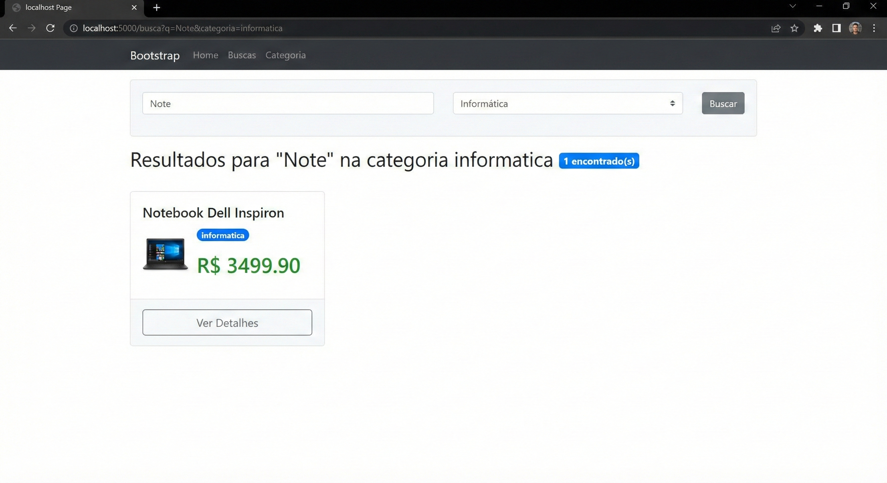

### 🔎 Verifique seu Entendimento

Uma plataforma de e-sports quer uma busca de campeonatos por nome do jogo, com um filtro opcional de "modalidade" (individual ou equipe).

**Desafio:** Escreva a rota `/campeonatos` com `request.args.get` lendo `jogo` e `modalidade` (com `'todas'` como padrão), e a linha de filtro em list comprehension que remove da lista os campeonatos cuja modalidade não bate, seguindo o padrão desta seção.

> 💬 Tente por conta própria antes de seguir. A solução comentada está no gabarito desta aula (link na última seção da página).

---

## Parte 9 — Usando as ferramentas de desenvolvedor para inspecionar requisições

### O painel de rede do navegador

Todo navegador moderno tem um conjunto de ferramentas de desenvolvedor acessado com `F12`. A aba **Network** (Rede) é especialmente valiosa: ela mostra em tempo real todas as requisições feitas pela página — incluindo os dados enviados e recebidos em cada uma.

Para inspecionar um formulário POST, abra o painel de rede (`F12 → Network`), envie o formulário, e clique na requisição que apareceu. Na aba **Payload** (ou **Form Data** em alguns navegadores), você verá exatamente os campos e valores enviados ao servidor. Na aba **Headers**, você verá os cabeçalhos da requisição e o código de status da resposta. Isso é fundamental para depurar problemas — quando os dados não chegam ao servidor como esperado, é aqui que você investiga.

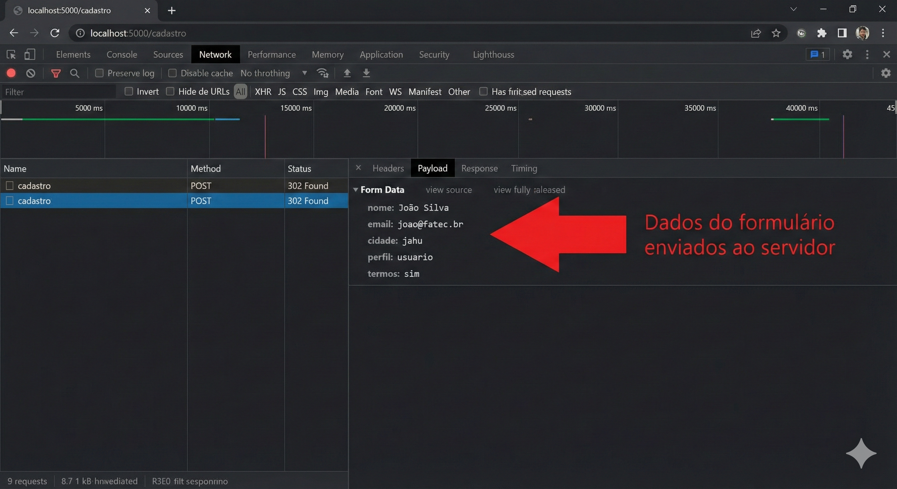

Para usar o painel de rede:

Abra as ferramentas de desenvolvedor com `F12`. Clique na aba **Network**. Marque a opção **Preserve log** (para que as entradas não desapareçam após o redirecionamento do PRG). Envie o formulário. Clique na requisição POST que apareceu. Explore as abas **Headers** e **Payload**. Faça isso ao menos uma vez com o formulário de cadastro — entender o que trafega pelo HTTP é fundamental para qualquer desenvolvedor web.

### 🔎 Verifique seu Entendimento

Um painel de créditos de uso de IA generativa parece "travar" ao clicar em "Resgatar código promocional" — o botão gira, mas nada acontece na tela.

**Desafio:** Descreva os passos que você daria no painel Network do navegador para descobrir se o problema é (a) a requisição nem está sendo enviada, (b) o servidor está respondendo com erro, ou (c) os dados enviados estão incorretos — e qual aba do painel (Headers, Payload ou Response) responderia a cada uma dessas três hipóteses.

> 💬 Tente por conta própria antes de seguir. A solução comentada está no gabarito desta aula (link na última seção da página).

---

## 🃏 Flashcards de Revisão

Tente responder mentalmente antes de clicar para revelar.

??? question "Qual a diferença fundamental entre GET e POST quanto a onde os dados trafegam?"
    GET envia dados na **URL**, como query string (`?chave=valor`), visíveis e limitados em tamanho. POST envia dados no **corpo da requisição**, invisíveis na URL e sem limite prático de tamanho.

??? question "Por que `request.form['campo']` pode ser mais perigoso que `request.form.get('campo')`?"
    `request.form['campo']` lança `KeyError` (erro 400) se o campo não existir no formulário enviado. `request.form.get('campo')` retorna `None` (ou um valor padrão) sem quebrar a aplicação — mais seguro para campos opcionais ou quando o cliente pode manipular a requisição.

??? question "Por que um checkbox desmarcado não aparece em `request.form`?"
    O HTML só envia um checkbox se ele estiver marcado — quando desmarcado, o navegador simplesmente omite o campo do formulário enviado. Por isso o código sempre usa `request.form.get('campo', 'valor_padrao')` para checkboxes, nunca `request.form['campo']`.

??? question "Qual a diferença entre validação no cliente (HTML) e validação no servidor (Flask)?"
    A validação no cliente (`required`, `type="email"`, `minlength`) é conveniência para o usuário — pode ser contornada pelo DevTools ou por uma requisição direta via Postman/curl. A validação no servidor é obrigatória e é a única que realmente protege o sistema contra dados inválidos.

??? question "O que o padrão PRG (Post-Redirect-Get) evita, e como ele é implementado no Flask?"
    Evita que o navegador reenvie os dados de um formulário quando o usuário atualiza a página (F5) após um POST. No Flask, é implementado terminando o processamento de um POST bem-sucedido com `return redirect(url_for('rota'))`, nunca com `render_template()` direto.

??? question "Em uma requisição GET, por onde chegam os dados no Flask: request.form ou request.args?"
    `request.args` — porque uma requisição GET não tem corpo (body); os dados vêm da query string da URL, e é isso que `request.args.get('chave')` lê.

---

## ✅ Quiz de Fixação

<quiz>
Um formulário de login envia usuário e senha. Qual método HTTP é o correto e por quê?
- [ ] GET, porque é mais rápido
> Não. GET expõe os dados na URL — inclusive a senha ficaria visível e salva no histórico do navegador.
- [x] POST, porque os dados vão no corpo da requisição, não na URL
> Correto. Dados sensíveis como senha nunca devem trafegar visíveis na URL — POST os mantém no corpo da requisição.
- [ ] Tanto faz, os dois funcionam igual
> Não. Os dois "funcionam" tecnicamente, mas GET expõe a senha de formas perigosas (histórico, favoritos, logs do servidor).
- [ ] GET, porque permite compartilhar o link de login
> Não faz sentido compartilhar um link com credenciais de outra pessoa — e isso é exatamente o risco de usar GET aqui.
</quiz>

<quiz>
Sobre `request.form` e `request.args` no Flask, marque TODAS as afirmações corretas:
- [x] `request.form` é usado para ler dados enviados por POST
> Sim — `request.form` lê o corpo da requisição, presente em POST.
- [x] `request.args` é usado para ler a query string, presente em qualquer método (inclusive GET)
> Sim — a query string vem depois do `?` na URL e é lida com `request.args`.
- [x] `.get('campo', 'padrao')` evita uma exceção quando o campo não existe
> Sim — essa é justamente a vantagem de `.get()` sobre o acesso com colchetes.
- [ ] `request.form['campo']` nunca gera erro, mesmo se o campo não existir
> Não. `request.form['campo']` lança `KeyError` (erro 400) se o campo não existir no formulário enviado.
</quiz>

<quiz>
Por que o formulário de cadastro re-renderiza com `value="{{ nome | default('') }}"` quando há erro de validação?
- [ ] Para limpar o campo automaticamente
> Não — o objetivo é o oposto: manter o que o usuário digitou.
- [x] Para repopular o campo com o dado já digitado, evitando que o usuário redigite tudo
> Correto. É uma boa prática de UX: nunca fazer o usuário perder o que já preencheu por causa de um erro em outro campo.
- [ ] Porque o Flask exige esse filtro em todo input
> Não é uma exigência do Flask — é uma escolha de design do formulário para melhorar a experiência do usuário.
- [ ] Para validar o campo no navegador
> Não. Esse `value` só repopula o campo; quem valida é o código Python no servidor.
</quiz>

<quiz>
Qual é a consequência de terminar um POST bem-sucedido com `render_template()` em vez de `redirect()`?
- [ ] Nenhuma — os dois têm o mesmo efeito
> Não. Há uma diferença importante no comportamento do navegador ao atualizar a página.
- [x] O navegador pode reenviar os dados do formulário se o usuário der F5, causando duplicação
> Correto — esse é exatamente o problema que o padrão PRG resolve com o `redirect`.
- [ ] O Flask recusa a requisição com erro 405
> Não. O Flask processa normalmente; o problema aparece depois, quando o usuário recarrega a página.
- [ ] A flash message deixa de funcionar
> Não tem relação direta — o problema é especificamente o reenvio do formulário no F5.
</quiz>

<quiz>
No painel Network do Chrome (F12), qual aba mostra os campos e valores exatos que um formulário POST enviou ao servidor?
- [ ] Response
> Não. Response mostra o que o servidor devolveu, não o que foi enviado.
- [x] Payload (ou Form Data)
> Correto. É nessa aba que aparecem os pares campo/valor exatamente como foram enviados no corpo da requisição.
- [ ] Console
> Não. Console mostra logs e erros de JavaScript, não dados de formulário.
- [ ] Elements
> Não. Elements mostra a árvore HTML/CSS renderizada, sem relação com requisições de rede.
</quiz>

---

## 📝 Resumo

Hoje você aprendeu os conceitos que tornam uma aplicação web interativa. Entendeu o protocolo HTTP — requisições, respostas e códigos de status. Compreendeu a diferença fundamental entre GET e POST e quando usar cada um. Construiu formulários HTML completos com todos os tipos de input, em incrementos pequenos e testados um a um. Processou dados no Flask com `request.form` e `request.args`. Implementou validação no servidor coletando erros granulares e repopulando o formulário. Aplicou feedback visual avançado com as classes `is-valid`/`is-invalid` do Bootstrap. Entendeu e aplicou o padrão PRG para evitar reenvio de dados. E aprendeu a usar o painel Network do navegador para inspecionar o que trafega nas requisições.

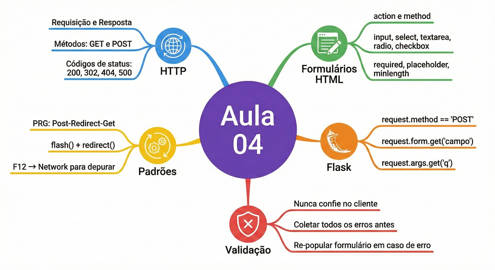

Na próxima aula você vai conectar o Flask ao MySQL. Toda a lógica de formulários que construímos hoje — coleta de dados, validação, feedback — vai ganhar persistência real: os cadastros serão salvos no banco de dados e poderão ser lidos, editados e excluídos. É o início do CRUD completo.

---

## Parte 10 — Atividade da Aula

### O que fazer

Esta é a atividade mais completa até agora, e o resultado dela será a base do Trabalho 1 (T1) que você entregará na Aula 09.

Crie uma rota `/novo` no seu sistema com um formulário POST para cadastrar um novo item do seu domínio (produto, cliente, livro, consulta — o que você escolheu no início do semestre). O formulário deve ter pelo menos quatro campos de tipos diferentes: um campo de texto, um campo numérico ou de data, um select com pelo menos três opções, e um campo de texto longo com `<textarea>`. Todos os campos devem ter `label` com `for` correto e placeholder descritivo.

Implemente a validação completa no servidor: verifique se os campos obrigatórios estão preenchidos, se os valores numéricos são válidos, e se o select tem uma opção selecionada. Colete todos os erros antes de exibir e mostre-os com flash messages `danger`. Em caso de erro, re-popule o formulário com os dados que o usuário já havia digitado. Em caso de sucesso, use o padrão PRG com `redirect` e flash message `success`.

Crie também uma rota `/buscar` com formulário GET que filtre a lista de itens pelo menos por nome. Os resultados devem ser exibidos com `` em cards ou tabela, com a mensagem "Nenhum resultado" quando a lista estiver vazia.

Verifique tudo no painel Network do navegador (`F12`) antes de fazer o commit.

```
git add .
git commit -m "Aula 04: formulários GET e POST, validação servidor, padrão PRG"
git push
```

---

## 🏆 Conquista da Aula

!!! success "Selo desbloqueado: 📨 Mensageiro(a) HTTP"
    Você completou a Aula 04. Seu sistema agora recebe dados do usuário com formulários completos, valida tudo no servidor e usa o padrão PRG para evitar reenvios. Na próxima aula, esses dados ganham memória permanente: é hora de conectar o Flask ao MySQL.

---

## 🔗 Navegação

⬅️ [Aula 03 — Templates Jinja2 e Rotas](Aula_03_Templates_Jinja2_e_Rotas.md) · ➡️ [Aula 05 — Conexão MySQL e Python](Aula_05_Conexao_MySQL_e_Python.md)

---

## Referências e Leitura Complementar

A especificação completa do protocolo HTTP está na RFC 7231, mas para fins práticos a documentação do MDN em `developer.mozilla.org/pt-BR/docs/Web/HTTP` é muito mais acessível e igualmente completa. O capítulo 4 do livro **Desenvolvimento Web com Flask** de Miguel Grinberg cobre formulários com a biblioteca WTForms — uma alternativa mais estruturada ao que fizemos aqui que será apresentada nas aulas avançadas.

---

## 📋 Gabarito dos Exercícios

Os mini-desafios de "🔎 Verifique seu Entendimento" espalhados ao longo desta aula têm as soluções comentadas reunidas em um único arquivo, organizado por bloco de conteúdo. Tente resolver cada desafio por conta própria antes de conferir.

➡️ [Gabarito — Aula 04](gabaritos/Aula_04_gabarito.md)

---

*Fatec Jahu · ILP951 · Prof. Ronan Adriel Zenatti · 2026*
