# 🌐 Programação para Internet — ILP951

> **Fatec Jahu** · Tecnologia em Gestão da Tecnologia da Informação (GTI)
> **Professor:** Ronan Adriel Zenatti
> **Semestre:** 2º Semestre / 2026
> **Carga Horária:** 80 aulas (20 encontros de 4 horas-aula)

---

## 📋 Sobre esta disciplina

Bem-vindo ao repositório oficial da disciplina **Programação para Internet**. Aqui
você vai aprender a construir aplicações web completas do zero, desde a estrutura de
páginas HTML5 até um sistema com banco de dados, login e relatórios gerenciais
funcionando.

A tecnologia principal usada no semestre é **Python** com o microframework **Flask**,
junto com **Jinja2**, **Bootstrap** e **MySQL**. Ao final, você terá desenvolvido um
sistema web completo, apresentado em banca.

## Ementa

Tecnologias e padrões de navegadores. Arquitetura de aplicações para Internet.
Programação do lado cliente e seus padrões. Construção de páginas dinâmicas e
interativas. Acesso a banco de dados através de uma linguagem de programação.
Construção de uma GUI (Graphical User Interface) para um aplicativo de banco de dados.
Modelagem Visualização e Controle (Model View Controller) e outros. Programação do
lado servidor: conhecimento de uma linguagem e padrões. Controle de sessões, cookies,
request/response e conexão com BD.

## Objetivo

Entender e aplicar conceitos de desenvolvimento de sistemas para internet, bem como os
padrões, técnicas e ferramentas associados. Desenvolver um aplicativo previamente
especificado.

---

## 📊 Critérios de Avaliação

> ⚠️ Os pesos abaixo seguem a fórmula do plano de ensino de referência da disciplina
> `(T1+A1+T2+A2)×1+R`. Confirme com o professor se os pesos permanecem os mesmos do
> semestre anterior antes de divulgar esta tabela aos alunos.

| Sigla | Nome | Tipo | Quando |
|-------|------|------|--------|
| **T1** | Estrutura de Rotas e Interface | Trabalho prático | Aula 9 (entrega) |
| **P1** | Avaliação Teórica + apresentação do T1 | Prova escrita + apresentação | Aula 10 |
| **T2** | Validação Final e Deploy | Trabalho prático | Aula 17 (início) |
| **P2** | Projeto Final | Apresentação do sistema completo | Aula 18 |
| **R** | Avaliação Substitutiva | Prova substitutiva (recupera P1 ou P2) | Aula 19 |

**P1** avalia a capacidade de estruturação de projeto web e front-end, e os
conhecimentos conceituais de HTTP, Web e Flask. **P2** avalia a competência técnica na
construção de soluções web completas (CRUD, login, relatórios).

---

## 🗺️ Trilha do(a) Desenvolvedor(a) Full-Stack

A jornada do semestre é dividida em dois blocos, cada um com sua própria progressão de
selos. A trilha completa dos selos aparece na "Conquista da Aula" de cada página, à
medida que as aulas são publicadas.

```mermaid
flowchart LR
    subgraph B1["🟢 Bloco 1 — Arquiteto(a) de Aplicações Web (Aulas 1–10)"]
        direction LR
        A1["🧭 1"] --> A2["2"] --> A3["🗺️ 3"] --> A4["4"] --> A5["5"] --> A6["6"] --> A7["7"] --> A8["8"] --> A9["9"] --> A10["🎖️ 10 · P1"]
    end
    subgraph B2["🔵 Bloco 2 — Engenheiro(a) Full-Stack (Aulas 11–20)"]
        direction LR
        A11["11"] --> A12["12"] --> A13["13"] --> A14["14"] --> A15["15"] --> A16["16"] --> A17["17"] --> A18["🏆 18 · P2"] --> A19["19"] --> A20["🎓 20"]
    end
    B1 --> B2
```

---

## 🟢 Bloco 1 — Fundamentos e Primeiro Sistema (Aulas 1 a 10)

Do zero absoluto até a apresentação do primeiro sistema completo: ambiente de
desenvolvimento, Git, Flask, Bootstrap, templates, formulários, conexão com MySQL e
CRUD completo.

| Aula | Data | Título | Status |
|------|------|--------|--------|
| 1 | 06/08 | [Introdução, Git e HTML5](aulas/Aula_01_Introducao_Git_HTML5.md) | ✅ Disponível |
| 2 | 13/08 | Flask e Bootstrap | 🔒 Em breve |
| 3 | 20/08 | [Templates Jinja2 e rotas](aulas/Aula_03_Templates_Jinja2_e_Rotas.md) | ✅ Disponível |
| 4 | 27/08 | Formulários e HTTP | 🔒 Em breve |
| 5 | 03/09 | Conexão MySQL e Python | 🔒 Em breve |
| 6 | 05/09 | Calculadora de IMC em Flask (trabalho individual) | 🔒 Em breve |
| 7 | 10/09 | CRUD: inserção e leitura | 🔒 Em breve |
| 8 | 17/09 | CRUD: edição e exclusão | 🔒 Em breve |
| 9 | 24/09 | Entrega do Trabalho 1 | 🔒 Em breve |
| 10 | 01/10 | Avaliação P1 (Teórica) e apresentação do Trabalho 1 | 🔒 Em breve |

---

## 🔵 Bloco 2 — Sistema Relacional, Segurança e Entrega Final (Aulas 11 a 20)

Evolução do sistema para múltiplas tabelas relacionadas, segurança de credenciais,
login, relatórios gerenciais e entrega do projeto final.

| Aula | Data | Título | Status |
|------|------|--------|--------|
| 11 | 08/10 | Modelagem relacional 1:N | 🔒 Em breve |
| 12 | 22/10 | CRUD relacional: implementação | 🔒 Em breve |
| 13 | 24/10 | Evolução da Calculadora de IMC com histórico em banco de dados (trabalho individual) | 🔒 Em breve |
| 14 | 29/10 | Visualização mestre-detalhe e segurança de registro | 🔒 Em breve |
| 15 | 05/11 | Login e controle de sessão | 🔒 Em breve |
| 16 | 12/11 | IV Congresso de Tecnologia da Fatec Jahu | 🔒 Em breve |
| 17 | 19/11 | Relatórios gerenciais e Trabalho 2 | 🔒 Em breve |
| 18 | 26/11 | Avaliação P2: Projeto Final | 🔒 Em breve |
| 19 | 03/12 | Fechamento de notas: avaliação substitutiva | 🔒 Em breve |
| 20 | 10/12 | Encerramento do semestre | 🔒 Em breve |

---

## 🛠️ Tecnologias utilizadas

**Python 3.x**, linguagem principal. **Flask**, microframework web usado no semestre
inteiro. **Jinja2**, motor de templates do Flask. **Bootstrap 5**, framework CSS para
interfaces responsivas. **MySQL**, banco de dados relacional usado para persistir os
dados do sistema. **Git e GitHub**, versionamento de código desde a primeira aula.

## 📚 Bibliografia básica

FREEMAN, Eric; FREEMAN, Elisabeth. *Use A Cabeça! HTML com CSS e XHTML*. São Paulo:
Alta Books, 2008. MICHAEL, Morrison. *Use a Cabeça! Javascript*. São Paulo: Alta
Books, 2008.

## 📚 Bibliografia complementar

RIORDAN, Rebecca M. *Use A Cabeça! Ajax Profissional*. São Paulo: Alta Books, 2009.
WATRALL, Ethan; SIARTO, Jeff. *Use A Cabeça! Web Design*. São Paulo: Alta Books, 2009.

## 📚 Bibliografia de referência

GRINBERG, Miguel. *Desenvolvimento Web com Flask: Desenvolvendo Aplicações Web
Robustas com Python*. 2. ed. São Paulo: Novatec, 2019. PERCIVAL, Harry. *TDD com
Python: Siga o Bode dos Testes: Usando Django, Selenium e JavaScript*. 1. ed. São
Paulo: Novatec, 2018. RAMALHO, Luciano. *Python Fluente: Programação Clara, Concisa e
Eficaz*. 1. ed. São Paulo: Novatec, 2015.

---

*Fatec Jahu · ILP951 · Prof. Ronan Adriel Zenatti · 2º Semestre/2026*
