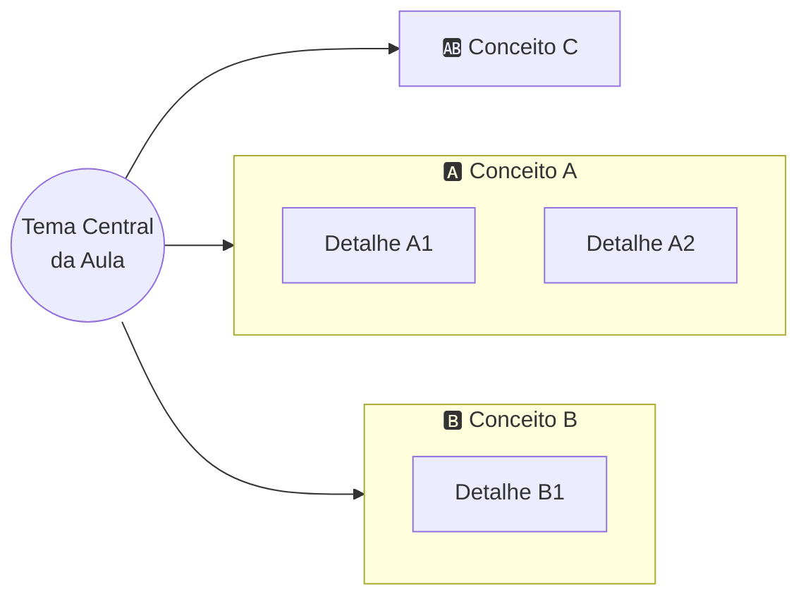

<!--
GABARITO ESTRUTURAL DE AULA, vive fora de docs/, não é publicado no site.
Use como referência de seções obrigatórias ao remodelar uma aula. A ordem importa:
ela foi desenhada para intercalar teoria com prática de memorização em vez de
empilhar tudo no fim. Nem toda aula terá conteúdo para todas as seções (ex.: aulas
que são só enunciado de trabalho, avaliação, ou evento institucional pulam mapa
mental e flashcards), use bom senso e, na dúvida, pergunte ao professor em vez de
forçar uma seção vazia.

Lembrete de estilo (ver CLAUDE.md, "Ensino incremental de código"): ao apresentar
código, fatie em incrementos pequenos, peça para o aluno rodar e observar antes de
seguir para o próximo trecho. Só consolide tudo num bloco único ao final da seção.
-->

# Aula NN — [Título da Aula]

**Disciplina:** Programação para Internet (ILP951)
**Professor:** Ronan Adriel Zenatti · ronan.zenatti@cps.sp.gov.br
**Fatec Jahu — 2º Semestre/2026**

---

## 🎯 Objetivos da Aula

Ao final desta aula você deverá ser capaz de:
- [objetivo 1, verbo de ação: criar/implementar/conectar/identificar/...]
- [objetivo 2]
- [objetivo 3]

---

## 🗺️ Mapa Mental da Aula

Visão geral dos conceitos antes de entrar no detalhe, ajuda a criar a "moldura" onde o
conteúdo que vem a seguir vai se encaixando.

> ⚠️ **Use `flowchart LR` com subgraphs, não o diagrama `mindmap` do Mermaid nem
> `flowchart TD`.**
> - `mindmap` usa um layout orgânico/de força sem controle de colisão entre linhas e
>   texto, as linhas de conexão cruzam por cima dos rótulos e ficam ilegíveis, sem
>   correção confiável na versão do Mermaid empacotada pelo Material.
> - `flowchart TD` com vários subgraphs irmãos espalha tudo lado a lado
>   horizontalmente, o diagrama fica mais largo que a coluna de conteúdo do site e o
>   Material encolhe o SVG inteiro para caber, virando ilegível de tão pequeno.
> - `flowchart LR` empilha os mesmos subgraphs na vertical em vez de espalhar na
>   horizontal, largura controlada (cresce só com a profundidade da árvore), altura
>   livre (a página rola, sem problema). Veja o padrão abaixo.

Para aulas centradas em rotas, requisição e resposta, um bom padrão de nós é
`Cliente → Rota → View/Lógica → Template/Resposta`. Para aulas de banco de dados, um
`erDiagram` complementar (separado do mapa mental) ajuda a mostrar tabelas e chaves
estrangeiras.

---

## 1. [Primeiro bloco de conteúdo]

[Mantém a didática já usada no conteúdo herdado do 1º semestre: parte de um
problema/situação concreta antes de nomear o conceito teórico. Apresente o código em
incrementos pequenos, um trecho novo por vez, com uma instrução explícita para o aluno
rodar e observar antes do próximo incremento. Use tabelas, exemplos de código e
diagramas Mermaid (`flowchart`, `erDiagram`) onde ajudar a visualizar.]

## 2. [Segundo bloco de conteúdo]

[...]

---

## 🃏 Flashcards de Revisão

Bloco colapsado por padrão, o aluno tenta responder mentalmente antes de clicar para
revelar. Usar 3 a 6 flashcards por aula, cobrindo os conceitos mais prováveis de cair
em prova ou de serem esquecidos primeiro.

??? question "Pergunta objetiva sobre o Conceito A?"
    Resposta direta e curta, 1 a 3 frases. Pode incluir um mini-exemplo.

??? question "Pergunta objetiva sobre o Conceito B?"
    Resposta direta e curta.

??? question "Pegadinha comum ou erro típico sobre o tema desta aula?"
    Explicação de por que é um erro e qual o raciocínio correto.

---

## ✅ Quiz de Fixação

3 a 5 perguntas cobrindo os pontos que mais importam da aula. Pelo menos uma pergunta
de múltipla resposta (checkbox) para variar o formato.

<quiz>
[Pergunta 1]?
- [ ] Alternativa incorreta
- [x] Alternativa correta
- [ ] Alternativa incorreta
- [ ] Alternativa incorreta

[Feedback explicando por que a resposta certa é certa, não só "Correto!".]
</quiz>

---

## 📝 Resumo

[3 a 5 frases amarrando os conceitos principais da aula, o que o aluno deve levar
consigo, não uma repetição do conteúdo.]

---

## 🏆 Conquista da Aula

!!! success "Selo desbloqueado: [Nome temático do selo, ver lista no CLAUDE.md]"
    Você completou a Aula NN. [Uma frase curta conectando esta aula à próxima,
    reforço de progresso, não apenas decoração.]

---

## 🔗 Navegação

⬅️ [Aula NN-1 — Título anterior](Aula_NN-1_Titulo.md) · ➡️ [Aula NN+1 — Título seguinte](Aula_NN+1_Titulo.md)

---

*Fatec Jahu · ILP951 · Prof. Ronan Adriel Zenatti · 2026*
